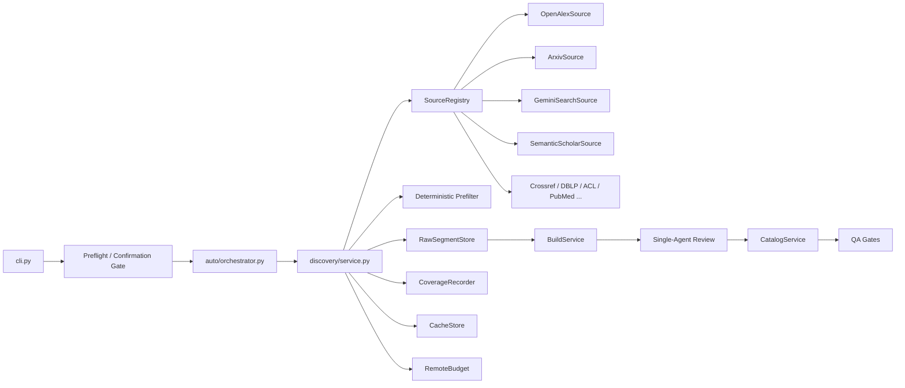
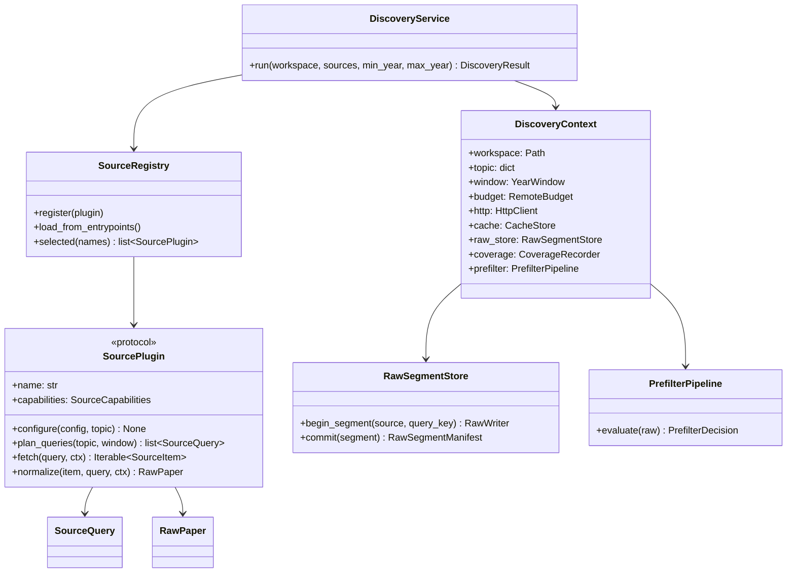
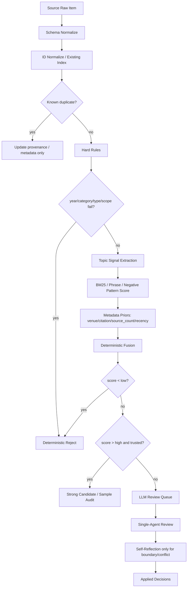
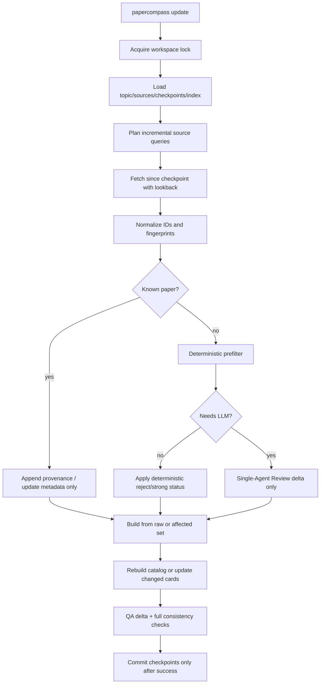
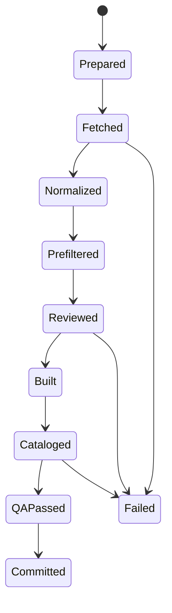
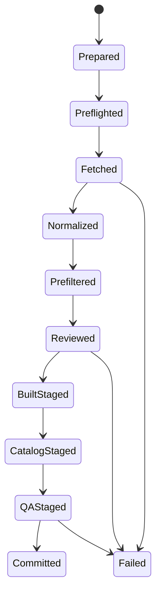
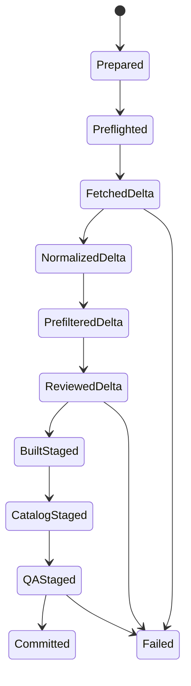

# Oracle Browser Transcript

Conversation: https://chatgpt.com/

## Prompt

# PaperCompass Codebase Review & Optimization Strategy

## 背景介绍
我为你提供了一个名为 **PaperCompass** 的项目完整源码压缩包（`PaperCompass_source.zip`），已作为附件上传。

**PaperCompass** 是一个**为 AI Agent 打造的本地文献库构建工具**。
在学术调研和文献管理中，人机协作面临以下痛点：
1. **结果容易丢失**：有价值的论文散落在冗长的对话记录中，缺乏持久化。
2. **边界模糊不清**：哪些论文被收录、哪些被排除，往往缺乏证据和审查标准。
3. **难以二次利用**：无法轻松地将本次调研的结果喂给另一个 Agent 或 Web UI 继续使用。

PaperCompass 的目标是通过人机协作（User 💬 Agent 🤖 PaperCompass），将一个模糊的研究方向转化为一个结构化的 Workspace。候选论文、来源证据、筛选决策和质量检查将被完整地保存在本地。

### ⚠️ 关于 Agent 协作的定位（重点设计考量）
在本项目中，我们**不预先设定**用户拥有多个不同的 Agent（例如分别负责不同任务的 Agent 团队），也**不推荐**复杂的跨模型/多模型协作。
典型的用户使用方式非常直接：“**使用 papercompass 帮我调研……**”。
这意味着：
- 接收用户指令并调用 PaperCompass 的就是**当前的主 Agent（单一 Agent 场景）**。
- 虽然项目目前代码中包含“审计 Agent”的概念，或之前曾考虑过使用不同的模型进行交叉审计，但为了让用户最省事，我们希望在架构和流程上**尽可能只使用这一个主 Agent** 独立且简便地完成建库、复核、分类与 QA 的全套工作。

---

## 评审要求与核心问题
请你深度阅读上传的 `PaperCompass_source.zip` 源码（包括 `src/` 核心逻辑、`docs/` 设计文档以及 `tests/` 测试用例），并从以下六个维度给出深入、具体且具备工程指导价值的优化建议与意见。**请务必全程使用中文进行详细回复，结合具体文件和代码逻辑进行剖析：**

### 1. 架构设计与本地优先（Local-First）原则
- 目前的 Workspace 契约（`workspace_contract.py`）和目录结构（包含 `.papercompass/`, `data/`, `catalog/`, `sources.yaml`, `topic.yaml` 等）设计是否优雅？
- 在保持“本地优先、文件即数据（File-first）”的前提下，如何进一步增强数据读写的健壮性，防止由于并发调用或进程意外中断导致本地 JSONL 数据损坏？

### 2. 单一主 Agent 场景下的防呆与交互简化（Agent-First）
- `AGENT_ENTRY.md` 为 Agent 规定了严格的 SOP（例如 Confirmation Gate 和 OpenAlex API Key 阻断检查）。然而，外部 Agent 依然可能因为“幻觉”绕过 SOP 强行运行命令行。
- 我们如何通过 **CLI 和代码层面的防御性编程**（例如在 `cli.py` 或 `orchestrator.py` 中引入校验逻辑），强制或引导主 Agent 必须先获得用户确认？
- 在“只使用这一个主 Agent”的前提下，如何最大程度地简化交互，让建库流程对用户而言既省事又防呆？

### 3. `discovery.py` 模块化重构与数据源扩展
- `src/papercompass/discovery.py` 承担了极其庞杂的检索与发现逻辑，目前文件大小接近 150KB，有明显的重构空间。
- 请给出一个优雅的 **数据源可插拔架构（Pluggable Source Architecture）** 设计方案，将 OpenAlex、ArXiv、Gemini Search 甚至是 Semantic Scholar 拆分为独立的插件或类，以提高代码的单一职责性和可维护性。
- 在多源检索中，如何设计更高效的增量去重与数据对齐（Normalization）策略？

### 4. 单一 Agent 流程下的文献复核（Candidate Review）与 QA 门禁
- 审视 `candidate_review.py` 和 `qa.py` 中的 LLM 评分/判定逻辑。
- 我们希望**不依赖复杂的多 Agent 对质（Critique）或多模型分工**，只让同一个主 Agent 独自搞定文献质量把控。在这种限制下，如何通过 Prompt 优化、自我反思（Self-Reflection）或带有置信度的评分机制，最大化提升相关性评审和 QA 校验的准确率（Precision/Recall）？
- 如何通过优化上下文，降低单 Agent 重复调用的 Token 消耗和建库成本？

### 5. 确定性 Pipeline 与大模型（LLM/Agent）的职责边界划分
- 全部交给 LLM/Agent 处理虽然效果好，但会带来不可接受的响应延迟与经济成本。因此，核心原则是：**能够用确定性代码、算法或规则解决的问题，就绝不使用 LLM。**
- 请分析我们目前的设计与代码实现（如 `discovery.py`、`candidate_review.py`）：
  - 哪些目前使用了 LLM 的步骤，实际上可以通过**传统的确定性代码/算法**（例如：基于 TF-IDF/BM25 的关键词相关性打分、基于领域规则/白名单的过滤、基于引用数与期刊元数据的静态截断等）来完全替代？
  - 如何设计一个优雅的**前置过滤（Pre-filtering）流水线**，将文献发现后的大量脏候选进行初筛，使送入大模型（LLM Review）的候选文献数量降至最低，从而实现性价比最大化？

### 6. 增量更新与持续追踪（Continuous Monitoring）
- 学术文献是持续产出的。如果用户希望对某个已建好的 Workspace 进行 **增量更新（例如每周自动追踪并吸纳新发表的相关论文）**，目前的管线设计需要做哪些改造？
- 如何在不重复拉取和全量复核的前提下，由单一 Agent 优雅地整合新发现的文献，并自动修正 `catalog` 分类与 QA 状态？

---

## 期待的输出格式
1. **架构重构规划**：对 `discovery.py` 以及“确定性 Pipeline 与 LLM 职责划分”的具体重构方案或类图设计（可以用 Mermaid 表示）。
2. **核心代码改进**：针对重构后的插件机制、防御性 CLI 校验、确定性前置过滤流水线或 LLM 单 Agent 复核机制，给出具体的 Python 伪代码或实现片段。
3. **设计缺陷与建议**：列出您在代码中发现的**所有**可能引发 Bug、性能瓶颈、成本冗余或体验硬伤的设计缺陷，并给出解决方案。
4. **开放式发现（不限范围）**：**请不要局限于上述列出的问题**。如果您在阅读源码时发现了任何其他我们未提及的设计盲区、重构契机或潜在风险，请一并详细指出并给出优化建议。

## Answer

我读了这份源码的核心路径，包括 `src/`、`docs/`、`skills/shared-references/` 和 `tests/`。总体判断是：**PaperCompass 的产品方向和 Workspace 契约是成立的，Local-First / File-First 的骨架也比较清晰；但当前实现里有三类必须优先处理的工程债：**

第一，**SOP 主要停留在文档层**。`AGENT_ENTRY.md` 对 Agent 有很严格的确认门和 OpenAlex Key 检查要求，但 `cli.py` / `auto/orchestrator.py` 没有代码级强制门禁，外部 Agent 完全可以绕过。

第二，**`discovery.py` 已经变成了单体“大泥球”**。它把 HTTP、缓存、预算、来源适配、主题过滤、raw 写入、coverage、build/catalog 触发都揉在一起，后续加 Semantic Scholar、Gemini Search、bioRxiv、IEEE Xplore 一类数据源会越来越难维护。

第三，**文件写入不是事务式的**。`write_json()`、`write_jsonl()`、`append_jsonl()`、build 输出、review decision 追加、catalog 替换等路径普遍没有锁、没有原子替换、没有 fsync，和 `.raw/` “只追加、可审计”的目标还差一层工程保障。

我还执行了测试：`pytest -q` 结果是 **247 passed, 1 skipped, 3 deselected, 2 failed**。两个失败分别是示例 workspace 缺少 `.papercompass/auto/final_summary.json`，以及 Claude 插件测试在本环境没有 `claude` CLI 时提前抛 `BrainUnavailable`，没有进入测试想验证的 JSON error-wrapper 分支。这说明测试总体覆盖不错，但示例契约和插件测试隔离还有改进空间。

---

# 1. 架构设计与 Local-First 原则

## 1.1 Workspace 契约整体是优雅的

`docs/workspace.md:30-50` 给出的目录结构很清楚：

```text
<workspace>/
  topic.yaml
  sources.yaml
  .raw/
  data/
  catalog/
  overrides/
  .papercompass/
```

这个分层是合理的：

`topic.yaml` 定义“收什么”，`sources.yaml` 定义“从哪里搜”，`.raw/` 保存原始候选证据，`data/` 和 `catalog/` 是可重建产物，`.papercompass/` 放运行状态、cache、logs、manifests、reviews。`docs/workspace.md:95-103` 还强调长期文件应使用 workspace 相对路径，这对可迁移性很重要。

`src/papercompass/workspace_contract.py` 也做了不少正确设计：

* 规范库名格式：`<topic_id>--<min_year>plus[--<model_variant>][--run-YYYYMMDD]`。
* `resolve_auto_workspace()` 防止 `--workspace` 和 `--workspace-name` 混用。
* 自动 workspace 必须有 `min_year`，这比 `discovery.year_range()` 的默认 2022 更安全。
* `export_workspace()` 默认排除 `.raw/` 和 cache，符合“raw 是审计证据，不是默认分发物”的定位。

所以 Workspace 契约的方向不用推倒重来。真正需要补的是**事务、锁、索引和恢复机制**。

## 1.2 当前 Local-First 的主要问题：文件是数据，但写入不够安全

当前基础 IO 在 `src/papercompass/text.py:100-130`：

```python
def write_json(path: Path, data: Any) -> None:
    path.parent.mkdir(parents=True, exist_ok=True)
    path.write_text(json.dumps(data, ensure_ascii=False, indent=2), encoding="utf-8")

def write_jsonl(path: Path, items: Iterable[Any]) -> int:
    path.parent.mkdir(parents=True, exist_ok=True)
    count = 0
    with path.open("w", encoding="utf-8") as handle:
        for item in items:
            handle.write(json.dumps(item, ensure_ascii=False, sort_keys=True) + "\n")
            count += 1
    return count
```

`discovery.py:69-74` 里的 `append_jsonl()` 也是直接 `open("a")` 追加。`candidate_review.py:366-370` 对 `applied_decisions.jsonl` 也是直接 append。`build.py:556-598` 会连续写多个 `data/*.json/jsonl` 和 manifest。`catalog.py:262-264` 会先删除旧 `catalog/`，再把 `.catalog.tmp` rename 成新目录。

这些实现简单，但有几个现实风险：

1. **进程中断风险**：写 `papers.json` 写到一半，JSON 文件可能变成半截。
2. **并发调用风险**：两个 Agent 或两个 shell 同时跑 `discover/build/auto-build`，JSONL 行可能交错，manifest 和 data 可能互相覆盖。
3. **多文件一致性风险**：`data/papers.json`、`data/papers.jsonl`、`data/pending_review_candidates.json`、`manifests/latest.json` 不是同一个事务提交的，崩溃后可能彼此不一致。
4. **catalog 短暂消失风险**：`catalog.py:262-264` 先 `rmtree(catalog)` 再 `rename(tmp)`，崩溃在中间会留下没有 `catalog/` 的 workspace。
5. **JSONL 读失败恢复弱**：`iter_jsonl()` 在遇到坏行时直接抛错，这是 fail-fast，但没有 quarantine / recover 模式，生产环境里一次尾部半行就会阻断整个 build。

## 1.3 建议：引入 workspace 事务层

建议新增一个 `papercompass/storage.py` 或 `papercompass/local_store.py`，统一提供：

* `workspace_lock()`：workspace 级互斥锁。
* `atomic_write_text()` / `atomic_write_json()` / `atomic_write_jsonl()`。
* `append_jsonl_locked()`。
* `RunTransaction`：一次 build/catalog/review 作为事务提交。
* `JsonlSegmentStore`：`.raw/` 不再追加到共享文件，而是每个 source-run 产生不可变 segment。

示意代码：

```python
# src/papercompass/storage.py
from __future__ import annotations

import contextlib
import json
import os
import tempfile
import uuid
from pathlib import Path
from typing import Any, Iterable

try:
    import fcntl
except ImportError:  # Windows fallback 可后续补 portalocker
    fcntl = None


def _fsync_dir(path: Path) -> None:
    if not hasattr(os, "O_DIRECTORY"):
        return
    fd = os.open(str(path), os.O_RDONLY | os.O_DIRECTORY)
    try:
        os.fsync(fd)
    finally:
        os.close(fd)


@contextlib.contextmanager
def workspace_lock(workspace: Path, name: str = "workspace"):
    lock_dir = workspace / ".papercompass" / "locks"
    lock_dir.mkdir(parents=True, exist_ok=True)
    lock_path = lock_dir / f"{name}.lock"

    with lock_path.open("a+", encoding="utf-8") as handle:
        if fcntl is not None:
            fcntl.flock(handle.fileno(), fcntl.LOCK_EX)
        try:
            handle.seek(0)
            handle.truncate()
            handle.write(json.dumps({"pid": os.getpid()}, ensure_ascii=False))
            handle.flush()
            os.fsync(handle.fileno())
            yield
        finally:
            if fcntl is not None:
                fcntl.flock(handle.fileno(), fcntl.LOCK_UN)


def atomic_write_text(path: Path, text: str) -> None:
    path.parent.mkdir(parents=True, exist_ok=True)
    tmp = path.with_name(f".{path.name}.{uuid.uuid4().hex}.tmp")

    with tmp.open("w", encoding="utf-8") as handle:
        handle.write(text)
        handle.flush()
        os.fsync(handle.fileno())

    os.replace(tmp, path)
    _fsync_dir(path.parent)


def atomic_write_json(path: Path, data: Any) -> None:
    atomic_write_text(
        path,
        json.dumps(data, ensure_ascii=False, indent=2, sort_keys=True) + "\n",
    )


def atomic_write_jsonl(path: Path, rows: Iterable[dict[str, Any]]) -> int:
    count = 0
    lines: list[str] = []
    for row in rows:
        lines.append(json.dumps(row, ensure_ascii=False, sort_keys=True) + "\n")
        count += 1
    atomic_write_text(path, "".join(lines))
    return count


def append_jsonl_locked(path: Path, rows: Iterable[dict[str, Any]]) -> int:
    path.parent.mkdir(parents=True, exist_ok=True)
    lock_path = path.with_suffix(path.suffix + ".lock")

    count = 0
    with lock_path.open("a+", encoding="utf-8") as lock:
        if fcntl is not None:
            fcntl.flock(lock.fileno(), fcntl.LOCK_EX)

        try:
            with path.open("a", encoding="utf-8") as handle:
                for row in rows:
                    handle.write(json.dumps(row, ensure_ascii=False, sort_keys=True) + "\n")
                    count += 1
                handle.flush()
                os.fsync(handle.fileno())
            _fsync_dir(path.parent)
        finally:
            if fcntl is not None:
                fcntl.flock(lock.fileno(), fcntl.LOCK_UN)

    return count
```

然后把 `text.py` 中的 `write_json()` / `write_jsonl()` 迁移为 atomic 版本；把 `discovery.append_jsonl()`、`candidate_review.apply_review_decisions()`、`build.write_run_log()` 替换为带锁写入。

## 1.4 `.raw/` 建议从“共享 append”升级为“不可变 segment”

当前 `.raw/<source>/*.jsonl` 已经按 run 写多个文件，这是好方向，但内部实现仍然有 append 模式。建议明确规则：

```text
.raw/openalex/
  20260619_120501_openalex_query_xxx.jsonl       # committed
  .20260619_120501_openalex_query_xxx.jsonl.tmp  # uncommitted, 可恢复清理
```

每次 source run：

1. 写 `.tmp`。
2. flush + fsync。
3. `os.replace(tmp, final)`。
4. 写 source_runs manifest。
5. 最后更新 coverage manifest。

这样 `.raw/` 就不依赖多进程 append 的原子性，也更容易做恢复：启动时发现 `.tmp` 可以 quarantine 或删除。

## 1.5 建议增加 manifest checksum

`build.py` 的 manifest 目前记录了输出路径和计数，但没有文件 hash。建议 build 完成时计算：

```json
{
  "outputs": {
    "papers_json": {
      "path": "data/papers.json",
      "sha256": "...",
      "bytes": 123456,
      "records": 78
    }
  }
}
```

QA 时增加 `atomicity_report()`：

* `latest.json` 里的 hash 是否匹配现有文件。
* `catalog/manifest.json.paper_count` 是否等于 `data/papers.json` 长度。
* `topic_papers.jsonl` 数量是否和 main papers 数量一致。
* `anchor_papers.json/jsonl` 是否同步。

这比单纯检查文件存在更符合 Local-First 的“可审计资产”定位。

---

# 2. 单一主 Agent 场景下的防呆与交互简化

## 2.1 文档 SOP 很严格，但代码没有强制

`AGENT_ENTRY.md:3-6` 明确说 PaperCompass 不接受“收到一句话就立即运行”的黑盒模式。`AGENT_ENTRY.md:36-65` 要求必须有 Confirmation Gate，并且 OpenAlex Key 缺失时必须提示并暂停。`docs/core-pipeline.md:61` 也写明：缺少年份、边界或用户确认时，Agent 不能启动正式建库。

但 `src/papercompass/cli.py:314-371` 的 `cmd_auto_build()` 只检查了 `--direction` 非空，然后直接调用 `run_auto_build()`。`auto-build` 的 argparse 也没有 `--confirmed`、`--confirmed-token`、`--allow-missing-openalex-key` 之类参数，`cli.py:818-821` 的 help 甚至写的是“一句话方向 → 直接构建论文库”。

这意味着：**SOP 是给乖 Agent 看的，不是系统边界。**

## 2.2 建议改成两阶段 CLI：prepare → confirmed run

最小侵入方案：

```bash
papercompass auto-build --prepare \
  --direction "..." \
  --min-year 2022 \
  --sources openalex arxiv dblp
```

这一步只做：

* 生成 workspace 名称。
* 解析/展示方向、年份、source、预算、brain。
* 检查 OpenAlex Key / email / source auth。
* 写入 `.papercompass/confirmations/<token>.json`。
* 输出“请用户确认”的文本和 token。
* 不触发远程检索，不写 `.raw/`。

用户确认后，主 Agent 再执行：

```bash
papercompass auto-build \
  --confirmed-token <token> \
  --direction "..." \
  --min-year 2022
```

`--confirmed-token` 要校验：

* token 文件存在。
* token 未过期，例如 24 小时内。
* direction / min_year / workspace / sources 和 prepare 时一致。
* OpenAlex 缺 key 时，必须 token 中记录了用户明确允许匿名继续。
* token 使用后标记 consumed，防止旧确认被重复使用。

## 2.3 更关键：门禁必须放在 orchestrator，而不只是 CLI

只在 CLI 做门禁不够，因为外部代码可以直接调用 `run_auto_build()`。应该在 `src/papercompass/auto/orchestrator.py:552-572` 的函数签名里加 preflight 对象：

```python
@dataclass(frozen=True)
class AutoBuildPreflight:
    user_confirmed: bool
    confirmation_token: str | None = None
    allow_missing_openalex_key: bool = False
    confirmed_direction_hash: str | None = None
    confirmed_at: str | None = None
    confirmed_by: str | None = None


class ConfirmationRequired(RuntimeError):
    pass


class MissingCredential(RuntimeError):
    pass


def run_auto_build(
    workspace: Path,
    direction: str,
    *,
    brain: BrainPlugin | str | None = None,
    second_brain: BrainPlugin | str | None = None,
    min_year: int | None = None,
    sources: list[str] | None = None,
    preflight: AutoBuildPreflight | None = None,
    ...
) -> AutoBuildResult:
    enforce_auto_build_preflight(
        workspace=workspace,
        direction=direction,
        min_year=min_year,
        sources=sources,
        preflight=preflight,
        plan_only=plan_only,
    )
    ...
```

门禁函数：

```python
def enforce_auto_build_preflight(
    *,
    workspace: Path,
    direction: str,
    min_year: int | None,
    sources: list[str] | None,
    preflight: AutoBuildPreflight | None,
    plan_only: bool,
) -> None:
    if plan_only:
        # plan-only 可以允许没有最终确认，但仍应要求 min_year 不为空，
        # 或者显式声明“不限制年份”。
        if min_year is None:
            raise ConfirmationRequired("plan-only 也必须显式给出 min_year 或 no-year-limit")
        return

    if preflight is None or not preflight.user_confirmed:
        raise ConfirmationRequired(
            "正式 auto-build 需要用户确认。请先运行 --prepare，并在用户确认后传入 --confirmed-token。"
        )

    if min_year is None:
        raise ConfirmationRequired("正式建库禁止使用隐式年份；请传入用户确认过的 --min-year。")

    selected = set(sources or CORE_DEFAULT_SOURCES)
    if "openalex" in selected:
        has_key = bool(resolve_secret(
            cfg={},
            value_key="api_key",
            env_key="api_key_env",
            default_env="OPENALEX_API_KEY",
        ))
        has_email = bool(os.getenv("OPENALEX_EMAIL", "").strip())
        if not has_key and not has_email and not preflight.allow_missing_openalex_key:
            raise MissingCredential(
                "OpenAlex 被选中，但未检测到 OPENALEX_API_KEY / OPENALEX_EMAIL。"
                "需要用户明确确认匿名继续，或配置 key 后重试。"
            )
```

这能防止“外部 Agent 幻觉绕过 SOP 直接跑命令”。

## 2.4 修复 OpenAlex Key 配置与文档不一致

`README.md:79-88` 和 `AGENT_ENTRY.md:55-65` 都说环境变量 `OPENALEX_API_KEY` 可以配置。但 `discovery.py:3161-3167` 只有在 `sources.yaml` 中显式写了 `api_key_env` 时才会读环境变量：

```python
api_key_env = clean_text(oa_cfg.get("api_key_env", ""))
api_key = clean_text(oa_cfg.get("api_key", ""))
if api_key_env and not api_key:
    api_key = os.getenv(api_key_env, "")
```

这会导致用户按文档 `export OPENALEX_API_KEY=...` 后，代码仍然可能不带 key 请求。建议统一做 secret resolver：

```python
def resolve_secret(
    cfg: dict[str, Any],
    *,
    value_key: str,
    env_key: str,
    default_env: str,
) -> str:
    direct = clean_text(cfg.get(value_key, ""))
    if direct:
        return direct

    configured_env = clean_text(cfg.get(env_key, ""))
    env_name = configured_env or default_env
    return clean_text(os.getenv(env_name, ""))
```

OpenAlex：

```python
api_key = resolve_secret(
    oa_cfg,
    value_key="api_key",
    env_key="api_key_env",
    default_env="OPENALEX_API_KEY",
)
mailto = resolve_secret(
    oa_cfg,
    value_key="mailto",
    env_key="mailto_env",
    default_env="OPENALEX_EMAIL",
)
```

Semantic Scholar / PubMed 也有同类问题，`discovery.py:3276-3283` 和 `discovery.py:3320-3326` 也应采用默认 env 名称，例如：

```python
SEMANTIC_SCHOLAR_API_KEY
NCBI_API_KEY
```

## 2.5 单一主 Agent 下的交互简化方案

不要设计多 Agent 团队，也不要默认 cross-model。推荐 UX：

```text
用户：使用 papercompass 帮我调研 X

主 Agent：
1. 抽取方向、年份、边界。
2. 如缺年份/边界，补问一次。
3. 生成确认卡片。
4. 用户确认。
5. 主 Agent 调用 papercompass auto-build --confirmed-token ...
6. 主 Agent 读取 final_summary.json + QA 报告，给用户总结。
```

CLI 层只暴露三种用户心智模型：

```bash
papercompass auto-build --prepare ...
papercompass auto-build --confirmed-token ...
papercompass update ...
```

`--second-brain` 保留为高级参数，但不应在默认 help 中强调“cross-model 最可靠”。目前 `cli.py:845-851` 和 `orchestrator.py:812-815` 的措辞会诱导复杂多模型流程；建议改成：

> 可选：对边界样本进行同一主 Brain 的二次自检；仅高级用户可指定不同 brain。

---

# 3. `discovery.py` 模块化重构与数据源可插拔架构

## 3.1 当前 `discovery.py` 的问题

`src/papercompass/discovery.py` 约 3400 多行，承担了过多职责：

* `RemoteBudget`。
* JSON/JSONL/cache IO。
* query 生成。
* topic term / topic match。
* HTTP 请求。
* OpenAlex / Crossref / DBLP / arXiv / ACL / PubMed / EuropePMC / OpenReview / Semantic Scholar / Gemini Search 的 source 逻辑。
* source coverage。
* provenance。
* discovery 后触发 build/catalog。

`run_discovery()` 在 `discovery.py:3110-3415` 用连续的 `if "source" in selected:` 调度各个数据源。这是典型的单体调度器，新增数据源必须继续改这个文件。

而且项目已经有一个“source plugin roadmap”，`skills/shared-references/source-plugin-protocol.md:1-5` 明确写着当前 source 硬编码在 `discovery.py`，插件协议尚未实现。这份文档方向是对的，但接口还太粗，需要升级为真正可维护的架构。

## 3.2 推荐架构图



类图：



## 3.3 推荐目录拆分

```text
src/papercompass/
  discovery/
    __init__.py
    service.py              # run_discovery 主流程
    context.py              # DiscoveryContext
    registry.py             # SourceRegistry
    budget.py               # RemoteBudget
    cache.py                # CacheStore
    coverage.py             # CoverageRecorder
    raw_store.py            # RawSegmentStore
    query_plan.py           # 通用 query 生成
    prefilter.py            # 确定性前置过滤
    types.py                # SourceQuery, SourceResult, RawPaper
    normalize_ids.py        # 跨源 ID 标准化
  sources/
    base.py
    openalex.py
    arxiv.py
    crossref.py
    dblp.py
    acl_anthology.py
    pubmed.py
    europepmc.py
    openreview.py
    semantic_scholar.py
    gemini_search.py
    paperlists.py
```

保留 `papercompass.discovery.run_discovery` 作为兼容入口，但内部委托给 `DiscoveryService`。

## 3.4 插件协议建议

```python
# src/papercompass/discovery/types.py
from dataclasses import dataclass, field
from pathlib import Path
from typing import Any, Iterable, Literal, Protocol


@dataclass(frozen=True)
class YearWindow:
    min_year: int
    max_year: int

    @property
    def years(self) -> list[int]:
        return list(range(self.min_year, self.max_year + 1))


@dataclass(frozen=True)
class SourceCapabilities:
    name: str
    requires_auth: bool = False
    supports_incremental: bool = True
    supports_citations: bool = False
    supports_abstracts: bool = True
    default_enabled: bool = False


@dataclass(frozen=True)
class SourceQuery:
    source: str
    query: str
    query_key: str
    window: YearWindow
    mode: str = "keyword"
    params: dict[str, Any] = field(default_factory=dict)


@dataclass
class SourceFetchResult:
    source: str
    query_key: str
    seen: int = 0
    kept: int = 0
    skipped: int = 0
    errors: list[dict[str, Any]] = field(default_factory=list)
    status: str = "success"
    raw_segments: list[str] = field(default_factory=list)


class SourcePlugin(Protocol):
    name: str
    capabilities: SourceCapabilities

    def configure(self, config: dict[str, Any], topic: dict[str, Any]) -> None:
        ...

    def plan_queries(self, topic: dict[str, Any], window: YearWindow) -> list[SourceQuery]:
        ...

    def fetch(self, query: SourceQuery, ctx: "DiscoveryContext") -> Iterable[dict[str, Any]]:
        ...

    def normalize(
        self,
        item: dict[str, Any],
        query: SourceQuery,
        ctx: "DiscoveryContext",
    ) -> dict[str, Any]:
        ...
```

`DiscoveryService`：

```python
class DiscoveryService:
    def __init__(self, registry: SourceRegistry):
        self.registry = registry

    def run(
        self,
        workspace: Path,
        *,
        source_names: list[str] | None,
        min_year: int,
        max_year: int,
        refresh: bool = False,
        max_remote_calls: int | None = None,
    ) -> dict[str, Any]:
        with workspace_lock(workspace, "discovery"):
            topic = load_topic_config(workspace)
            cfg = load_sources_config(workspace)
            window = YearWindow(min_year=min_year, max_year=max_year)

            ctx = DiscoveryContext.from_workspace(
                workspace=workspace,
                topic=topic,
                config=cfg,
                window=window,
                refresh=refresh,
                max_remote_calls=max_remote_calls,
            )

            results: list[SourceFetchResult] = []
            for plugin in self.registry.selected(source_names, cfg):
                plugin_cfg = ctx.config_for(plugin.name)
                plugin.configure(plugin_cfg, topic)

                for query in plugin.plan_queries(topic, window):
                    result = self._run_query(plugin, query, ctx)
                    results.append(result)

            return ctx.finalize(results)

    def _run_query(
        self,
        plugin: SourcePlugin,
        query: SourceQuery,
        ctx: DiscoveryContext,
    ) -> SourceFetchResult:
        result = SourceFetchResult(source=plugin.name, query_key=query.query_key)

        with ctx.raw_store.segment(plugin.name, query.query_key) as writer:
            for item in plugin.fetch(query, ctx):
                result.seen += 1
                raw = plugin.normalize(item, query, ctx)
                decision = ctx.prefilter.evaluate(raw)

                if decision.action == "reject":
                    result.skipped += 1
                    ctx.coverage.record_rejected(plugin.name, query, raw, decision)
                    continue

                writer.write(raw)
                result.kept += 1

            result.raw_segments.append(writer.relative_path)

        ctx.coverage.record_query_result(result)
        return result
```

## 3.5 Gemini Search 当前有一个真实 bug

`run_discovery()` 在 `discovery.py:3386-3389` 把 `years` 直接传给 `sync_gemini_search()`：

```python
sync_gemini_search(
    workspace,
    topic,
    years,
    ...
)
```

但 `src/papercompass/sources/gemini_search.py` 的 `_filter_by_year(rows, years)` 期望的是二元组 `(lo, hi)`。测试里只传了 `(2022, 2026)`，所以没覆盖真实调用链。自动发现路径里 `years` 是完整列表，例如 `[2022, 2023, 2024, 2025, 2026]`，会在解包 `lo, hi = years` 时失败。

修复方式之一：

```python
window = (years[0], years[-1]) if years else None

results.append(sync_gemini_search(
    workspace,
    topic,
    window,
    ...
))
```

更好的方式是所有 source 统一接受 `YearWindow`，不要有的接受 list，有的接受 tuple。

## 3.6 Gemini Search 还有两个设计风险

第一，Gemini Search 写 raw 时可能保存绝对路径。`sync_gemini_search()` 里把 `raw_path` 传给 `wrap_candidate()`，如果 wrapper 里直接 stringify，就会违反 `docs/workspace.md:95-103` 的相对路径要求。应统一在 `wrap_candidate()` 内部转换为 workspace-relative，或者 source 插件永远传相对路径。

第二，Gemini Search 没有像 OpenAlex/arXiv 那样先做 `matches_topic` 过滤。它把 Gemini 返回的结果全部 append 到 `.raw`，而 `normalize.relevance_decision()` 对非手工源一律变成 `pending_fusion_score`，见 `normalize.py:137-143`。这会把大量噪音推给 LLM Review，直接增加成本。

修复建议：

```python
raw = wrap_candidate(...)
match = topic_match_decision(raw["raw"], topic, source_type="gemini_search")

if match.action == "reject":
    coverage.record_filtered(...)
    continue

writer.write(raw)
```

---

# 4. 多源检索的增量去重与 Normalization 策略

## 4.1 当前去重逻辑的优点与风险

`normalize.py:288-318` 的 `identity_keys()` 已经覆盖了 DOI、arXiv、ACL、OpenReview、Semantic Scholar、OpenAlex、DBLP、PMID、PMCID、EuropePMC 等强 ID，这是正确的。

但它最后追加了：

```python
keys.append(f"title:{title}:{year or ''}")
keys.append(f"title:{title}")
```

裸 title key 有风险。很多 survey、benchmark、position paper 标题可能很短或高度通用，裸 title 容易误合并。建议改成两级身份系统：

**强身份：**

```text
doi
arxiv_id without version
openalex_id normalized to W-id
semantic_scholar_id / corpus_id
openreview_id
acl_id
dblp_key
pmid / pmcid
```

**弱身份：**

```text
normalized_title + year + first_author
normalized_title + year ± 1 + venue
title_simhash + first_author + year
```

弱身份只在相似度足够高时合并，并记录 `merge_confidence`，不要直接等价。

## 4.2 增量索引建议

File-first 不等于不能有索引。建议把索引视为 `.papercompass/index/` 下的**可重建派生产物**：

```text
.papercompass/index/
  identity_index.jsonl
  source_seen_index.jsonl
  query_checkpoints.json
  paper_fingerprints.jsonl
```

或者使用 SQLite 作为派生索引：

```text
.papercompass/index/index.sqlite
```

SQLite 不破坏 Local-First，因为 source of truth 仍然是 `.raw/`、`topic.yaml`、`sources.yaml`、`applied_decisions.jsonl`；SQLite 只是加速查重和增量更新。

推荐索引字段：

```json
{
  "paper_key": "doi:10.xxx/yyy",
  "identity_keys": ["doi:...", "openalex:...", "title:...:2024:first_author"],
  "raw_fingerprints": ["sha256:..."],
  "first_seen_at": "...",
  "last_seen_at": "...",
  "sources": ["openalex", "arxiv"],
  "latest_metadata_hash": "...",
  "decision_context_hash": "...",
  "review_status": "accepted|rejected|pending|deferred"
}
```

## 4.3 合并策略需要优先级，不应简单 `dict.update`

`normalize.py:321-346` 的 `merge_paper()` 对 `decision` 采用：

```python
base.update({k: v for k, v in value.items() if v not in (None, "", [], {})})
```

这可能让后来的弱来源 pending decision 覆盖已有的 review accept/reject。建议给 decision 定义优先级：

```python
DECISION_PRIORITY = {
    "review_accept": 100,
    "review_anchor": 95,
    "trusted_required_seed": 90,
    "trusted_import": 80,
    "review_reject": 70,
    "publication_scope_reject": 60,
    "hard_rule_reject": 50,
    "pending_fusion_score": 10,
}
```

合并时：

```python
def merge_decision(old: dict, new: dict) -> dict:
    old_p = decision_priority(old)
    new_p = decision_priority(new)
    if new_p > old_p:
        return {**old, **new, "merged_from": [old, new]}
    return old
```

同理，venue、abstract、citation_count、publication_type 也应有 source priority。例如 DOI/Crossref 的出版元数据可信度可能高，OpenAlex citation 丰富，arXiv abstract 新鲜，DBLP venue 规范。

---

# 5. 单一 Agent 流程下的 Candidate Review 与 QA 门禁

## 5.1 `candidate_review.py` 本身更像“队列与落盘”，不是 LLM Judge

`candidate_review.py` 做得比较好的点：

* `workspace_decision_context_hash()` 会 hash `topic.yaml` 和 `sources.yaml`，避免 topic/source 变更后盲目复用旧 review decision，见 `candidate_review.py:62-72`。
* `validate_review_decisions()` 要求 review 文件覆盖 queue 中所有候选，能发现 missing、extra、duplicate，见 `candidate_review.py:295-346`。
* `apply_review_decisions()` 采用 append-only 的 `applied_decisions.jsonl`，审计语义是正确的。

但它也有不足：

* `normalize_decision_row()` 只接受 `accept/reject/defer/anchor` 和 reason，缺少数值置信度、证据、反证、缺失信息，见 `candidate_review.py:268-292`。
* `compact_candidate()` 会保留完整 `source_records`，见 `candidate_review.py:125-152`，对 LLM review 来说可能 token 偏重。
* `apply_review_decisions()` 直接 append，无锁无 fsync，见 `candidate_review.py:366-370`。

真正的 LLM 判定在 `auto/brain_score.py`、`auto/prompts.py`、`auto/stages.py`。`BRAIN_SCORE_PROMPT` 已经强调严格打分和边界样本，见 `auto/prompts.py:251-307`，这是好基础。

## 5.2 单一主 Agent 下，应从“多模型对质”改为“同一 Agent 的结构化自检”

不建议默认 `--second-brain`。在单 Agent 场景下，可以用以下策略提升准确率：

### 一次调用内要求结构化证据

把当前 schema：

```json
{
  "candidate_key": "...",
  "score": 0-100,
  "paper_role": "...",
  "reason": "..."
}
```

升级为：

```python
class SingleAgentReviewDecision(TypedDict):
    candidate_key: str
    score: int
    confidence: float
    decision: Literal["accept", "reject", "defer", "anchor"]
    paper_role: Literal[
        "core_method",
        "mechanism_eval",
        "background_anchor",
        "boundary_negative",
        "out_of_scope",
    ]
    inclusion_evidence: list[str]
    exclusion_evidence: list[str]
    missing_information: list[str]
    false_positive_risk: Literal["low", "medium", "high"]
    false_negative_risk: Literal["low", "medium", "high"]
    reason: str
```

Prompt 增强方向：

```text
请先按以下固定 rubric 判断，但只输出 JSON：
1. 论文主贡献是否直接服务于用户方向？
2. 是否只是关键词重合？
3. 是否违反 publication/source scope？
4. 是否与 in-scope anchors 同类？
5. 是否与 out-of-scope anchors 更相似？
6. 给出 inclusion evidence 和 exclusion evidence。
7. 如果证据不足，不要猜，decision=defer。
```

落盘时保留：

* `score`
* `confidence`
* `inclusion_evidence`
* `exclusion_evidence`
* `missing_information`
* `review_prompt_version`
* `review_policy`
* `candidate_fingerprint`

### 只对边界样本做二次自检

不要对所有候选二跑。只对这些情况二次自检：

* LLM score 在 45-75。
* deterministic score 高，但 LLM reject。
* LLM confidence < 0.65。
* 缺 abstract，只有 title。
* 高引用/高质量 venue，但 LLM 低分。
* 多源命中但 LLM 低分。

二次 prompt 不是“另一个 Agent”，而是同一主 Agent 的 falsification pass：

```text
你刚才的初判是 {decision}，现在请专门寻找相反证据：
- 如果初判 accept，请找它是否只是关键词重合或主贡献偏离。
- 如果初判 reject，请找它是否其实满足核心边界。
只允许在发现明确反证时修改判断。
输出 revised_decision、confidence_delta 和 reason。
```

这样符合“单一主 Agent”约束，又能减少明显误判。

## 5.3 精度/召回的策略建议

推荐最终判定不是只看 `score`，而是：

```python
def final_review_policy(row: dict) -> str:
    score = row["score"]
    conf = row.get("confidence", 0.0)
    has_evidence = bool(row.get("inclusion_evidence"))
    has_exclusion = bool(row.get("exclusion_evidence"))

    if score >= 78 and conf >= 0.70 and has_evidence and not has_exclusion:
        return "accept"

    if score <= 30 or (has_exclusion and score < 60):
        return "reject"

    if row.get("paper_role") == "background_anchor" and score >= 45:
        return "anchor"

    return "defer"
```

同时保留 `defer`，但 `stage_resolve_boundary()` 不要无限 LLM 消耗。可以对 defer 进行：

1. 同 Agent 自检。
2. 若仍不确定，保留为 `pending_review_candidates`，不要强行收录。
3. QA 报告里明确“边界未决数”。

## 5.4 Token 成本优化

当前 `score_candidate_batch()` 会渲染 title、year、venue、abstract 等，`auto/brain_score.py:42-118` 每批调用 Brain。`stage_score_papers()` 已经有 embedding pre-rank 和 partial cache，这是好的。但还可以继续降本：

### 候选 compact 化

给 LLM 的候选只保留：

```json
{
  "candidate_key": "...",
  "title": "...",
  "year": 2024,
  "venue": "...",
  "source_count": 3,
  "sources": ["openalex", "arxiv"],
  "ids": {"doi": "...", "arxiv": "..."},
  "topic_hits": ["..."],
  "negative_hits": ["..."],
  "abstract_excerpt": "前 700-900 字符",
  "deterministic_score": 72,
  "why_selected_for_llm": "uncertain_band"
}
```

不要把完整 `source_records` 丢给 LLM。完整证据留给本地审计文件即可。

### 缓存键要包含 prompt/policy 版本

```text
brain_score_cache_key =
  sha256(candidate_fingerprint + topic_context_hash + prompt_version + review_policy_version)
```

`candidate_review.py` 已经有 `decision_context_hash()`，可以扩展到 LLM score cache。这样重复 build 或增量 update 时，只对新候选/变更候选付费。

### LLM 只看“不确定带”

低成本策略：

```text
确定性低分     -> 自动 reject
确定性高分     -> 可进入抽样审计或直接 strong_candidate
中间不确定带   -> LLM Review
高风险冲突样本 -> LLM Self-Reflection
```

---

# 6. QA 门禁评价与改进

`qa.py` 大多数是确定性 QA，这是正确方向。值得保留的点：

* `raw_pollution_report()` 检查 wrapper 派生字段是否污染 raw。
* `review_report()` 检查 queue/decision 覆盖。
* `applied_review_decisions_report()` 检查 stale context。
* `score_decisions_report()` 防止没有 Brain score 却被收录。
* `coverage_report()` 检查 source coverage/auth 风险。
* `publication_scope`、catalog count、seed/query coverage 等检查都对交付质量有帮助。

需要改进的点：

## 6.1 QA 不应默认产生副作用

`qa.py:536-560` 的 `coverage_manifest_report()` 会 import `make_coverage_report()` 并刷新 coverage report。这让 QA 从“检查器”变成了“检查 + 修改状态”。建议：

```bash
papercompass qa workspace --refresh-coverage
```

默认 QA 只读；需要刷新时显式传参。

## 6.2 Recall 阈值过于静态

`qa.py:430-434` 写死：

```python
thresholds = {
    "min_review_queue": 50,
    "min_raw_candidates": 80,
    "min_final_papers": 40,
}
```

这对热门 ML topic 可能合理，但对 niche topic、医学小领域、特定年份范围不一定合理。建议把阈值放入 `topic.yaml` 或 `sources.yaml`：

```yaml
qa:
  recall_pool:
    min_raw_candidates: 80
    min_review_queue: 50
    min_final_papers: 40
    strict: true
```

并允许 plan 阶段根据 topic 类型给出建议，但最终写入配置。

## 6.3 新增几个 QA Gate

建议增加：

```text
atomicity_report
  - manifest hash 是否匹配实际文件
  - data/*.json 与 *.jsonl 数量是否一致

decision_conflict_report
  - 同一 identity key 是否同时出现 accept/reject
  - review decision 是否被 merge_paper 覆盖

prefilter_efficiency_report
  - seen / kept / reviewed / accepted 比例
  - 某 source 的噪音率过高时提示收紧 query

llm_cost_report
  - brain calls
  - cache hit rate
  - reviewed candidate count
  - self-reflection count

incremental_delta_report
  - 新增候选
  - 已知重复
  - metadata-only 更新
  - 新增收录
  - 新增拒绝
```

---

# 7. 确定性 Pipeline 与 LLM/Agent 的职责边界

## 7.1 当前哪些步骤用了 LLM / Brain

主要有四类：

1. `stage_plan_direction()`：把自然语言方向拆成 `topic.yaml`、scope、judge examples。
2. `stage_score_papers()`：对 pending candidates 做相关性打分。
3. `stage_resolve_boundary()`：对 boundary 样本二次处理。
4. `gemini_search`：用 Gemini Search 作为开放式发现源。

`candidate_review.py` 本身不直接调用 LLM，它负责 review queue 和 decision apply。`qa.py` 也基本是确定性检查。

## 7.2 哪些应尽量改成确定性代码

以下不应该交给 LLM：

* 年份过滤。
* publication type 过滤。
* arXiv primary category 过滤。
* DOI/arXiv/OpenAlex/S2/DBLP/PMID 等 ID 规范化。
* 跨源 dedupe。
* source budget。
* source auth preflight。
* source coverage。
* citation_count / venue / source_count 静态排序。
* title/abstract 的关键词、短语、负例 pattern 命中。
* BM25 / TF-IDF 相关性初筛。
* exact seed matching。
* required seed / trusted import 处理。
* catalog 分类文件生成。
* QA。
* export。

LLM 只应做：

```text
自然语言边界草案
语义模糊候选判定
边界样本自检
分类标签的少量语义命名
```

## 7.3 建议的前置过滤流水线



## 7.4 简单 BM25 实现不需要新依赖

项目依赖很轻，`pyproject.toml:15-18` 只有 `beautifulsoup4` 和 `PyYAML`，embedding 是 optional。可以先手写轻量 BM25：

```python
import math
import re
from collections import Counter
from dataclasses import dataclass


_TOKEN_RE = re.compile(r"[a-zA-Z][a-zA-Z0-9\-]{1,}")


def tokenize(text: str) -> list[str]:
    return [t.lower() for t in _TOKEN_RE.findall(text or "")]


@dataclass
class BM25Index:
    docs: list[list[str]]
    idf: dict[str, float]
    avgdl: float
    k1: float = 1.5
    b: float = 0.75

    @classmethod
    def build(cls, texts: list[str]) -> "BM25Index":
        docs = [tokenize(text) for text in texts]
        n = max(1, len(docs))
        df: Counter[str] = Counter()
        for doc in docs:
            df.update(set(doc))

        idf = {
            term: math.log(1 + (n - freq + 0.5) / (freq + 0.5))
            for term, freq in df.items()
        }
        avgdl = sum(len(d) for d in docs) / n
        return cls(docs=docs, idf=idf, avgdl=max(avgdl, 1.0))

    def score(self, doc_id: int, query_terms: list[str]) -> float:
        doc = self.docs[doc_id]
        tf = Counter(doc)
        dl = len(doc) or 1

        score = 0.0
        for term in query_terms:
            f = tf.get(term, 0)
            if not f:
                continue
            denom = f + self.k1 * (1 - self.b + self.b * dl / self.avgdl)
            score += self.idf.get(term, 0.0) * (f * (self.k1 + 1)) / denom
        return score
```

确定性相关性：

```python
@dataclass
class PrefilterDecision:
    action: Literal["reject", "review", "strong"]
    score: float
    reasons: list[str]
    topic_hits: list[str]
    negative_hits: list[str]


class PrefilterPipeline:
    def __init__(self, topic: dict, policy: dict):
        self.topic = topic
        self.policy = policy
        self.positive_terms = build_positive_terms(topic)
        self.negative_patterns = build_negative_patterns(topic)

    def evaluate(self, paper: dict) -> PrefilterDecision:
        reasons: list[str] = []

        year = parse_year(paper.get("year"))
        min_year = parse_year(self.topic.get("min_year"))
        if min_year and year and year < min_year:
            return PrefilterDecision("reject", 0, ["before_min_year"], [], [])

        if violates_publication_scope(paper, self.topic):
            return PrefilterDecision("reject", 0, ["publication_scope_violation"], [], [])

        title = paper.get("title", "")
        abstract = paper.get("abstract", "")
        text = f"{title}\n{abstract}"

        topic_hits = phrase_hits(text, self.positive_terms)
        negative_hits = pattern_hits(text, self.negative_patterns)

        phrase_score = min(40, 8 * len(topic_hits))
        title_boost = 15 if phrase_hits(title, self.positive_terms) else 0
        source_score = source_agreement_score(paper)
        venue_score = venue_prior_score(paper)
        citation_score = citation_prior_score(paper)
        negative_penalty = 30 if negative_hits and not topic_hits else 0

        score = phrase_score + title_boost + source_score + venue_score + citation_score - negative_penalty

        if score < self.policy.get("low_threshold", 25):
            return PrefilterDecision("reject", score, reasons + ["low_deterministic_relevance"], topic_hits, negative_hits)

        if score >= self.policy.get("high_threshold", 80) and source_score >= 15:
            return PrefilterDecision("strong", score, reasons + ["high_deterministic_relevance"], topic_hits, negative_hits)

        return PrefilterDecision("review", score, reasons + ["uncertain_band"], topic_hits, negative_hits)
```

关键点：**自动 accept 要保守**。除 required seed / trusted import 之外，强候选可以减少 LLM 优先级，但不必完全绕过审计。对正式库，可以抽样审计强候选，或者只让强候选进入更小的 LLM 队列。

---

# 8. 增量更新与持续追踪

## 8.1 当前设计只支持“追加 raw 后全量 rebuild”

`docs/core-pipeline.md:113-115` 写的是：新增 source、query、审查反馈或手工确认论文时，追加 `.raw/` 或 overrides，然后重新运行 build/catalog/QA。这个思路是安全的，但不是高效的 continuous monitoring。

问题在于：

* 没有 source checkpoint。
* 没有 query-level cursor。
* 没有 identity index。
* 没有 review score cache 的正式契约。
* 没有 delta summary。
* 没有“只复核新候选”的 pipeline。
* final QA 也没有区分 full build 和 incremental update。

## 8.2 建议新增 update/monitor 命令

```bash
papercompass monitor init \
  --workspace workspaces/foo--2022plus \
  --frequency weekly \
  --sources openalex arxiv semanticscholar

papercompass update \
  --workspace workspaces/foo--2022plus \
  --since last \
  --max-remote-calls 80 \
  --confirmed-token <token>
```

状态文件：

```text
.papercompass/monitoring/
  policy.yaml
  checkpoints.json
  last_update_summary.json

.papercompass/index/
  identity_index.jsonl
  review_score_cache.jsonl
  source_seen_index.jsonl

.papercompass/manifests/
  update_20260619_120000.json
```

`policy.yaml`：

```yaml
frequency: weekly
sources:
  - openalex
  - arxiv
  - semanticscholar
lookback_days: 14
max_remote_calls: 80
review:
  reuse_cached_scores: true
  self_reflection_for_boundary: true
  llm_review_limit: 100
```

`checkpoints.json`：

```json
{
  "openalex": {
    "query_hash:abc": {
      "last_success_at": "2026-06-19T12:00:00Z",
      "from_publication_date": "2026-06-05",
      "cursor": null,
      "last_seen_ids": ["openalex:W..."]
    }
  },
  "arxiv": {
    "query_hash:def": {
      "last_success_at": "2026-06-19T12:00:00Z",
      "submitted_after": "202606050000",
      "last_seen_ids": ["arxiv:2606.12345"]
    }
  }
}
```

## 8.3 增量更新流程



建议实现骨架：

```python
class IncrementalUpdater:
    def __init__(self, registry: SourceRegistry):
        self.registry = registry

    def run(
        self,
        workspace: Path,
        *,
        since: str = "last",
        max_remote_calls: int = 80,
        confirmed: bool = False,
    ) -> dict[str, Any]:
        if not confirmed:
            raise ConfirmationRequired("增量更新也需要用户确认或 monitor policy 授权。")

        with workspace_lock(workspace, "update"):
            topic = load_topic_config(workspace)
            sources_cfg = load_sources_config(workspace)
            checkpoints = load_checkpoints(workspace)
            index = IdentityIndex.load(workspace)

            delta = UpdateDelta()

            with RunTransaction(workspace, kind="update") as tx:
                for plugin in self.registry.selected(None, sources_cfg):
                    for query in plugin.plan_incremental_queries(topic, checkpoints):
                        for item in plugin.fetch(query, tx.discovery_context):
                            raw = plugin.normalize(item, query, tx.discovery_context)
                            entity = index.lookup(raw)

                            if entity.known and not entity.metadata_changed(raw):
                                delta.known_duplicates += 1
                                tx.raw_store.write_provenance_only(raw, entity.paper_key)
                                continue

                            if entity.known and entity.metadata_changed(raw):
                                delta.metadata_updates += 1
                                tx.raw_store.write(raw)
                                index.update(entity.paper_key, raw)
                                continue

                            pre = tx.prefilter.evaluate(raw)
                            if pre.action == "reject":
                                delta.prefilter_rejected += 1
                                tx.decisions.append_deterministic_reject(raw, pre)
                            else:
                                delta.new_review_candidates.append(raw)
                                tx.raw_store.write(raw)

                review_delta = review_new_candidates_only(
                    workspace,
                    delta.new_review_candidates,
                    cache=index.review_cache,
                )
                tx.apply_review_delta(review_delta)

                build_result = build_workspace(workspace)
                catalog_result = build_catalog(workspace)
                qa_result = build_quality_report(workspace)

                if qa_result["status"] not in {"passed", "warnings"}:
                    raise RuntimeError("增量更新 QA 未通过，不提交 checkpoint")

                tx.commit_checkpoints()
                tx.commit()

            return {
                "status": "updated",
                "delta": delta.to_dict(),
                "build": build_result,
                "catalog": catalog_result,
                "qa": qa_result,
            }
```

## 8.4 Catalog 分类如何增量修正

最简单可靠的方式：**每次 update 后全量重建 catalog**。Catalog 是派生产物，重建成本通常比 LLM review 小很多。

如果后续库很大，再做增量 catalog：

* 每篇 paper 的 card 路径由稳定 `paper_key` 决定。
* 新增/变更 paper 只重写对应 markdown/json。
* index 文件按全量重建生成。
* taxonomy 如果变化小，不改目录结构。
* 如果新增论文大量落入 “uncategorized”，再让同一主 Agent 生成 taxonomy patch，但 patch 必须落到 `topic.yaml` 或 `catalog_policy.yaml`。

---

# 9. 核心代码改进片段

## 9.1 CLI 确认门

```python
def cmd_auto_build(args: argparse.Namespace) -> None:
    direction = args.direction.strip()
    if not direction:
        raise SystemExit("--direction 必须给出研究方向描述")

    if args.prepare:
        plan = prepare_confirmation_plan(args)
        print_json(plan.to_dict())
        return

    preflight = load_and_validate_confirmation(
        workspace=args.workspace,
        token=args.confirmed_token,
        direction=direction,
        min_year=args.min_year,
        sources=args.sources,
        allow_missing_openalex_key=args.allow_missing_openalex_key,
    )

    result = run_auto_build(
        workspace,
        direction,
        brain=args.brain,
        second_brain=args.second_brain,
        min_year=workspace_resolution.min_year,
        sources=args.sources,
        preflight=preflight,
        ...
    )
```

Argparse：

```python
auto_p.add_argument("--prepare", action="store_true", help="只生成用户确认计划，不执行远程检索")
auto_p.add_argument("--confirmed-token", default=None, help="用户确认后由 --prepare 生成的 token")
auto_p.add_argument(
    "--allow-missing-openalex-key",
    action="store_true",
    help="仅当用户明确允许无 OpenAlex key 继续时使用；会写入审计日志",
)
```

## 9.2 Discovery 插件注册

```python
class SourceRegistry:
    def __init__(self) -> None:
        self._plugins: dict[str, type[SourcePlugin]] = {}

    def register(self, plugin_cls: type[SourcePlugin]) -> None:
        name = plugin_cls.name
        if name in self._plugins:
            raise ValueError(f"duplicate source plugin: {name}")
        self._plugins[name] = plugin_cls

    def selected(
        self,
        names: list[str] | None,
        cfg: dict[str, Any],
    ) -> list[SourcePlugin]:
        selected = names or cfg.get("discovery", {}).get("sources") or CORE_DEFAULT_SOURCES
        plugins: list[SourcePlugin] = []

        for name in selected:
            plugin_cls = self._plugins.get(name)
            if plugin_cls is None:
                raise ValueError(f"unknown source plugin: {name}")
            plugins.append(plugin_cls())

        return plugins


def builtin_registry() -> SourceRegistry:
    registry = SourceRegistry()
    registry.register(OpenAlexSource)
    registry.register(ArxivSource)
    registry.register(CrossrefSource)
    registry.register(DblpSource)
    registry.register(GeminiSearchSource)
    registry.register(SemanticScholarSource)
    return registry
```

## 9.3 OpenAlex 插件示意

```python
class OpenAlexSource:
    name = "openalex"
    capabilities = SourceCapabilities(
        name="openalex",
        requires_auth=True,
        supports_incremental=True,
        supports_citations=True,
        default_enabled=True,
    )

    def configure(self, config: dict[str, Any], topic: dict[str, Any]) -> None:
        self.config = config
        self.api_key = resolve_secret(
            config,
            value_key="api_key",
            env_key="api_key_env",
            default_env="OPENALEX_API_KEY",
        )
        self.mailto = resolve_secret(
            config,
            value_key="mailto",
            env_key="mailto_env",
            default_env="OPENALEX_EMAIL",
        )

    def plan_queries(self, topic: dict[str, Any], window: YearWindow) -> list[SourceQuery]:
        specs = openalex_query_specs(self.config, topic)
        return [
            SourceQuery(
                source=self.name,
                query=spec["query"],
                query_key=stable_query_key(self.name, spec, window),
                window=window,
                mode=spec.get("mode", "exact"),
                params=spec,
            )
            for spec in specs
        ]

    def fetch(self, query: SourceQuery, ctx: DiscoveryContext):
        for page in openalex_pages(
            query=query,
            api_key=self.api_key,
            mailto=self.mailto,
            http=ctx.http,
            cache=ctx.cache,
            budget=ctx.budget.child(self.name),
        ):
            yield from page["results"]

    def normalize(self, item: dict[str, Any], query: SourceQuery, ctx: DiscoveryContext) -> dict[str, Any]:
        paper = map_openalex_work_to_raw_paper(item)
        return wrap_candidate(
            source_name=self.name,
            source_type=self.name,
            query=query.query,
            source_run_id=ctx.run_id,
            source_item_id=paper.get("openalex_id"),
            source_url=paper.get("url"),
            raw=paper,
            workspace=ctx.workspace,
            raw_path=ctx.raw_store.current_relative_path,
            topic=ctx.topic,
        )
```

## 9.4 Review schema 升级

```python
def brain_review_schema() -> dict[str, Any]:
    return {
        "type": "object",
        "required": ["decisions"],
        "additionalProperties": False,
        "properties": {
            "decisions": {
                "type": "array",
                "items": {
                    "type": "object",
                    "required": [
                        "candidate_key",
                        "score",
                        "confidence",
                        "decision",
                        "paper_role",
                        "inclusion_evidence",
                        "exclusion_evidence",
                        "missing_information",
                        "reason",
                    ],
                    "additionalProperties": False,
                    "properties": {
                        "candidate_key": {"type": "string"},
                        "score": {"type": "integer", "minimum": 0, "maximum": 100},
                        "confidence": {"type": "number", "minimum": 0, "maximum": 1},
                        "decision": {"enum": ["accept", "reject", "defer", "anchor"]},
                        "paper_role": {
                            "enum": [
                                "core_method",
                                "mechanism_eval",
                                "background_anchor",
                                "boundary_negative",
                                "out_of_scope",
                            ]
                        },
                        "inclusion_evidence": {
                            "type": "array",
                            "items": {"type": "string"},
                            "maxItems": 3,
                        },
                        "exclusion_evidence": {
                            "type": "array",
                            "items": {"type": "string"},
                            "maxItems": 3,
                        },
                        "missing_information": {
                            "type": "array",
                            "items": {"type": "string"},
                            "maxItems": 3,
                        },
                        "false_positive_risk": {"enum": ["low", "medium", "high"]},
                        "false_negative_risk": {"enum": ["low", "medium", "high"]},
                        "reason": {"type": "string", "maxLength": 240},
                    },
                },
            }
        },
    }
```

---

# 10. 本轮审读发现的主要设计缺陷与修复建议

| 优先级 | 位置                                                          | 问题                                                  | 风险                                       | 建议                                                              |
| --- | ----------------------------------------------------------- | --------------------------------------------------- | ---------------------------------------- | --------------------------------------------------------------- |
| P0  | `cli.py:314-371`, `auto/orchestrator.py:552-572`            | 没有代码级 Confirmation Gate                             | Agent 可绕过 SOP 直接建库                       | 增加 `--prepare` / `--confirmed-token`，并在 `run_auto_build()` 强制校验 |
| P0  | `discovery.py:3161-3167`                                    | OpenAlex 默认不读 `OPENALEX_API_KEY`，除非配置 `api_key_env` | 文档与实际行为不一致，用户配置 key 仍可能匿名请求              | 增加 `resolve_secret(..., default_env="OPENALEX_API_KEY")`        |
| P0  | `text.py:100-130`, `discovery.py:69-74`, `build.py:556-598` | 写文件非原子，无锁                                           | 中断/并发导致 JSON/JSONL 损坏或 data/manifest 不一致 | 统一 atomic write + workspace lock + fsync                        |
| P0  | `catalog.py:262-264`                                        | 先删除旧 catalog 再 rename 新 catalog                     | 崩溃后 catalog 消失                           | 使用 generation dir + atomic pointer，或 backup swap                |
| P0  | `sources/gemini_search.py` + `discovery.py:3386-3389`       | Gemini Search 年份参数类型不匹配                             | 真实 discovery 路径可能崩溃                      | 统一 `YearWindow` 或传 `(years[0], years[-1])`                      |
| P1  | `discovery.py` 整体                                           | 3400+ 行单体                                           | 难扩展、难测、难维护                               | 拆成 DiscoveryService + SourcePlugin                              |
| P1  | `normalize.py:321-346`                                      | `decision` merge 简单 `update`                        | review accept/reject 可能被弱 decision 覆盖    | 引入 decision priority lattice                                    |
| P1  | `normalize.py:313-318`                                      | 裸 title key 去重                                      | 误合并同名/泛名论文                               | 弱身份需 title+year+author/venue，相似度达标才合并                           |
| P1  | `discovery.py:109-114`                                      | 低层 `year_range()` 默认 2022                           | 与 SOP “不要编造年份”冲突                         | 正式 discover/auto 禁止隐式年份；默认只允许 smoke/example                     |
| P1  | `stage_discover()` in `auto/stages.py:287-298`              | auto discovery 阶段直接 build+catalog，后面又 build/catalog | 重复 IO，可能产生中间态 catalog                    | auto 内 discovery 用 `build=False, catalog=False`                 |
| P1  | `candidate_review.py:366-370`                               | applied decisions 追加无锁                              | 并发 review apply 损坏审计日志                   | 使用 `append_jsonl_locked()`                                      |
| P1  | `qa.py:536-560`                                             | QA 刷新 coverage，有副作用                                 | QA 不再是纯检查                                | 增加 `--refresh-coverage` 显式开关                                    |
| P1  | `qa.py:430-434`                                             | recall 阈值写死                                         | niche topic 被误判 underpowered             | 阈值迁移到 workspace 配置                                              |
| P1  | `cli.py:845-851`, `orchestrator.py:812-815`                 | 默认文案强调 second-brain/cross-model                     | 与单主 Agent 产品定位冲突                         | 改成高级可选，同 Agent self-reflection 为默认                              |
| P2  | `sources/arxiv.py` vs `discovery.py`                        | arXiv 有两套实现                                         | CLI sync 与 discover 行为不一致                | 统一为 ArxivSource 插件                                              |
| P2  | `config.py` source dirs                                     | source 目录硬编码                                        | 新插件需要改核心代码                               | 插件自声明 raw/cache dir                                             |
| P2  | 多处 `int(cfg.get(...))`                                      | 配置类型错误时异常不友好                                        | Agent 难定位配置错误                            | 增加 typed config validation                                      |
| P2  | `auto/metadata.py`                                          | freshness 年份硬编码                                     | 随时间失效                                    | 使用当前年份和 topic min_year 动态计算                                     |
| P2  | `auto/embed.py`                                             | embedding 无磁盘缓存                                     | 重复 build 重算 embedding                    | 增加 fingerprint-based embedding cache                            |
| P2  | `candidate_review.py:125-152`                               | compact candidate 带完整 source_records                | LLM token 偏高                             | LLM 输入只保留 compact evidence                                      |
| P2  | `qa.py`                                                     | 缺 cost/cache 效率报告                                   | 难优化费用                                    | 增加 LLM cost / cache hit / prefilter efficiency report           |
| P2  | tests                                                       | `pytest -q` 有两个失败                                   | CI 不稳定                                   | 示例补 final_summary 或测试降级；Claude 测试 mock `is_available()`         |

---

# 11. 推荐落地路线

## 第一阶段：安全与契约修复

优先修：

1. CLI / orchestrator confirmation gate。
2. OpenAlex / Semantic Scholar / PubMed 默认 env key 读取。
3. atomic write + workspace lock。
4. Gemini Search 年份参数 bug。
5. build/catalog 事务式提交。
6. 修复当前两个测试失败。

这一阶段不改变产品形态，但能显著提升可靠性。

## 第二阶段：Discovery 插件化

按以下顺序拆：

1. 抽 `RemoteBudget`、Cache、Coverage、RawStore。
2. 抽 `SourcePlugin` protocol 和 `SourceRegistry`。
3. 先迁移 arXiv，因为已有 `sources/arxiv.py`，但要统一到 discovery 的 richer 行为。
4. 再迁移 OpenAlex。
5. 再迁移 Crossref/DBLP/Paperlists。
6. 最后迁移 Gemini Search / Semantic Scholar。

每迁移一个 source，保留旧测试并新增插件级测试。

## 第三阶段：确定性 prefilter 降本

1. 加 `PrefilterPipeline`。
2. 加 topic positive/negative signal extraction。
3. 加 BM25/phrase score。
4. 加 source/venue/citation priors。
5. LLM 只处理 uncertain band。
6. QA 加 prefilter efficiency。

目标是把 LLM Review 候选数压到原来的 20%-40%，但不牺牲 recall。

## 第四阶段：单 Agent Review 升级

1. Review schema 加 confidence/evidence/counterevidence/missing_info。
2. Prompt 加 falsification rubric。
3. 只对 boundary/conflict 样本做 self-reflection。
4. Review cache 按 candidate/topic/prompt/policy fingerprint 复用。
5. final_summary 输出成本、命中率、边界样本数。

## 第五阶段：增量更新

1. `.papercompass/index/identity_index`。
2. source checkpoints。
3. `papercompass update`。
4. delta-only review。
5. checkpoint 只在 build/catalog/QA 成功后提交。
6. monitor policy。

---

# 12. 最核心的结论

PaperCompass 当前最有价值的部分是：**把文献调研变成可落盘、可复核、可重建的本地 Workspace**。这个方向非常好，目录契约也基本正确。

但要让它真正适合“单一主 Agent 一句话协作”的场景，下一步不应该继续堆更多 LLM 或更多 Agent，而应该做四件事：

1. **把 SOP 变成代码门禁**：没有用户确认、没有明确年份/边界、OpenAlex 凭证状态未处理，就不能正式建库。
2. **把 discovery 单体拆成 source plugin**：每个数据源只负责 fetch/cache/raw/coverage，下游 build/review/catalog/QA 保持统一。
3. **把本地文件写入升级为事务系统**：atomic write、workspace lock、raw segment、manifest checksum、恢复机制。
4. **把 LLM 缩到语义边界层**：确定性规则/BM25/metadata/source priors 先过滤，单主 Agent 只审真正模糊或高价值的候选，并用结构化 self-reflection 提升精度。

这样改完后，PaperCompass 会更符合它的产品定位：**用户只需要和当前主 Agent 对话，主 Agent 调用 PaperCompass，PaperCompass 用确定性代码保障边界、证据、复现和成本，LLM 只负责少数必须语义判断的部分。**

---

# ✍️ 人工额外补充说明 (Human Decoupling Review)

基于人工对 codebase 中数据源与大脑插件（Brain Plugin）依赖关系的进一步审视，除 Gemini 之外，我们发现了数个类似的**特定 Agent/模型/专有本地命令行工具强绑定**的设计风险。并非所有用户都会安装这些 CLI 工具或具备相应的授权认证，它们同样属于在架构重构时需要“解强绑定”的非通用性设计：

### 1. 大脑驱动（Brain Plugins）中的本地专有 CLI 强依赖
*   **现象**：在 [brain.py](file:///home/yhli/yhli-local-projects/PaperCompass/src/papercompass/plugins/brain.py) 中，`CodexPlugin`、`GeminiPlugin`、`ClaudePlugin` 和 `OpenCodePlugin` 全部硬性依赖于本地进程的第三方开发 CLI 工具（代码使用 `shutil.which` 在系统 PATH 下检测是否存在 `codex`、`gemini`、`claude`、`opencode` 命令行）。若未安装，则会直接抛出 `BrainUnavailable`。
*   **风险**：这些命令行工具往往带有专属的环境认证体系（如 `~/.claude/` 凭证、`~/.codex/config.toml` 配置）及商业授权门槛。这违背了通用文献库工具无门槛交互的初衷，让非特定 Agent 环境下的用户无法运行大脑质检。
*   **建议**：
    *   **首选标准接口**：在后续架构演进中，主 Brain 驱动应首选开放式的网络 HTTP API（例如 `DeepSeekAPIPlugin` 调用 API 仅需传入 Key 即可完成交互），解除与特定专有 CLI 的深度耦合。
    *   **移除本地进程强绑定**：允许主 Agent 优先使用非 subprocess 调用的纯 SDK/API 模型客户端，以提高对不同用户开发环境的普适度。

### 2. 数据源（Discovery Sources）中的特异性依赖
*   **Gemini Search**（已在计划中体现）：强依赖本地 `gemini` 命令行工具和 Google Grounding 搜索能力。必须归类为“可选特异插件”，默认关闭。
*   **Paperlists**：依赖于本地必须事先就位并缓存好的特定会议论文静态 JSONL 行列表（例如 `examples/` 下的 `paperlists/iclr/2026_paperlists-iclr2026.jsonl`）。对于常规新领域的在线调研而言，该源无法作为通用检索依赖，同样应定性为特定情况下的“可选本地静态源”。

### 3. 数据质量检验与录用验真缺失（Data Grounding & Clean-up）—— 💡 大模型审读盲区纠偏
*   **现象与风险**：大模型在此前的静态代码分析中**完全忽视了数据质量校验（尤其是数据源中包含脏数据、拒稿论文等真伪问题）**。在真实场景中，如 `Paperlists` 等抓取或生成的论文包中，可能存在格式抽取错误（缺少 DOI、摘要为空），或者把很多未被会议最终录用（被 Rejected 的 submission 或 preprints）的论文混了进来但未予标明。如果直接信任并入库，会污染文献库的权威性与一致性。
*   **建议**：
    *   **权威身份验真（Authority Grounding）**：对于从 `Paperlists` 等离线抓取源导入的候选论文，代码层应自动通过公共学术 API（如 CrossRef 或 OpenAlex）进行一次轻量级的元数据对齐与权威性验证，获取真实的 `publication_type` 和被录用的 `venue`。
    *   **过滤拒稿文献**：对无法查验到 Peer-reviewed 录用状态、或被核实属于 preprints/rejected 状态的文献，应自动标记为 `unverified_submission`，并在 build 阶段予以隔离或踢除。
    *   **QA 增强门禁**：在 [qa.py](file:///home/yhli/yhli-local-projects/PaperCompass/src/papercompass/qa.py) 中增加 `data_integrity_check`，一旦导入的论文缺失核心字段（如 DOI、Abstract 等）或未决样本率过高，直接触发 QA 警报。

### 4. Web 页面查看体验与论文推荐分级显性化（Visual Rank Indication）
*   **现象与痛点**：目前 [web.py](file:///home/yhli/yhli-local-projects/PaperCompass/src/papercompass/web.py) 和前端仅仅把论文粗暴地列出，缺少直观的“论文等级”（如 `core_method`, `mechanism_eval`, `background_anchor` 等）展示。用户查看文献时，需要手动查看详情去辨别哪些是主方法，哪些是次要或背景文献，阅读体验不够直观。
*   **建议**：
    *   **不同等级高亮 Badge**：在 Web 主列表页及详情页的每篇论文标题前，根据 `paper_role`（文献角色）和 `decision` 自动以不同的醒目色彩标签（如：红色代表“核心主文献 Core”，黄色代表“机制评估 Eval”，蓝色代表“背景锚点 Anchor”）予以显性化高亮标示。
    *   **快速按级筛选**：在前端列表页新增“按文献等级筛选”的快速切换按钮（Filter Tags），让用户能够在一秒内仅看核心论文或仅看背景文献，将“页面查看”的体验做到最直观、最便捷。

### 5. 去除特定智能体/模型 brand 名词绑定，面向通用智能体（Universal Agent Decoupling）
*   **现象**：当前代码库、文档、插件命名以及测试用例中大量出现了 `claude`、`gemini`、`codex` 等特定智能体或商业模型的专属品牌名词与硬编码逻辑。
*   **风险**：本项目定位为**面向通用智能体**（Universal Agent）的本地文献库构建工具，理论上应由任何调用它的大模型或主 Agent 独立且无缝驱动。硬编码或在核心契约、逻辑中引入特定模型品牌词，违背了工具通用性的定位，且只要本项目没有显式定义或引入特定环境，就不应该包含和强依赖它们。
*   **建议**：
    *   **全面解耦品牌名词**：在核心代码（如 [brain.py](file:///home/yhli/yhli-local-projects/PaperCompass/src/papercompass/plugins/brain.py)）中剔除特定品牌的专用插件逻辑，将大脑插件或调用接口统一命名为通用术语（如 `UniversalBrainPlugin` 或 `api_llm`）。
    *   **参数配置驱动**：通过配置文件传入通用的 `base_url`、`model_name` 和 `api_key` 进行网络 API 交互，而不去判断和显式定义任何具体智能体/模型品牌。

### 6. 记录用户原始交互原话与输入溯源（User Query Traceability）
*   **现象**：当前 Workspace 的 [topic.yaml](file:///home/yhli/yhli-local-projects/PaperCompass/workspaces/chinese-gec-csc--2023plus/topic.yaml) 中只记录了被主 Agent 提炼、翻译为英文后的 `direction_raw` 字段。对于用户在聊天框里输入的原始中文/口语提问（如“帮我调研一下2023年之后的中文纠错……”）完全没有予以记录。
*   **风险**：
    *   **信息丢失与微小偏差**：Agent 对原始原话的提炼和翻译可能会遗漏一些非学术性但对用户心智非常关键的限制或偏好上下文。一旦发生偏差，后续的二次审核者（包括人类或其他 Agent）将无法核对和溯源当时用户真正的本意。
    *   **无法一键重现原始交互**：如果只记录翻译后的英文 direction_raw，用户在想要“原样重复一遍调研”时，只能手动去翻找外部聊天历史，降低了 Workspace “本地优先、自包含”的资产完整性。
*   **建议**：
    *   **在 topic.yaml 中新增 original_query 字段**：在 Workspace 契约的 [topic.yaml](file:///home/yhli/yhli-local-projects/PaperCompass/workspaces/chinese-gec-csc--2023plus/topic.yaml) 文件中，增加一个 `original_query` 字段，专门用于在规划阶段由主 Agent 将用户输入的原始原话（原样中文口语文本）不加任何修改地记录下来。
    *   **CLI 支持原始提问透传**：为 `papercompass auto-build` 等核心命令提供 `--original-query`（或 `--user-prompt`）的可选命令行参数，供调用它的外部 Agent 进行透传并持久化落盘，以确保整个文献数据库的溯源链（Provenance）绝对完整。


# ✍️ 第二轮 GPT-Pro 审计答复

下面是第二轮审计结论。为了避免只看变更说明而遗漏实现细节，我直接解压了这次上传的 PaperCompass_source.zip，重点审了 text.py、cli.py、auto/orchestrator.py、auto/stages.py、plugins/brain.py、update.py、catalog.py、qa.py、discovery.py、auto/prefilter.py 以及相关测试。

我还实际跑了测试：当前压缩包在本环境执行 python -m pytest -q 的结果是：

266 passed, 1 skipped, 3 deselected, 1 failed

唯一失败项是 tests/test_score_pipeline.py::test_claude_plugin_detects_not_logged_in：测试模拟了 claude CLI 返回 is_error=true 的 JSON wrapper，但本环境没有 claude 可执行文件，所以 ClaudePlugin._ask_once() 在进入模拟的 subprocess.run 前先抛了 BrainUnavailable。这和进度文档里记录的“全量 241 通过”不完全一致；进度文档也说明本轮完成了 B1/B2/A1/C1/A2/B3，A3/C3 仍是部分完成，B4/C2/T3 暂缓。

实施进度

总体判断

这轮修改方向是正确的，而且比第一轮明显前进了一大步：

write_json() / write_jsonl() 已经从直接覆盖升级为同目录临时文件 + os.replace() 原子替换。

append_jsonl_locked() 已经把 .raw、source run log、candidate provenance、applied_decisions.jsonl 这类 append-only 写入统一到文件锁路径。

auto-build 和 update 都有了代码级 --user-confirmed 门禁。

discover 年份不再静默默认 2022，而是要求显式 min_year 或 topic.yaml.min_year。

OPENALEX_API_KEY / OPENALEX_EMAIL / SEMANTIC_SCHOLAR_API_KEY / NCBI_API_KEY 的默认环境变量读取已经补上。

original_query 作为原始用户请求追溯字段写入 topic.yaml，设计上是加分项。

qa workspace 默认不再刷新 coverage，改为 --refresh-coverage 显式副作用，这个也修得很好。

但这轮还没有达到“高可用级别”。目前更像是从“易损文件脚本”升级到了“基本防崩溃的本地工具”，下一步还需要补三类关键工程边界：

锁的覆盖范围还不够大：有文件级 append 锁，但没有统一 workspace 级互斥锁。auto-build、discover、build、catalog、qa --refresh-coverage、update 仍可能互相并发踩数据。

SOP 门禁仍是 boolean，不是可验证确认契约：--user-confirmed 能挡住忘传参数的调用，但挡不住“幻觉 Agent 自己加上参数”。要达到高可靠，需要 prepare → confirmed-token → run。

“通用 Agent/Brain”尚未真正完成：代码取消了隐式 provider 顺序，这是好事；但 plugins/brain.py 仍主要是品牌/CLI wrapper，只有 DeepSeek 是直连 API，尚未实现真正的 OpenAI-compatible base_url + model_name + api_key 通用插件。

1. 本地原子写入与文件锁实现质量
1.1 atomic_write_text() 的实现总体是正确的

src/papercompass/text.py:128-136：

Python
Run
def atomic_write_text(path: Path, text: str) -> None:
    path.parent.mkdir(parents=True, exist_ok=True)
    tmp = path.with_name(f".{path.name}.{os.getpid()}.{uuid.uuid4().hex}.tmp")
    with tmp.open("w", encoding="utf-8") as handle:
        handle.write(text)
        handle.flush()
        os.fsync(handle.fileno())
    os.replace(tmp, path)
    _fsync_dir(path.parent)

优点很明确：

临时文件和目标文件在同一目录，os.replace() 可以保证同一文件系统内的原子替换。

写入临时文件后 fsync(file)，替换后 _fsync_dir(parent)，这是本地文件系统下比较标准的防断电/防崩溃写法。

临时文件名包含 pid 和 uuid，并发写同一路径时不会抢同一个 .tmp。

write_json() 和 write_jsonl() 都已经走了这条路径，build.py 输出 data/papers.json/jsonl 时不再容易出现半截 JSON。

这部分可以认为是一个合格的 P0 修复。

1.2 仍需要补的边界
问题 A：异常中断时临时文件不会清理

如果 handle.write()、fsync() 或 os.replace() 前抛异常，.xxx.tmp 会残留。残留本身不破坏数据，但长期运行会污染 workspace。

建议：

Python
Run
def atomic_write_text(path: Path, text: str) -> None:
    path.parent.mkdir(parents=True, exist_ok=True)
    tmp = path.with_name(f".{path.name}.{os.getpid()}.{uuid.uuid4().hex}.tmp")
    try:
        with tmp.open("w", encoding="utf-8") as handle:
            handle.write(text)
            handle.flush()
            os.fsync(handle.fileno())
        os.replace(tmp, path)
        _fsync_dir(path.parent)
    except BaseException:
        try:
            tmp.unlink(missing_ok=True)
        finally:
            raise

同时加一个启动时/QA 时的 orphan temp 检查：

.papercompass/qa:
  orphan_tmp_files:
    count: N
    examples: [...]
问题 B：Windows fallback 实际没有锁

text.py:12-15 在没有 fcntl 时把 fcntl = None，_file_lock() 里如果 fcntl is None 就直接 yield。也就是说 Windows 上 append_jsonl_locked() 只是普通 append，不具备并发互斥。

这不一定是 P0，因为项目看起来主要面向 Unix-like agent runtime，但需要在文档和 QA 里明确：

Python
Run
def supports_file_lock() -> bool:
    return fcntl is not None or os.name == "nt"

Windows 可选方案：

引入轻量依赖 portalocker。

或实现 msvcrt.locking() fallback。

或在 Windows 上对并发写入明确报 warning：file_lock_unavailable_on_platform。

推荐做法是加 optional dependency：

TOML
[project.optional-dependencies]
lock = ["portalocker>=2.8"]

然后：

Python
Run
try:
    import portalocker
except ImportError:
    portalocker = None

有 portalocker 时跨平台锁；没有时 Unix 用 fcntl，Windows 输出高风险 warning。

问题 C：fcntl.flock 是 advisory lock，不是强制锁

append_jsonl_locked() 能保护所有走 helper 的路径，但不能保护绕过 helper 的直接写入。当前还有多处直接 append / direct write：

cli.py:267：override 追加仍直接 open("a")。

build.py:159-178：agent build steps / markdown worklog 直接 append。

auto/state.py:137-138：brain call iteration log 直接 append。

auto/stages.py:950-979、1328-1344：partial cache 直接 append。

auto/state.py:48-56：state.json 直接 write_text()，不是 atomic。

config.py:30-32：write_yaml() 仍然直接覆盖。

auto/plan.py:240、auto/orchestrator.py:515/1082：关键 auto 产物仍有直接 write_text()。

这些未必都需要同等强度的事务，但至少以下文件应该纳入统一安全层：

topic.yaml
sources.yaml
.papercompass/auto/state.json
.papercompass/auto/final_summary.json
.papercompass/auto/iterations.jsonl
.papercompass/logs/source_runs.jsonl
.papercompass/logs/agent_build_steps.jsonl
.papercompass/reviews/applied_decisions.jsonl

建议把 write_yaml() 改为 atomic，把所有 JSONL append 改为 append_jsonl_locked()。

问题 D：没有 workspace 级互斥锁

append_jsonl_locked() 解决的是“同一个 JSONL 文件的行不会交错”。但 PaperCompass 的真正风险是多文件一致性：

build_workspace() 会连续写 papers.json、papers.jsonl、anchor_papers.json、pending_review_candidates.json、rejected_candidates.json、latest.json。

build_catalog() 会移动整个 catalog/。

update() 会串联 discovery → build → catalog → QA。

auto-build 会多次 build、apply decisions、catalog、QA。

discover 默认仍可 build。

现在只有 update.py 有 workspace_update_lock()，而且这个锁只保护 update 自己。auto-build、discover、build、catalog build 不会拿同一把锁。所以两个进程可以这样互相踩：

进程 A: papercompass update --user-confirmed
进程 B: papercompass auto-build --user-confirmed

它们不会共享同一把全局 workspace 锁。

建议新增：

Python
Run
# text.py 或 storage.py
@contextlib.contextmanager
def workspace_lock(workspace: Path, *, purpose: str, timeout_seconds: float | None = None):
    ...

并在所有 mutating command 入口使用同一把锁：

Python
Run
with workspace_lock(workspace, purpose="mutate"):
    run_discovery(...)
    build_workspace(...)
    build_catalog(...)
    build_quality_report(...)

需要覆盖：

auto-build
update
discover
build
catalog build
import-papers
add-manual
override add
apply-review
qa workspace --refresh-coverage
fulltext fetch

只读命令如 stats/search/show/export 可以不加写锁。

问题 E：catalog.py 目录替换修复了“先删后 rename”，但还不算完整事务

当前 catalog.py:262-270：

Python
Run
old_catalog_moved = False
if catalog.exists():
    catalog.rename(backup_dir)
    old_catalog_moved = True
try:
    tmp_dir.rename(catalog)
except Exception:
    if old_catalog_moved and backup_dir.exists() and not catalog.exists():
        backup_dir.rename(catalog)
    raise

这是对上一轮最危险 bug 的有效修复：不再先删除旧目录。

但还剩几个边界：

成功后 backup_dir 没有清理，会留下 .catalog.prev.<build_id>。

目录 rename 后没有 fsync workspace 目录，极端断电时目录项持久性仍不完全保证。

如果成功 rename 新 catalog 后进程崩溃，backup 会永久残留。

如果 Windows 上 catalog 内文件被占用，rename 可能失败；现在能回滚，但 UX 上还需要说明。

没有 workspace lock 时，两个 catalog build 仍可能互相移动对方目录。

建议：

Python
Run
def atomic_replace_dir(target: Path, staged: Path) -> None:
    parent = target.parent
    backup = parent / f".{target.name}.prev.{uuid.uuid4().hex}"

    if target.exists():
        target.rename(backup)
    try:
        staged.rename(target)
        _fsync_dir(parent)
    except BaseException:
        if not target.exists() and backup.exists():
            backup.rename(target)
            _fsync_dir(parent)
        raise
    else:
        if backup.exists():
            shutil.rmtree(backup, ignore_errors=True)
        _fsync_dir(parent)

更高阶方案是 generation pointer：

.catalog_generations/
  catalog_20260619_120000/
  catalog_20260619_121500/
catalog_current.json  # atomic write, 指向 active generation

但这会改变 UI 路径，短期不建议；当前 rename-swap 加锁即可。

2. Confirmation Gate 与 --user-confirmed
2.1 这轮门禁已经比第一轮强很多

auto-build argparse 已新增 --user-confirmed，cli.py:961-967 说明正式构建必填，--plan-only 可不填。

run_auto_build() 在 auto/orchestrator.py:579-583 一开始就做了：

Python
Run
if not plan_only and not user_confirmed:
    raise ConfirmationRequired(...)

而且这个检查发生在 workspace 创建之前。tests/test_auto_orchestrator.py:61-67 也验证了未确认时 workspace 不会被创建。

update.py:55-71 也做了同类防线：

Python
Run
if not user_confirmed:
    raise UpdateConfirmationRequired(...)

这个设计是正确的。它至少可以防止以下低级事故：

Bash
papercompass auto-build --direction "..." --min-year 2024

直接开跑。

2.2 但 --user-confirmed 还不是“高可用级别”的门禁

它的问题是：boolean 参数不能证明用户真的确认过。一个幻觉 Agent 如果会绕过 SOP，也可能自己加上 --user-confirmed。

所以这轮门禁属于“防忘记”，还不是“防伪造”。

要达到高可用，我建议下一步升级为两阶段确认令牌：

Bash
papercompass auto-build --prepare \
  --direction "..." \
  --min-year 2024 \
  --sources openalex arxiv crossref

输出：

JSON
{
  "status": "confirmation_required",
  "confirmation_token": "pcfm_...",
  "plan": {
    "direction": "...",
    "min_year": 2024,
    "sources": ["openalex", "arxiv", "crossref"],
    "will_modify": [".raw", "data", "catalog", ".papercompass"],
    "credential_warnings": [...]
  }
}

确认后再运行：

Bash
papercompass auto-build \
  --confirmed-token pcfm_... \
  --direction "..." \
  --min-year 2024

令牌文件建议存：

.papercompass/confirmations/pcfm_<hash>.json

内容：

JSON
{
  "schema_version": "papercompass.confirmation.v1",
  "created_at": "...",
  "expires_at": "...",
  "direction_hash": "...",
  "min_year": 2024,
  "sources": ["openalex", "arxiv", "crossref"],
  "workspace": "xxx--2024plus",
  "credential_state": {
    "openalex": "api_key_configured|email_configured|anonymous_user_allowed"
  },
  "original_query_hash": "...",
  "consumed": false
}

正式运行校验：

Python
Run
def validate_confirmation_token(token, *, direction, min_year, sources, workspace):
    rec = load_token(token)
    if rec["consumed"]:
        raise ConfirmationRequired("confirmation token 已使用")
    if expired(rec):
        raise ConfirmationRequired("confirmation token 已过期")
    if rec["direction_hash"] != stable_hash(direction):
        raise ConfirmationRequired("direction 与确认时不一致")
    if rec["min_year"] != min_year:
        raise ConfirmationRequired("min_year 与确认时不一致")
    if sorted(rec["sources"]) != sorted(sources or DEFAULTS):
        raise ConfirmationRequired("sources 与确认时不一致")
    mark_consumed_atomically(rec)

短期可以保留 --user-confirmed，但把它降级为 dev/unsafe：

Bash
--user-confirmed
  Deprecated shortcut. For production Agent flows, use --prepare + --confirmed-token.
2.3 仍存在绕过路径：其他 mutating command 没有确认门

当前只有 auto-build 和 update 做了确认门。外部 Agent 仍然可以绕过 SOP 直接跑：

Bash
papercompass discover --workspace ... --min-year 2024
papercompass build --workspace ...
papercompass catalog build --workspace ...
papercompass import-papers --workspace ...
papercompass add-manual --workspace ...
papercompass override add --workspace ...

这些命令都可能修改 workspace。尤其 discover 默认 build=True、catalog=True，是强副作用命令。

建议把命令分级：

read-only:
  stats, search, show, export, sources check

mutating-low-risk:
  qa workspace --refresh-coverage, fulltext fetch

mutating-high-risk:
  auto-build, update, discover, build, catalog build, import-papers, add-manual, override add, apply-review

对 high-risk 命令统一要求：

Bash
--user-confirmed

或者更好：统一要求 confirmation token。

如果担心影响高级用户，可以用环境变量/配置开关：

Bash
PAPERCOMPASS_UNSAFE_ALLOW_UNCONFIRMED=1

但默认应该保护 Agent-first 场景。

2.4 auto-build 与 update 的错误输出不一致

update 未确认时，main() 捕获 UpdateConfirmationRequired 并输出 JSON：

JSON
{"status": "error", "error": "...--user-confirmed..."}

但 cmd_auto_build() 捕获 ConfirmationRequired 后直接 raise SystemExit(...)，main() 不会把它包装成 JSON。对 Agent 来说，机器解析不一致。

建议定义统一错误类型：

Python
Run
class PaperCompassError(RuntimeError):
    exit_code = 1
    error_code = "papercompass_error"

然后：

Python
Run
except PaperCompassError as exc:
    print_json({
        "status": "error",
        "error_code": exc.error_code,
        "error": str(exc),
    })
    raise SystemExit(exc.exit_code)

ConfirmationRequired 输出：

JSON
{
  "status": "error",
  "error_code": "confirmation_required",
  "error": "正式 auto-build 需要..."
}

这样对外部 Agent 更友好。

2.5 plan-only 仍然可能联网和调用 Brain

run_auto_build(plan_only=True) 不要求 --user-confirmed，这是合理的；但注意 stage_plan_direction() 会调用 Brain，并且会走 search_seed_candidates() 做 source-backed seed 搜索，见 auto/stages.py:211-217。

也就是说：

Bash
papercompass auto-build --plan-only ...

不是纯本地 dry-run，仍可能消耗模型额度和 OpenAlex 请求。建议明确拆分：

Bash
--plan-only
  允许调用 brain，但不写 .raw/data/catalog

--plan-only --no-remote-seed-search
  不联网，只生成 topic.yaml/sources.yaml 草案

--prepare
  不调用 brain、不联网，只生成确认摘要

或者默认 plan-only 不联网，显式传：

Bash
--plan-seed-search

这样更符合 Agent-first 的“先给用户确认，不先花钱”。

3. API Key 自动读取与 advisory
3.1 resolve_secret() 修得很好

discovery.py:122-134：

Python
Run
def resolve_secret(cfg, *, value_key, env_key, default_env="") -> str:
    direct = clean_text(cfg.get(value_key, ""))
    if direct:
        return direct
    configured_env = clean_text(cfg.get(env_key, ""))
    env_name = configured_env or clean_text(default_env)
    return clean_text(os.getenv(env_name, "")) if env_name else ""

并且：

OpenAlex 使用 OPENALEX_API_KEY / OPENALEX_EMAIL，见 discovery.py:3178-3191。

PubMed 使用 NCBI_API_KEY，见 discovery.py:3300-3305。

Semantic Scholar 使用 SEMANTIC_SCHOLAR_API_KEY，见 discovery.py:3346-3351。

这是上轮指出的文档/实现不一致问题的正确修复。

3.2 但 advisory 只在运行后提示，不等于 preflight

cli.py:514-551 会在运行结束后检查 SEMANTIC_SCHOLAR_API_KEY、OPENALEX_API_KEY 并根据 source errors 打印建议。这对排障很好，但不是前置保护。

更好的做法是 formal run 前输出 preflight：

JSON
{
  "source_preflight": {
    "openalex": {
      "auth": "api_key|email|anonymous",
      "risk": "low|medium|high",
      "message": "anonymous OpenAlex may hit 403/429"
    },
    "semanticscholar": {
      "auth": "api_key|optional_no_key",
      "risk": "medium"
    }
  }
}

结合 confirmation token，把用户对匿名访问的许可写入确认记录。否则 Agent 可能每次都匿名撞 rate limit，最后用户只看到“跑失败”。

4. 通用智能体/Brain 解耦评估
4.1 已完成的好变化

plugins/brain.py:799-840 的 detect_brain() / select_brain() 已经取消了“自动按某个 provider 顺序选择”的行为：

Python
Run
PaperCompass intentionally has no implicit provider order.

选择优先级变成：

--brain
→ PAPERCOMPASS_BRAIN
→ PAPERCOMPASS_CALLER_AGENT
→ 否则失败

这很符合“单一主 Agent”定位：PaperCompass 不应该自作主张选择另一个模型。

--second-brain 的帮助文案也改成“高级可选”，常规单主 Agent 不需要设置，这比上一轮更贴近产品目标。

4.2 但“通用 API Brain”尚未真正实现

当前 plugins/brain.py 仍有明确品牌类：

CodexPlugin
GeminiPlugin
ClaudePlugin
OpenCodePlugin
DeepSeekAPIPlugin

其中 DeepSeekAPIPlugin 是直连 API，但 endpoint、模型、定价、环境变量都是 DeepSeek 专用：

Python
Run
"https://api.deepseek.com/v1/chat/completions"
DEEPSEEK_API_KEY
PAPERCOMPASS_DEEPSEEK_MODEL

这还不是“通过 base_url、model_name、api_key 进行网络 API 交互”的 Universal Agent 形态。

建议新增真正通用的 OpenAI-compatible 插件：

Python
Run
class OpenAICompatibleBrain(BrainPlugin):
    name = "openai_compatible"
    display = "OpenAI-compatible chat API"

    @classmethod
    def is_available(cls) -> bool:
        return bool(
            os.environ.get("PAPERCOMPASS_BRAIN_BASE_URL")
            and os.environ.get("PAPERCOMPASS_BRAIN_MODEL")
            and os.environ.get("PAPERCOMPASS_BRAIN_API_KEY")
        )

    def _ask_once(...):
        base_url = os.environ["PAPERCOMPASS_BRAIN_BASE_URL"].rstrip("/")
        model = os.environ["PAPERCOMPASS_BRAIN_MODEL"]
        api_key = os.environ["PAPERCOMPASS_BRAIN_API_KEY"]
        endpoint = f"{base_url}/chat/completions"
        ...

支持配置文件：

YAML
brain:
  provider: openai_compatible
  base_url_env: PAPERCOMPASS_BRAIN_BASE_URL
  api_key_env: PAPERCOMPASS_BRAIN_API_KEY
  model: deepseek-v4-flash
  timeout: 900
  temperature: 0
  response_format: json_schema

然后 CLI help 改为：

--brain openai_compatible|codex|gemini|claude|opencode|deepseek

并把品牌插件标成兼容层，而不是默认推荐路径。

4.3 当前测试失败说明品牌解耦还没完全闭环

失败测试的核心原因是 ClaudePlugin._ask_once() 一开始就检查 self.is_available()，没有 claude CLI 时直接抛 BrainUnavailable，导致测试模拟的 subprocess.run 根本进不去。

最小修复是改测试：

Python
Run
monkeypatch.setattr(
    ClaudePlugin,
    "is_available",
    classmethod(lambda cls: True),
)

或者把测试改成只测 JSON wrapper parser，不直接调用 _ask_once()。

这个失败本身不影响生产逻辑，但它说明：当前测试还在显式依赖品牌插件行为，与“通用主 Agent”目标有残留矛盾。

5. original_query 落地评估

original_query 的实现是合理的：

CLI 参数在 cli.py:878-882。

run_auto_build() 把它写入 state，见 auto/orchestrator.py:607-608。

stage_plan_direction() 传给 render_plan()，见 auto/stages.py:227-232。

render_plan() 写入 topic_yaml["original_query"]，见 auto/plan.py:821-822。

文档也已经补充，README 和 docs 都有说明。

这个字段有明显价值：可以保留用户最初中文意图，后续 QA、复盘、迁移给另一个 Agent 都更可靠。

需要注意两个隐患：

第一，topic.yaml 默认会随 workspace 导出，original_query 可能包含用户隐私、机构内部项目名、未公开研究计划。建议给 export 增加：

Bash
papercompass export --redact-original-query

或在 topic.yaml 同时存：

YAML
original_query: "..."
original_query_sha256: "..."
privacy:
  original_query_contains_user_verbatim: true

第二，原始 query 不做长度限制。用户可能传很长的 prompt。建议限制，例如 8KB：

Python
Run
def normalize_original_query(value: str, max_chars: int = 8000) -> str:
    value = str(value)
    if len(value) > max_chars:
        return value[:max_chars] + "\n...[truncated by PaperCompass]..."
    return value
6. 当前 prefilter 的状态与问题

你们已经加入了 auto/prefilter.py，并在 stage_score_papers() 中使用：

Python
Run
prefilter = PrefilterPipeline(topic, prefilter_cfg)
prefilter_decisions = [prefilter.evaluate(cand) ...]

这说明你们已经开始往正确方向走了。当前 prefilter 做了：

positive terms：source_filter_terms、discriminator_terms、search_hints、search_keyword_text、in-scope examples。

negative terms：negative_patterns、negative_terms、exclude_terms、out-of-scope examples。

phrase hits。

title boost。

source prior。

citation prior。

negative penalty。

action：strong / review / low。

但它目前主要是排序辅助，不是“前置过滤流水线”。具体问题：

它发生在 build_weak_candidate_review() 之后，而不是 discovery 后、review queue 生成前。

它没有真正把低分候选从 LLM review queue 中剔除；后续仍然会按 embedding/prefilter 排序取 top-K。

没有 BM25，只有 phrase match，召回泛化能力有限。

cache 仍主要用 candidate_key，没有绑定 topic/prompt/candidate fingerprint。

prefilter decision 没有成为正式可审计产物，例如 data/prefilter_decisions.jsonl。

QA 还没有 prefilter efficiency report。

这不是坏事；它说明可以渐进式重构，不用先大拆 discovery.py。

7. 下一步：确定性 Prefilter 应如何融入 Pipeline

我建议不要一开始就把 prefilter 塞进每个 source fetch 里。更稳的顺序是：

source fetch / raw write
→ build normalize / dedupe
→ deterministic prefilter
→ review queue partition
→ LLM review only uncertain/high-value subset

也就是说，第一版 prefilter 应该接在 build.py 的 normalized candidate 阶段，而不是 source adapter 阶段。原因是：

discovery 层的 raw 是审计证据，不应过早丢弃。

跨源去重后的 merged paper 才有更完整的 source_count、citation、venue、abstract、publication_status。

一次 prefilter 可以利用全候选集合做 BM25 IDF。

改动面比拆 discovery.py 小。

7.1 推荐 Pipeline
Mermaid
7.2 类图设计
Mermaid
7.3 配置建议

写入 topic.yaml：

YAML
prefilter:
  schema_version: papercompass.prefilter.v1
  enabled: true
  low_threshold: 25
  high_threshold: 75
  hard_reject_threshold: 15
  strong_requires_source_count: 2
  max_llm_review_candidates: 200
  sample_strong_for_audit_rate: 0.1
  bm25:
    enabled: true
    weight: 25
  phrase:
    weight: 35
  metadata:
    source_count_weight: 15
    citation_weight: 10
    venue_weight: 10
  negative:
    penalty: 35
7.4 核心实现示意
Python
Run
@dataclass(frozen=True)
class PrefilterPolicy:
    low_threshold: float = 25.0
    high_threshold: float = 75.0
    hard_reject_threshold: float = 15.0
    strong_requires_source_count: int = 2
    max_llm_review_candidates: int = 200
    sample_strong_for_audit_rate: float = 0.1


@dataclass
class PrefilterDecision:
    paper_key: str
    action: str
    score: float
    confidence: str
    reasons: list[str]
    topic_hits: list[str]
    negative_hits: list[str]
    features: dict[str, Any]


class DeterministicPrefilter:
    def __init__(self, topic: dict[str, Any], policy: PrefilterPolicy):
        self.topic = topic
        self.policy = policy
        self.lexicon = TopicLexicon.from_topic(topic)
        self.bm25 = BM25Scorer()

    def fit(self, candidates: list[dict[str, Any]]) -> None:
        self.bm25.fit([
            candidate_text(c)
            for c in candidates
        ])

    def evaluate(self, paper: dict[str, Any], index: int) -> PrefilterDecision:
        hard = hard_scope_check(paper, self.topic)
        if hard.reject:
            return PrefilterDecision(
                paper_key=paper_key(paper),
                action="hard_reject",
                score=0.0,
                confidence="high",
                reasons=hard.reasons,
                topic_hits=[],
                negative_hits=[],
                features={"hard_scope": hard.to_dict()},
            )

        text = candidate_text(paper)
        title = clean_text(paper.get("title"))
        topic_hits = phrase_hits(text, self.lexicon.positive_phrases)
        title_hits = phrase_hits(title, self.lexicon.positive_phrases)
        negative_hits = phrase_hits(text, self.lexicon.negative_phrases)

        bm25_score = self.bm25.score(index, self.lexicon.query_terms)
        bm25_norm = min(25.0, bm25_score * 6.0)

        phrase_score = min(35.0, 7.0 * len(topic_hits))
        title_boost = 12.0 if title_hits else 0.0
        source_prior = source_agreement_prior(paper)
        citation_prior = citation_prior_score(paper)
        venue_prior = venue_prior_score(paper, self.topic)
        negative_penalty = 35.0 if negative_hits and not title_hits else 0.0

        score = max(
            0.0,
            phrase_score
            + title_boost
            + bm25_norm
            + source_prior
            + citation_prior
            + venue_prior
            - negative_penalty,
        )
        score = round(min(100.0, score), 1)

        reasons = []
        if not topic_hits:
            reasons.append("no_topic_phrase_hit")
        if negative_hits:
            reasons.append("negative_signal")
        if bm25_norm >= 12:
            reasons.append("bm25_topic_match")
        if source_prior >= 10:
            reasons.append("multi_source_support")

        source_count = len(set(as_list(paper.get("sources"))))

        if is_required_seed(paper):
            action = "protected"
            confidence = "high"
        elif score < self.policy.hard_reject_threshold and negative_hits:
            action = "hard_reject"
            confidence = "high"
        elif score < self.policy.low_threshold:
            action = "reject"
            confidence = "medium"
        elif score >= self.policy.high_threshold and source_count >= self.policy.strong_requires_source_count:
            action = "strong"
            confidence = "medium"
        else:
            action = "review"
            confidence = "medium"

        return PrefilterDecision(
            paper_key=paper_key(paper),
            action=action,
            score=score,
            confidence=confidence,
            reasons=reasons,
            topic_hits=topic_hits[:12],
            negative_hits=negative_hits[:12],
            features={
                "bm25": bm25_norm,
                "phrase": phrase_score,
                "title_boost": title_boost,
                "source_prior": source_prior,
                "citation_prior": citation_prior,
                "venue_prior": venue_prior,
                "negative_penalty": negative_penalty,
                "source_count": source_count,
            },
        )
7.5 Prefilter 不要直接“自动 accept”普通论文

我建议动作语义这样定义：

protected:
  required seed / trusted manual import，保护进入 main 或 anchor

hard_reject:
  年份、publication scope、明确负例、非论文类型等硬规则失败

reject:
  确定性低相关；进入 rejected_candidates，保留证据

strong:
  高确定性候选，但默认仍进入 audit-light 或 LLM 抽样，而不是无脑进 main

review:
  送 LLM review

尤其不要让 BM25/关键词把论文直接收进 main。确定性 prefilter 的目标是降本和排序，不是取代语义判断。

7.6 QA 新增 prefilter efficiency report

建议 QA 增加：

JSON
{
  "prefilter_efficiency": {
    "candidate_count": 1200,
    "hard_reject": 340,
    "reject": 520,
    "strong": 110,
    "review": 230,
    "llm_review_ratio": 0.191,
    "accepted_from_review": 64,
    "strong_sample_audit_count": 12,
    "strong_sample_false_positive_count": 1,
    "top_reject_reasons": {
      "no_topic_phrase_hit": 320,
      "negative_signal": 95
    }
  }
}

并加 warning：

prefilter_too_permissive
  review_ratio > 0.6 且 candidate_count > 300

prefilter_too_strict
  strong+review < required_seed_count 或 seed recall missing

negative_terms_overactive
  negative_hits 导致大量 high-source-count papers 被拒
8. 单主 Agent 结构化 Review 升级

你们已经把 brain_score_schema() 升级到包括：

confidence

inclusion_evidence

exclusion_evidence

missing_information

这是非常好的方向，见 auto/prompts.py:304-308 和 schema 部分。

但目前还有两个不足：

confidence 是 low/medium/high 字符串，不利于阈值计算。

cache 主要按 candidate_key，没有绑定 topic/prompt/candidate fingerprint，存在 stale cache 风险。

8.1 Review schema 建议升级

建议统一成：

JSON
{
  "candidate_key": "...",
  "score": 0,
  "confidence": 0.0,
  "decision_hint": "accept|reject|defer|anchor",
  "paper_role": "core_method|mechanism_eval|background_anchor|boundary_negative|out_of_scope",
  "inclusion_evidence": ["..."],
  "exclusion_evidence": ["..."],
  "missing_information": ["..."],
  "false_positive_risk": "low|medium|high",
  "false_negative_risk": "low|medium|high",
  "reason": "..."
}

可以保留旧 confidence: low|medium|high 作为兼容字段，但内部最好转成数值：

Python
Run
CONFIDENCE_VALUE = {
    "low": 0.35,
    "medium": 0.65,
    "high": 0.85,
}

最终 policy：

Python
Run
def review_policy(row: dict[str, Any]) -> str:
    score = int(row["score"])
    conf = confidence_value(row.get("confidence"))
    inc = row.get("inclusion_evidence") or []
    exc = row.get("exclusion_evidence") or []

    if score >= 78 and conf >= 0.70 and inc and not exc:
        return "accept"
    if score <= 30 or (exc and score < 60):
        return "reject"
    if row.get("paper_role") == "background_anchor" and score >= 45:
        return "anchor"
    return "defer"
8.2 Self-Reflection 只跑边界/冲突样本

不要让 self-reflection 成为第二遍全量 LLM。只对这些样本触发：

Python
Run
def needs_reflection(candidate, prefilter, review) -> bool:
    score = review.score
    conf = review.confidence_value

    return any([
        45 <= score <= 75,
        conf < 0.65,
        prefilter.action == "strong" and score < 50,
        prefilter.action in {"reject", "hard_reject"} and score >= 70,
        high_source_or_citation(candidate) and score < 45,
        missing_abstract(candidate),
        review.exclusion_evidence and score >= 70,
        review.inclusion_evidence and score <= 35,
    ])

Reflection prompt 不要问“重新评审一遍”，而是明确要求找反证：

你刚才给出的初判如下：
{initial_review_json}

现在只做反证检查，不要重新泛泛总结。

任务：
1. 如果初判偏 accept，请专门寻找它其实只是关键词重合、主贡献偏离、或违反 publication scope 的证据。
2. 如果初判偏 reject，请专门寻找它其实满足核心收录边界的证据。
3. 只有发现明确反证时才修改判断。
4. 如果信息不足，保持 defer。

输出 JSON：
{
  "candidate_key": "...",
  "counter_evidence_found": true/false,
  "revised_score": 0-100,
  "revised_confidence": 0-1,
  "revised_decision_hint": "accept|reject|defer|anchor",
  "change_reason": "...",
  "evidence": [...]
}
8.3 Review cache 必须从 candidate_key 升级为 fingerprint cache

当前 auto/stages.py:754-760 的 partial cache 说明写得很好，但实现上仍用 candidate_key。问题是：同一个 candidate_key 在这些情况下可能不该复用旧分数：

topic.yaml 改了。

publication_scope 改了。

judge_examples 改了。

prompt/schema 改了。

candidate abstract 变了。

source merge 后 venue/status 变了。

brain model 变了。

建议：

Python
Run
def review_cache_key(
    *,
    candidate: dict,
    topic: dict,
    prompt_version: str,
    schema_version: str,
    policy_version: str,
    brain_name: str,
    model_name: str,
) -> str:
    payload = {
        "candidate_fingerprint": candidate_fingerprint(candidate),
        "topic_context_hash": review_context_hash(topic),
        "prompt_version": prompt_version,
        "schema_version": schema_version,
        "policy_version": policy_version,
        "brain_name": brain_name,
        "model_name": model_name,
    }
    return sha256_json(payload)

Candidate fingerprint：

Python
Run
def candidate_fingerprint(c: dict) -> str:
    payload = {
        "title": normalize_title(c.get("title", "")),
        "year": parse_year(c.get("year")),
        "venue": clean_text(c.get("venue")),
        "abstract_hash": sha256_text(clean_text(c.get("abstract") or c.get("summary"))),
        "ids": c.get("ids") or {},
        "sources": sorted(as_list(c.get("sources"))),
        "publication_status": c.get("publication_status"),
    }
    return sha256_json(payload)

Cache 文件：

.papercompass/cache/review/
  brain_scores.v2.jsonl
  reflection.v1.jsonl

每行：

JSON
{
  "cache_key": "...",
  "candidate_key": "...",
  "candidate_fingerprint": "...",
  "topic_context_hash": "...",
  "prompt_version": "papercompass.brain_score.v2",
  "schema_version": "papercompass.review_schema.v2",
  "brain": "openai_compatible",
  "model": "deepseek-v4-flash",
  "created_at": "...",
  "usage": {"input_tokens": 1234, "output_tokens": 321, "cost_usd": 0.0002},
  "decision": {...}
}

命中 cache 时记录：

JSON
{
  "stage": "score_papers",
  "cache_hit": true,
  "cache_key": "...",
  "candidate_key": "..."
}
8.4 Prompt 框架建议

Review Prompt 建议拆成四块：

# Task
你是同一个主 Agent 的文献相关性评审模块。只根据给出的题名、摘要、venue、source 信号判断，不使用记忆补全事实。

# Topic Boundary
- 用户方向：
- in-scope：
- out-of-scope：
- publication/source scope：
- required anchors：

# Rubric
90-100: 主贡献直接命中核心方向，且不是关键词巧合
75-89: 明显相关，但可能有边界 caveat
45-74: 边界/背景/相关但主贡献不完全匹配
0-44: 关键词重合或明显跑题

# Required Checks
1. 主贡献是否直接服务用户方向？
2. 是否只是共享术语？
3. 是否违反 publication/source scope？
4. 与 in-scope anchors 更像，还是与 out-of-scope anchors 更像？
5. 证据不足时 confidence 降低，不要猜。

# Output
严格 JSON。

候选输入应尽量 compact：

JSON
{
  "candidate_key": "...",
  "title": "...",
  "year": 2024,
  "venue": "...",
  "publication_status": "...",
  "sources": ["openalex", "arxiv"],
  "ids": {"doi": "...", "arxiv": "..."},
  "abstract_excerpt": "... <= 900 chars",
  "prefilter": {
    "score": 62,
    "topic_hits": ["..."],
    "negative_hits": ["..."],
    "reasons": ["uncertain_band"]
  },
  "metadata": {
    "citation_count": 42,
    "source_count": 3
  }
}

不要给 LLM 完整 source_records；完整证据留本地审计。

9. 下一步从哪里切入最科学

我建议按这个顺序推进，而不是立即全量拆 discovery.py。

P0：收尾当前回归与安全层

优先级最高：

修复当前失败测试：test_claude_plugin_detects_not_logged_in。

把 write_yaml()、AutoState.save()、final_summary.json、plan_response.json 改为 atomic write。

引入统一 workspace_lock()，覆盖所有 mutating commands。

给 Windows lock fallback 明确 warning 或引入 portalocker。

给 atomic_write_text() 加 tmp cleanup。

给 catalog.py 成功后清理 backup，并 fsync parent dir。

这一步完成后，Local-First 的底座才算稳。

P1：先在 build/review 层落地正式 Prefilter

不要急着拆所有 source。先做：

build.py normalize/dedupe 后
→ PrefilterPipeline.fit(candidates)
→ 写 data/prefilter_decisions.jsonl
→ 生成更小的 pending_review_candidates.json

这一步能立刻降低 LLM cost，并且不破坏 discovery 单体。

建议新增测试：

test_prefilter_rejects_negative_keyword_overlap
test_prefilter_keeps_required_seed_even_if_low_score
test_prefilter_routes_uncertain_to_review
test_prefilter_strong_not_auto_accept_without_audit
test_prefilter_decisions_are_context_hashed
P2：Review cache v2 + self-reflection

接着做：

brain_score_schema v2。

review_cache_key()。

brain_scores.v2.jsonl。

只对 boundary/conflict 触发 reflection。

QA 加 review cache hit rate / reflection coverage / accepted-without-evidence gate。

这一步会进一步降低重复构建成本。

P3：再拆 discovery.py 插件架构

等 prefilter 和 cache 稳了，再拆 discovery。拆法：

discovery.py
  → discovery/service.py
  → discovery/types.py
  → discovery/raw_store.py
  → discovery/cache.py
  → discovery/coverage.py
  → discovery/budget.py

sources/
  arxiv.py
  openalex.py
  crossref.py
  dblp.py
  semantic_scholar.py
  gemini_search.py

不要一次迁移所有源。顺序：

arXiv：已有 sources/arxiv.py，迁移成本最低。

OpenAlex：最核心，也最能验证插件协议。

Crossref/DBLP：结构比较稳定。

Semantic Scholar：auth/rate-limit 边界复杂，后迁。

Gemini Search：它是 LLM-assisted source，放最后，避免和 deterministic source 混淆。

P4：真正增量更新

当前 update 文档已经明确它是 conservative full refresh，不是差分合并算法，这个诚实表述很好。下一阶段再做真正增量：

.papercompass/index/
  identity_index.jsonl
  review_cache.jsonl
  source_checkpoints.json

.papercompass/updates/
  update_<run>.json

增量 update 的核心不是“少跑 build”，而是：

少抓：source checkpoint。

少审：review cache fingerprint。

少改：catalog 可以全量重建，成本低。

可回滚：checkpoint 只在 QA 成功后提交。

10. 重点问题清单与建议
优先级	位置	当前状态	风险	建议
P0	tests/test_score_pipeline.py	当前压缩包测试 1 failed	CI 不绿，品牌解耦未闭环	测试中 monkeypatch ClaudePlugin.is_available=True，或抽 wrapper parser 单测
P0	text.py	atomic write 正确但无 tmp cleanup	异常后残留 .tmp	try/except BaseException 中删除 tmp
P0	text.py	Windows 下 fcntl=None 等于无锁	Windows 并发 append 不安全	引入 portalocker 或 msvcrt fallback
P0	全局	只有 update lock，无 workspace 统一写锁	auto/update/discover/build/catalog 可互相踩	新增 workspace_lock() 并覆盖所有 mutating commands
P0	auto/state.py, config.py	state.json、YAML 仍直接覆盖	崩溃可能截断关键状态	write_yaml_atomic()、write_json 替换 direct write
P0	catalog.py	rename-swap 已修复大 bug	backup 残留、无 fsync、无全局锁	atomic_replace_dir() + cleanup + fsync + workspace lock
P1	CLI gate	--user-confirmed 是 boolean	幻觉 Agent 可伪造确认	--prepare + --confirmed-token
P1	mutating commands	discover/build/catalog/import 无确认门	Agent 可绕过 auto-build	统一 mutating command confirmation
P1	plan-only	可调用 Brain 和 OpenAlex seed search	未确认也可能花钱/联网	增加 --no-remote-seed-search 或把 prepare 做成纯本地
P1	plugins/brain.py	仍以品牌插件为主	未实现真正 Universal API Brain	新增 OpenAICompatibleBrain
P1	auto/prefilter.py	已有 phrase prefilter，但只辅助排序	降本效果有限	在 build/review queue 前正式分流
P1	Review cache	partial cache 用 candidate_key	topic/prompt/abstract 变化后可能复用旧分数	fingerprint-based cache
P2	docs	source-plugin-protocol.md 仍写“未实现”	文档状态与 registry 变更不一致	更新为“registry skeleton exists; adapters pending”
P2	export	original_query 默认导出	可能泄露用户原始 prompt	--redact-original-query
11. 最终建议

这轮最值得肯定的是：你们没有继续往“更多 Agent / 更多模型对质”方向堆复杂度，而是在补本地安全、确认门、source auth、接收状态、召回词污染这些真正影响交付可靠性的底层问题。这个方向是对的。

下一步最科学的切入点不是立刻大拆 discovery.py，而是：

先稳底座：
  workspace 统一锁 + atomic YAML/state/final_summary + 测试修复

再降成本：
  build 后正式 prefilter partition + BM25 + QA efficiency

再提质量：
  review cache v2 + self-reflection only for boundary/conflict

最后拆架构：
  DiscoveryService + SourcePlugin 逐源迁移

这样做的好处是每一步都有独立收益：

P0 让工具不容易损坏 workspace。

P1 直接减少 LLM 调用成本。

P2 提高单主 Agent 判定质量。

P3 才解决长期维护性。

当前代码已经从“文档 SOP 约束 Agent”进化到了“代码能挡住一部分错误调用”。下一步的目标应该是把它再推进到：所有写操作都有事务边界，所有正式运行都有可验证确认契约，所有 LLM 调用都有确定性前筛和 fingerprint cache。


# ✍️ 第三轮 GPT-Pro 审计答复

我先给出最关键的结论：**这次上传的 `PaperCompass_source(5).zip` 实际源码与您在说明中描述的 Round 3 完成状态明显不一致**。我按压缩包中的实际代码审计，而不是按进展描述推断。

我本地执行了：

```bash
cd /mnt/data/pc_round3
python -m pytest -q
```

结果是：

```text
269 passed, 1 skipped, 3 deselected, 1 failed
```

唯一失败仍是上一轮提到过的 `test_claude_plugin_detects_not_logged_in`，原因依然是本环境没有 `claude` CLI，测试在模拟 `subprocess.run` 前就被 `ClaudePlugin.is_available()` 阻断。也就是说，本包没有复现“279 个 pytest 全部通过”。另外，包内的 `实施进度.md` 仍记录的是较早一轮范围：B1/B2/A1/C1/A2/B3 完成、A3/C3 部分、B4/C2/T3 暂缓，以及“241 通过”这类旧状态，而不是您描述的 Round 3 完整落地状态。

还有一个必须马上处理的安全问题：**压缩包里包含 `.papercompass/openalex.yaml`，其中有明文 OpenAlex API Key**。我不会复述密钥值，但建议立即轮换/撤销该 key，并把 `.papercompass/`、`__pycache__/`、`.pytest_cache/`、`*.pyc`、本地 probe 数据从源码分发包和 Git 跟踪中排除。

---

# 1. 本轮代码实现质量评估

## 1.1 原子写入：核心方向正确，但还不是完整事务层

`src/papercompass/text.py` 里的 `atomic_write_text()` 已经实现了同目录临时文件、`fsync(file)`、`os.replace()`、`fsync(parent dir)`，并且加入了异常时清理 `.tmp` 的逻辑：

```python
try:
    ...
    os.replace(tmp, path)
    _fsync_dir(path.parent)
except BaseException:
    with contextlib.suppress(OSError):
        tmp.unlink()
    raise
```

这是一个合格的文件级 P0 修复。`write_yaml()` 也已经改为通过 `atomic_write_text()` 写入，`AutoState.save()` 通过 `write_json()` 间接走原子写，这是正确进展。

但它仍然只是**单文件原子写**，不是**多文件事务提交**。例如 `build_workspace()` 会连续写：

```text
data/papers.json
data/papers.jsonl
data/anchor_papers.json
data/pending_review_candidates.json
data/rejected_candidates.json
.papercompass/manifests/latest.json
```

这些文件虽然各自原子，但整个 build 不是一个事务。进程可能在写完 `papers.json`、但还没写 manifest 时崩溃，导致 data 与 manifest 暂时不一致。下一步建议引入 run generation 目录或 manifest commit pointer：

```text
.papercompass/runs/build_<run_id>/
  data/
  manifest.json

data/                       # 当前激活数据
.papercompass/manifests/latest.json
```

或者更轻量地在 `latest.json` 里记录各输出文件的 `sha256`、`bytes`、`records`，QA 检查一致性。

## 1.2 文件锁：比上一轮好，但当前实现有一个重要线程级漏洞

当前 `workspace_lock()` 在 `text.py` 中使用临时目录锁文件：

```python
workspace_key = hashlib.sha1(str(workspace.absolute()).encode("utf-8")).hexdigest()
lock_path = Path(tempfile.gettempdir()) / "papercompass-locks" / f"{workspace_key}.lock"
```

并通过 `_WORKSPACE_LOCKS` 做进程内重入：

```python
_WORKSPACE_LOCKS: dict[Path, tuple[int, IO[str]]] = {}
```

这个设计可以解决同一进程同一线程里的嵌套调用，例如 `update -> run_discovery -> build_workspace -> build_catalog`。但它有一个隐藏问题：**重入状态是进程全局的，不是线程私有的**。

也就是说，如果线程 A 持有某 workspace lock，线程 B 在同一 Python 进程里进入 `workspace_lock()`，会看到 `_WORKSPACE_LOCKS[lock_path]` 已存在，然后直接 `depth + 1`，不会阻塞。对于未来 Web UI、后台更新、测试并发或 SDK 内多线程场景，这是实际竞态。

建议改成“进程内 RLock + 跨进程文件锁”的双层锁：

```python
_PROCESS_LOCKS_GUARD = threading.Lock()
_PROCESS_LOCKS: dict[Path, threading.RLock] = {}

def _process_lock_for(path: Path) -> threading.RLock:
    with _PROCESS_LOCKS_GUARD:
        lock = _PROCESS_LOCKS.get(path)
        if lock is None:
            lock = threading.RLock()
            _PROCESS_LOCKS[path] = lock
        return lock

@contextlib.contextmanager
def workspace_lock(workspace: Path, *, timeout: float | None = None):
    canonical = workspace.expanduser().resolve(strict=False)
    lock_path = Path(tempfile.gettempdir()) / "papercompass-locks" / (
        hashlib.sha1(os.path.normcase(str(canonical)).encode("utf-8")).hexdigest() + ".lock"
    )
    lock_path.parent.mkdir(parents=True, exist_ok=True)

    process_lock = _process_lock_for(lock_path)
    with process_lock:
        with lock_path.open("a+", encoding="utf-8") as handle:
            _acquire_file_lock(handle, timeout=timeout)
            try:
                yield
            finally:
                _release_file_lock(handle)
```

同理，`append_jsonl_locked()` 也建议加同一类进程内 path lock。否则同一进程多线程写同一个 JSONL 时，只靠 `fcntl/flock` 或 `msvcrt` 不一定能提供线程级互斥。

## 1.3 Windows fallback：代码没有使用 `portalocker`

您的说明里写“引入了 `portalocker` optional dependency”，但实际 `pyproject.toml` 里没有 `portalocker`，`text.py` 也没有 import `portalocker`，只有：

```python
try:
    import fcntl
except ImportError:
    fcntl = None

try:
    import msvcrt
except ImportError:
    msvcrt = None
```

这比上一轮“Windows 无锁”要好，因为至少有 `msvcrt.locking()` fallback。但它还不是您描述中的 portalocker 方案。建议二选一：

第一种，明确采用 `msvcrt`，把文档里的 `portalocker` 删除，并补 Windows CI 测试。

第二种，引入真正的 optional dependency：

```toml
[project.optional-dependencies]
lock = ["portalocker>=2.8"]
```

然后优先使用 `portalocker.Lock(..., timeout=...)`，无依赖时再回落到 `fcntl/msvcrt`。

## 1.4 Workspace 锁覆盖范围：部分覆盖，但不是“所有 mutating command”

实际代码中已经加锁的主要入口包括：

```text
run_auto_build()
run_workspace_update()
run_discovery()
build_workspace()
build_catalog()
apply_review_decisions()
build_quality_report()
```

这是好进展。

但还有不少写操作没有进入 workspace lock 或没有确认门：

```text
import_records()
add_manual_paper()
record_agent_search()
record_agent_run_step()
sync_arxiv()
cmd_override_add()
fetch_fulltext()
refresh_final_summary_from_qa()
```

尤其 `cmd_override_add()` 仍然直接：

```python
with out_path.open("a", encoding="utf-8") as handle:
    handle.write(...)
```

应该改成：

```python
append_jsonl_locked(out_path, [patch])
```

并且外层最好统一进入 workspace lock。

另外 `cmd_qa_workspace()` 在 `build_quality_report()` 结束后，如果传了 `--refresh-summary`，会调用 `refresh_final_summary_from_qa()`；这个 summary 写入发生在 `build_quality_report()` 的 lock 之外。建议让 `cmd_qa_workspace()` 自己持有 workspace lock，或者让 `refresh_final_summary_from_qa()` 内部也加锁。

## 1.5 Catalog 目录替换已修复大问题，但还可加强

`catalog.py` 已从“先删除旧 catalog 再 rename 新 catalog”改成了：

```python
if catalog.exists():
    catalog.rename(backup_dir)
...
tmp_dir.rename(catalog)
...
if backup_dir.exists():
    shutil.rmtree(backup_dir)
```

这修复了最危险的崩溃窗口。

剩余建议：

* 成功 rename 后对 workspace 目录 `_fsync_dir(workspace)`。
* 异常回滚后也 `_fsync_dir(workspace)`。
* 如果 `tmp_dir` 构建中途异常，应该清理 `.catalog.tmp.*`。
* QA 增加 orphan `.catalog.tmp.*` / `.catalog.prev.*` 检查。

---

# 2. 两阶段确认令牌门禁：实际没有落地

这是本轮最重要的不一致点。

您描述的是：

```bash
papercompass auto-build --prepare
papercompass auto-build --confirmed-token pcfm_...
```

但实际代码中：

* `cli.py` 没有 `--prepare` 参数。
* `cli.py` 没有 `--confirmed-token` 参数。
* 没有 `.papercompass/confirmations/` 相关代码。
* `run_auto_build()` 签名仍然是 `user_confirmed: bool = False`。
* `update` 仍然是 `--user-confirmed` boolean。
* `README.md` 示例也仍然使用 `--user-confirmed`。

所以当前门禁仍然是第二轮状态：**boolean confirmation gate**。它能防止 Agent 忘记传确认参数，但不能防止幻觉 Agent 自己加上 `--user-confirmed`。

当前 `run_auto_build()` 的确在代码层阻断未确认正式运行：

```python
if not plan_only and not user_confirmed:
    raise ConfirmationRequired(...)
```

这比纯文档 SOP 强，但还没有达到“高安全强度”。

建议真正落地：

```python
@dataclass(frozen=True)
class ConfirmationPayload:
    schema_version: str
    token: str
    created_at: str
    expires_at: str
    workspace: str
    command: str
    input_hash: str
    inputs: dict[str, Any]
    credential_state: dict[str, Any]
    consumed: bool = False
```

`--prepare` 只做本地计划，不联网、不调用 Brain：

```python
def prepare_auto_build_confirmation(args) -> dict[str, Any]:
    inputs = {
        "direction": args.direction,
        "min_year": args.min_year,
        "sources": sorted(args.sources or []),
        "workspace": str(resolved_workspace),
        "original_query_hash": sha256_text(args.original_query or ""),
    }
    input_hash = sha256_json(inputs)
    token = "pcfm_" + input_hash[:20]
    payload = ConfirmationPayload(...)
    write_json(confirmations_dir / f"{token}.json", asdict(payload))
    return {"status": "confirmation_required", "confirmation_token": token, "inputs": inputs}
```

正式运行校验：

```python
def validate_confirmation_token(
    workspace: Path,
    token: str,
    *,
    command: str,
    inputs: dict[str, Any],
) -> ConfirmationPayload:
    path = workspace / ".papercompass" / "confirmations" / f"{token}.json"
    payload = read_json(path, None)
    if not isinstance(payload, dict):
        raise ConfirmationRequired("confirmation token 不存在或不可读")

    if payload.get("consumed"):
        raise ConfirmationRequired("confirmation token 已使用")

    if is_expired(payload["expires_at"]):
        raise ConfirmationRequired("confirmation token 已过期")

    if payload.get("command") != command:
        raise ConfirmationRequired("confirmation token 命令不匹配")

    if payload.get("input_hash") != sha256_json(inputs):
        raise ConfirmationRequired("当前参数与用户确认时不一致")

    payload["consumed"] = True
    write_json(path, payload)
    return ConfirmationPayload(**payload)
```

CLI 层建议同时统一机器可解析错误：

```json
{
  "status": "error",
  "error_code": "confirmation_required",
  "error": "正式 auto-build 需要 --confirmed-token；请先运行 --prepare。"
}
```

当前 `cmd_auto_build()` 对 `ConfirmationRequired` 是 `SystemExit("papercompass auto-build: ...")`，而 `main()` 对普通异常输出 JSON，这两类错误格式不一致。Agent 调用时不够稳定。

---

# 3. Deterministic Prefilter：实际只是排序辅助，不是正式 BM25 前筛

实际 `src/papercompass/auto/prefilter.py` 仍然是上一轮的 phrase-based prefilter：

```python
class PrefilterPipeline:
    ...
    def evaluate(self, paper):
        ...
        phrase_score = min(40.0, 8.0 * len(topic_hits))
        title_boost = 15.0 if title_hits else 0.0
        negative_penalty = 30.0 if negative_hits and not title_hits else 0.0
        ...
        if score >= high:
            action = "strong"
        elif score < low:
            action = "low"
        else:
            action = "review"
```

没有看到：

* `DeterministicPrefilter` 类。
* BM25 index / BM25 scorer。
* `fit(candidates)`。
* `protected` / `hard_reject` / `reject` 动作。
* `data/prefilter_decisions.jsonl`。
* build normalize/dedupe 后、LLM queue 前的正式分流。
* QA 的 `prefilter_efficiency` 报告。
* strong candidate 抽样审计。

实际集成位置在 `auto/stages.py::stage_score_papers()`，也就是 `build_weak_candidate_review()` 之后。Prefilter 只参与 top-K 排序：

```python
indices_by_prefilter = sorted(
    range(len(candidates)),
    key=lambda i: prefilter_decisions[i].score,
    reverse=True,
)
```

低分样本并没有被剔除，只是更靠后；在预算足够时仍会进入 LLM。它目前更像“LLM batch 排序器”，不是“确定性前筛流水线”。

建议下一步先做一个真正的 `prefilter.py`，放在 `papercompass/prefilter.py` 或 `papercompass/auto/prefilter.py` 都可以，但应由 `build_workspace()` 或 review queue 生成阶段调用。

推荐动作语义：

```text
protected:
  required seed / trusted manual import，永不被 prefilter 拒绝

hard_reject:
  年份、publication scope、撤稿/拒稿、明显非论文类型、强负例命中

reject:
  低确定性相关度，进入 rejected_candidates，但保留证据

strong:
  高确定性候选，不直接进 main；进入 audit-light 或 LLM 抽样审计

review:
  模糊区，进入 LLM Review Queue
```

建议实现骨架：

```python
@dataclass(frozen=True)
class PrefilterPolicy:
    low_threshold: float = 25.0
    high_threshold: float = 75.0
    hard_reject_threshold: float = 15.0
    strong_requires_source_count: int = 2
    max_llm_review_candidates: int = 200
    strong_audit_rate: float = 0.10


@dataclass
class PrefilterDecision:
    paper_key: str
    action: str
    score: float
    confidence: str
    reasons: list[str]
    topic_hits: list[str]
    negative_hits: list[str]
    features: dict[str, Any]


class BM25Scorer:
    def fit(self, texts: list[str]) -> None:
        ...

    def score(self, index: int, query_terms: list[str]) -> float:
        ...


class DeterministicPrefilter:
    def __init__(self, topic: dict[str, Any], policy: PrefilterPolicy):
        self.topic = topic
        self.policy = policy
        self.lexicon = TopicLexicon.from_topic(topic)
        self.bm25 = BM25Scorer()

    def fit(self, candidates: list[dict[str, Any]]) -> None:
        self.bm25.fit([candidate_text(c) for c in candidates])

    def evaluate(self, candidate: dict[str, Any], index: int) -> PrefilterDecision:
        hard = hard_scope_check(candidate, self.topic)
        if hard.reject:
            return PrefilterDecision(
                paper_key=candidate["paper_key"],
                action="hard_reject",
                score=0,
                confidence="high",
                reasons=hard.reasons,
                topic_hits=[],
                negative_hits=[],
                features={"hard_scope": hard.to_dict()},
            )

        bm25 = self.bm25.score(index, self.lexicon.query_terms)
        phrase = phrase_score(candidate, self.lexicon)
        metadata = metadata_prior(candidate)
        negative = negative_penalty(candidate, self.lexicon)

        score = clamp(phrase + bm25 + metadata - negative, 0, 100)

        if is_required_seed(candidate):
            action = "protected"
        elif score < self.policy.hard_reject_threshold and negative > 0:
            action = "hard_reject"
        elif score < self.policy.low_threshold:
            action = "reject"
        elif score >= self.policy.high_threshold and source_count(candidate) >= self.policy.strong_requires_source_count:
            action = "strong"
        else:
            action = "review"

        return PrefilterDecision(...)
```

落盘：

```text
data/prefilter_decisions.jsonl
```

每行至少包括：

```json
{
  "paper_key": "...",
  "candidate_key": "...",
  "action": "review",
  "score": 62.5,
  "reasons": ["bm25_topic_match", "uncertain_band"],
  "features": {
    "bm25": 14.2,
    "phrase": 24,
    "source_prior": 12,
    "citation_prior": 5,
    "negative_penalty": 0
  },
  "topic_context_hash": "...",
  "policy_version": "papercompass.prefilter.v1"
}
```

QA 增加：

```json
{
  "prefilter_efficiency": {
    "candidate_count": 1200,
    "protected": 8,
    "hard_reject": 240,
    "reject": 520,
    "strong": 130,
    "review": 302,
    "llm_review_ratio": 0.251,
    "top_reject_reasons": {
      "no_topic_signal": 310,
      "negative_signal": 88
    }
  }
}
```

---

# 4. Review Schema、Cache v2 与 Self-Reflection：实际没有落地

## 4.1 Review confidence 仍是字符串，不是 0-1 数值

`auto/prompts.py` 仍然要求：

```text
confidence (low/medium/high)
```

schema 也是：

```python
"confidence": {
    "type": "string",
    "enum": ["low", "medium", "high"],
}
```

`brain_score.py` 也只接受 `low/medium/high`。因此“数值型 confidence 0-1”尚未实现。

建议兼容升级：

```python
def normalize_confidence(value: Any) -> float:
    if isinstance(value, int | float):
        return max(0.0, min(1.0, float(value)))
    mapping = {"low": 0.35, "medium": 0.65, "high": 0.85}
    return mapping.get(str(value).lower().strip(), 0.0)
```

然后 schema v2 使用：

```json
"confidence": {
  "type": "number",
  "minimum": 0,
  "maximum": 1
}
```

## 4.2 Cache v2 仍未实现

当前 `stage_score_papers()` 的 partial cache 仍然是：

```text
.papercompass/auto/score_papers_partial.jsonl
```

并且注释明确说：

```python
candidate_key is stable across runs, so cached scores keyed by it remain valid.
```

这正是上一轮指出的问题：`candidate_key` 稳定不等于 score 仍然有效。topic、prompt、schema、policy、candidate abstract、model 任何一个变了，都不应复用旧分数。

建议实现：

```python
def candidate_fingerprint(candidate: dict[str, Any]) -> str:
    payload = {
        "title": normalize_title(candidate.get("title", "")),
        "year": parse_year(candidate.get("year")),
        "venue": clean_text(candidate.get("venue")),
        "abstract_hash": sha256_text(clean_text(candidate.get("abstract") or candidate.get("summary"))),
        "ids": candidate.get("ids") or {},
        "sources": sorted(as_list(candidate.get("sources"))),
        "publication_status": candidate.get("publication_status"),
    }
    return sha256_json(payload)


def review_cache_key(
    *,
    candidate: dict[str, Any],
    topic: dict[str, Any],
    prompt_version: str,
    schema_version: str,
    policy_version: str,
    brain_name: str,
    model_name: str,
) -> str:
    return sha256_json({
        "candidate_fingerprint": candidate_fingerprint(candidate),
        "topic_context_hash": workspace_decision_context_hash_from_topic(topic),
        "prompt_version": prompt_version,
        "schema_version": schema_version,
        "policy_version": policy_version,
        "brain_name": brain_name,
        "model_name": model_name,
    })
```

缓存文件建议：

```text
.papercompass/cache/review/brain_scores.v2.jsonl
.papercompass/cache/review/reflections.v1.jsonl
```

每行：

```json
{
  "cache_key": "...",
  "candidate_key": "...",
  "candidate_fingerprint": "...",
  "topic_context_hash": "...",
  "prompt_version": "papercompass.brain_score.v2",
  "schema_version": "papercompass.review_schema.v2",
  "policy_version": "papercompass.review_policy.v2",
  "brain": "openai_compatible",
  "model": "xxx",
  "created_at": "...",
  "usage": {
    "input_tokens": 1234,
    "output_tokens": 321,
    "cost_usd": 0.0012
  },
  "decision": {
    "score": 82,
    "confidence": 0.78,
    "paper_role": "core_method",
    "inclusion_evidence": [],
    "exclusion_evidence": []
  }
}
```

## 4.3 Self-Reflection 也没有真正实现

实际 `stage_resolve_boundary()` 仍然是对所有 boundary candidates 再调用一次 `score_candidate_batch()`。这不是“反证式自我反思”，而是第二遍普通评分。Prompt 没有“如果初判 accept，就寻找跑题证据；如果初判 reject，就寻找 scope 内证据”的逻辑。

建议新增专门的 reflection prompt，而不是复用 score prompt：

```text
你刚才的初判如下：
{initial_review_json}

现在只做反证检查，不要重新泛泛评分。

如果初判偏 accept：
- 专门寻找它只是关键词重合、主贡献偏离、或违反 publication scope 的证据。

如果初判偏 reject：
- 专门寻找它其实满足核心收录边界的证据。

只有发现明确反证时才修改判断；信息不足时保持 defer。
```

触发条件只应覆盖冲突样本：

```python
def needs_reflection(candidate, prefilter, review) -> bool:
    score = review.score
    conf = review.confidence
    return any([
        45 <= score <= 75,
        conf < 0.65,
        prefilter.action == "strong" and score < 50,
        prefilter.action in {"reject", "hard_reject"} and score >= 70,
        high_source_or_citation(candidate) and score < 45,
        review.inclusion_evidence and review.exclusion_evidence,
    ])
```

---

# 5. OpenAICompatibleBrain：实际不存在

`plugins/brain.py` 里实际注册的是：

```text
ClaudePlugin
CodexPlugin
GeminiPlugin
OpenCodePlugin
DeepSeekAPIPlugin
```

没有 `OpenAICompatibleBrain`，也没有 `base_url_env` / `api_key_env` / `model` 通用配置。`DeepSeekAPIPlugin` 仍然是写死 DeepSeek endpoint：

```python
"https://api.deepseek.com/v1/chat/completions"
```

所以“彻底与特定模型品牌解耦”还没有实现。

建议新增：

```python
class OpenAICompatibleBrain(BrainPlugin):
    name = "openai_compatible"
    display = "OpenAI-compatible Chat Completions API"

    @classmethod
    def is_available(cls) -> bool:
        return bool(
            os.environ.get("PAPERCOMPASS_BRAIN_BASE_URL")
            and os.environ.get("PAPERCOMPASS_BRAIN_API_KEY")
            and os.environ.get("PAPERCOMPASS_BRAIN_MODEL")
        )

    def _ask_once(
        self,
        prompt: str,
        *,
        schema: dict | None = None,
        context_files=None,
        timeout: int = 600,
        temperature: float | None = None,
        system: str | None = None,
        cwd=None,
    ) -> BrainResponse:
        base_url = os.environ["PAPERCOMPASS_BRAIN_BASE_URL"].rstrip("/")
        api_key = os.environ["PAPERCOMPASS_BRAIN_API_KEY"]
        model = os.environ["PAPERCOMPASS_BRAIN_MODEL"]

        body = {
            "model": model,
            "messages": [
                *([{"role": "system", "content": system}] if system else []),
                {"role": "user", "content": _wrap_with_context(prompt, context_files, schema)},
            ],
            "temperature": 0 if temperature is None else temperature,
        }

        if schema is not None:
            body["response_format"] = {"type": "json_object"}

        ...
```

注册：

```python
_REGISTRY = {
    ...
    "openai_compatible": OpenAICompatibleBrain,
}
```

并让 DeepSeek 变成这个通用插件的配置别名，而不是单独硬编码实现。

---

# 6. Discovery 插件化：当前只是 names registry skeleton

`sources/registry.py` 目前只有：

```python
@dataclass(frozen=True)
class SourceDefinition:
    name: str
    description: str = ""
    kind: str = "builtin"
    supports_incremental: bool = False
```

以及内置 source 名称列表。`discovery.py` 的主流程仍然是一个长函数，连续判断：

```python
if "openalex" in selected:
    ...
if "crossref" in selected:
    ...
if "dblp" in selected:
    ...
if "semanticscholar" in selected:
    ...
```

所以插件化现在只是“source name 校验表”，不是业务逻辑解耦。下一步可以正式迁移。

推荐协议：

```python
@dataclass(frozen=True)
class SourceCapabilities:
    name: str
    requires_auth: bool = False
    supports_incremental: bool = True
    supports_cursor: bool = False
    supports_since: bool = False
    default_rate_limit_seconds: float = 1.0


@dataclass(frozen=True)
class SourcePreflight:
    source: str
    status: str              # ok | warning | blocked
    auth_state: str          # api_key | email | anonymous | missing
    warnings: list[str]
    effective_rate_limit_seconds: float


@dataclass(frozen=True)
class SourceQuery:
    source: str
    query: str
    query_key: str
    params: dict[str, Any]
    since: str | None = None
    cursor: str | None = None


class SourcePlugin(Protocol):
    name: str
    capabilities: SourceCapabilities

    def configure(self, cfg: dict[str, Any], topic: dict[str, Any]) -> None:
        ...

    def preflight(self, ctx: DiscoveryContext) -> SourcePreflight:
        ...

    def plan_queries(self, ctx: DiscoveryContext) -> list[SourceQuery]:
        ...

    def fetch(self, query: SourceQuery, ctx: DiscoveryContext) -> Iterable[dict[str, Any]]:
        ...

    def normalize(self, item: dict[str, Any], query: SourceQuery, ctx: DiscoveryContext) -> dict[str, Any]:
        ...

    def checkpoint_from_result(self, query: SourceQuery, result: SourceFetchResult) -> dict[str, Any]:
        ...
```

`DiscoveryContext`：

```python
@dataclass
class DiscoveryContext:
    workspace: Path
    topic: dict[str, Any]
    sources_config: dict[str, Any]
    min_year: int
    max_year: int
    run_id: str
    budget: RemoteBudget
    raw_store: RawSegmentStore
    cache: CacheStore
    checkpoints: DiscoveryCheckpoints
    rate_limiter: RateLimiter
```

迁移顺序建议：

1. **arXiv**：已有 `sources/arxiv.py`，结构简单，最适合作为第一块。
2. **OpenAlex**：核心 source，迁移后能验证 auth、budget、cache、rate-limit。
3. **Semantic Scholar**：最后迁移，因为 rate limit、bulk/search、API key 状态更复杂。
4. **Gemini Search**：作为 LLM-assisted source，建议最后迁，避免污染 deterministic source 协议。

---

# 7. Delta-only update 与可回滚 checkpoint 架构

当前 `update.py` 明确仍是：

```json
"mode": "conservative_full_refresh"
```

也就是 discover → build → catalog → QA 的保守全量刷新。真正的 delta-only update 还没开始。建议设计成“checkpoint 最后提交”的状态机。

目录建议：

```text
.papercompass/
  updates/
    update_20260619_120000/
      plan.json
      discovery_delta.jsonl
      prefilter_delta.jsonl
      review_delta.jsonl
      build_manifest.json
      qa.json
      commit.json
    latest.json

  checkpoints/
    discovery.json
    review_cache.jsonl
    identity_index.jsonl

  cache/
    review/
      brain_scores.v2.jsonl
      reflections.v1.jsonl

catalog/
  ...
```

状态机：



关键原则：

```text
Discovery checkpoint 只在 QA 通过后提交。
Review cache 可以 append，但每条必须有 fingerprint。
Catalog 是派生产物，可以全量重建；等库很大以后再局部更新。
```

`discovery.json`：

```json
{
  "schema_version": "papercompass.discovery_checkpoints.v1",
  "sources": {
    "openalex": {
      "query_hash:abc": {
        "last_success_at": "2026-06-19T12:00:00Z",
        "from_publication_date": "2026-06-05",
        "cursor": null,
        "last_seen_ids": ["openalex:W..."]
      }
    },
    "arxiv": {
      "query_hash:def": {
        "last_success_at": "2026-06-19T12:00:00Z",
        "submitted_after": "202606050000",
        "last_seen_ids": ["arxiv:2606.12345"]
      }
    }
  }
}
```

更新伪代码：

```python
def run_delta_update(workspace: Path, *, confirmed_token: str) -> dict[str, Any]:
    with workspace_lock(workspace):
        confirmation = validate_confirmation_token(...)
        update = begin_update_run(workspace)

        checkpoints = load_discovery_checkpoints(workspace)
        identity = IdentityIndex.load(workspace)
        review_cache = ReviewCache.load(workspace)

        for plugin in registry.selected(...):
            preflight = plugin.preflight(ctx)
            if preflight.status == "blocked":
                update.record_blocked_source(preflight)
                continue

            for query in plugin.plan_queries(ctx):
                for item in plugin.fetch(query, ctx):
                    raw = plugin.normalize(item, query, ctx)
                    entity = identity.lookup(raw)

                    if entity.known and not entity.metadata_changed(raw):
                        update.known_duplicates += 1
                        continue

                    update.raw_delta.write(raw)
                    identity.stage(raw)

        normalized_delta = normalize_delta(update.raw_delta)
        prefilter_result = prefilter.partition(normalized_delta)

        review_queue = prefilter_result.review + sample(prefilter_result.strong)
        review_decisions = review_with_cache(review_queue, review_cache)

        apply_review_delta(review_decisions)
        build = build_workspace(workspace)
        catalog = build_catalog(workspace)
        qa = build_quality_report(workspace)

        if qa["status"] == "failed":
            update.mark_failed(qa)
            return update.summary()

        commit_discovery_checkpoints(checkpoints.stage_updates)
        commit_identity_index(identity.stage_updates)
        update.mark_committed()
        return update.summary()
```

Catalog 局部修正建议分两期：

第一期：每次 delta update 后仍全量重建 catalog。Catalog 生成成本通常远小于 discovery 和 LLM review，且最安全。

第二期再做局部更新：

```text
.catalog_generations/
  catalog_<run_id>/
catalog_current.json
```

或者维持 `catalog/` 路径不变，但只重写 dirty paper cards，然后原子重写所有 index JSON。真正昂贵的是 index 一致性，不是单篇 markdown 写入。

---

# 8. 当前包的 P0 修复清单

我建议先不要继续推进大型插件化，先把“实际代码与声明不一致”收齐：

| 优先级 | 问题                         | 实际状态                                        | 建议                                                  |
| --- | -------------------------- | ------------------------------------------- | --------------------------------------------------- |
| P0  | 明文 OpenAlex API key 被打进源码包 | `.papercompass/openalex.yaml` 含密钥           | 立即 rotate，删除本地敏感文件，补 `.gitignore` / export exclude  |
| P0  | 测试未全绿                      | 实测 1 failed                                 | 修复 `ClaudePlugin.is_available` 测试 mock，或抽 parser 单测 |
| P0  | 两阶段 token 未实现              | 仍是 `--user-confirmed`                       | 增加 `--prepare` / `--confirmed-token`                |
| P0  | workspace lock 线程级漏洞       | 进程全局 depth，不区分线程                            | 加 path-level `threading.RLock`                      |
| P0  | portalocker 未实现            | pyproject 无依赖，代码无 import                    | 要么真加 portalocker，要么修正文档                             |
| P1  | Prefilter 未正式前置            | 只有 phrase 排序，无 BM25，无分流落盘                   | 实现 `DeterministicPrefilter.fit/partition`           |
| P1  | Review cache v2 未实现        | 仍按 `candidate_key` partial cache            | 加 fingerprint cache                                 |
| P1  | Reflection 未实现             | boundary 阶段只是二次评分                           | 加反证 prompt 和触发条件                                    |
| P1  | OpenAICompatibleBrain 未实现  | 仍是品牌插件 + DeepSeek 硬编码                       | 新增通用 Chat Completions 插件                            |
| P1  | Mutating CLI 漏确认           | discover/build/import/add/override 等无 token | 统一 mutating command confirmation                    |
| P2  | Source registry 只是名称表      | discovery 仍是大 if-chain                      | 逐源迁移到 SourcePlugin                                  |

---

# 9. 最终建议

基于这次上传包，我的判断是：

**Local-First 安全底座确实比第一轮强了，尤其是 atomic write、YAML/state 原子写、workspace lock 的初版、catalog rename-swap 都是实质进展。**

但您描述的 Round 3 关键成果——两阶段确认令牌、BM25 正式前筛、Review Cache v2、反证 Self-Reflection、OpenAICompatibleBrain、完整 QA prefilter efficiency——**在实际源码中没有落地**，更像是仍停留在设计文档或计划阶段。

最科学的下一步不是直接开始 Delta-only update，而是按顺序补齐：

```text
1. 处理密钥泄露与源码包卫生
2. 修复测试失败，确保 CI 真绿
3. 修复 workspace_lock 的线程级漏洞
4. 真正实现 --prepare / --confirmed-token
5. 真正实现 BM25 prefilter partition + data/prefilter_decisions.jsonl + QA
6. 实现 Review Cache v2 + reflection
7. 新增 OpenAICompatibleBrain
8. 再启动 Discovery Plugin 正式迁移
9. 最后做 Delta-only update/checkpoint/callback
```

等 1-7 做完，再推进 arXiv → OpenAlex → Semantic Scholar 的插件化迁移会更稳；否则后续 delta update 会建立在不稳定的 review/cache/confirmation 契约之上，返工成本会很高。


# ✍️ 第四轮 GPT-Pro 审计答复

我按这次上传的 `PaperCompass_source(7).zip` 实际源码重新审了一遍，并本地执行了测试。结论先说清楚：

**Round 4 相比上一轮确实有实质落地**：`confirmation.py`、BM25 prefilter、review cache v2、reflection prompt、OpenAI-compatible Brain、source registry、workspace 线程锁都已经写进源码，不再只是方案描述。

但也有几处需要立刻修正的事实不一致和 P0/P1 问题：

```text
实测 pytest:
280 passed, 1 skipped, 3 deselected, 1 failed
```

失败项仍是：

```text
tests/test_score_pipeline.py::test_claude_plugin_detects_not_logged_in
```

失败原因仍然是本环境没有 `claude` CLI，测试在进入 mock 的 `subprocess.run` 前被 `ClaudePlugin.is_available()` 拦截，抛出 `BrainUnavailable`。所以这次 zip 没有复现“290 个 pytest 全部通过”。

另外，这次 zip 里没有再看到上一轮的 `.papercompass/openalex.yaml` 明文 key，这是好事；但源码包仍包含 `.claude/settings.local.json`、`.pytest_cache/`、大量 `__pycache__/`、`.pyc`、`src/papercompass.egg-info/`、`gpt-pro意见/` 等本地/历史/构建副产物。虽然我没有在当前包里发现上一轮那类明文 OpenAlex key，但源码包卫生还没有达标。此前实施进度文件也仍然是旧阶段记录，我这次以最新 zip 源码和实测结果为准。

---

# 1. 并发锁、原子写与本地安全底座

## 1.1 `atomic_write_text()` 已经是合格的文件级原子写

`src/papercompass/text.py:215-228` 现在实现了：

```python
tmp = path.with_name(f".{path.name}.{os.getpid()}.{uuid.uuid4().hex}.tmp")
try:
    with tmp.open("w", encoding="utf-8") as handle:
        handle.write(text)
        handle.flush()
        os.fsync(handle.fileno())
    os.replace(tmp, path)
    _fsync_dir(path.parent)
except BaseException:
    with contextlib.suppress(OSError):
        tmp.unlink()
    raise
```

这部分值得肯定：

* 临时文件与目标文件在同目录，`os.replace()` 是正确的原子替换方式。
* 写临时文件后 `fsync(file)`，替换后 `_fsync_dir(parent)`，方向正确。
* 异常时清理 `.tmp`，补上了上一轮指出的垃圾残留问题。
* `write_json()`、`write_jsonl()`、`write_yaml()` 现在都走了原子写路径。

这已经解决了“进程中断导致 JSON/YAML 半截损坏”的主要风险。

剩余建议是：`write_json()` 最好末尾加换行，便于 git diff 和手工审计：

```python
def write_json(path: Path, data: Any) -> None:
    atomic_write_text(path, json.dumps(data, ensure_ascii=False, indent=2) + "\n")
```

不是安全问题，只是工程卫生。

## 1.2 Workspace 锁的线程级漏洞已经修复，但没有实现 `portalocker`

`text.py` 现在有两层锁：

* `_PROCESS_LOCKS: dict[Path, threading.RLock]`
* `_path_file_lock()` 内部使用 `fcntl.flock()` 或 Windows `msvcrt.locking()`

这比上一轮明显更好。`tests/test_text_storage.py` 也新增了 `test_workspace_lock_blocks_other_threads()`，覆盖了同一进程多线程竞争场景。

不过有一个事实不一致：**代码没有使用 `portalocker`，`pyproject.toml` 也没有依赖 `portalocker`**。当前实际实现是：

```python
try:
    import fcntl
except ImportError:
    fcntl = None

try:
    import msvcrt
except ImportError:
    msvcrt = None
```

所以你们现在不是 “RLock + portalocker”，而是：

```text
RLock + fcntl / msvcrt fallback
```

这并非不可接受。`msvcrt.locking()` 在 Windows 上可以工作，但建议二选一：

要么修正文档和进展说明，明确说采用 `msvcrt` fallback；

要么真的引入：

```toml
[project.optional-dependencies]
lock = ["portalocker>=2.8"]
```

并优先使用 `portalocker.Lock`，再 fallback 到 `fcntl/msvcrt`。

## 1.3 当前锁实现的主要边界

`workspace_lock()` 现在用：

```python
canonical = workspace.expanduser().resolve(strict=False)
workspace_key = hashlib.sha1(os.path.normcase(str(canonical)).encode("utf-8")).hexdigest()
lock_path = Path(tempfile.gettempdir()) / "papercompass-locks" / f"{workspace_key}.lock"
```

这比在 workspace 内创建锁文件更好，因为不会为了加锁而污染 workspace，也能给尚未创建的 auto-build workspace 加锁。

但还有几个建议：

第一，锁没有 timeout。真实生产里如果某个线程卡住，调用方会无限等待。建议增加：

```python
workspace_lock(workspace, timeout_seconds=...)
```

并在 CLI 输出：

```json
{
  "status": "error",
  "error_code": "workspace_lock_timeout",
  "workspace": "...",
  "hint": "another PaperCompass process may be mutating this workspace"
}
```

第二，`append_jsonl_locked()` 自身有文件级锁，但一些 markdown 工作日志仍然直接 append，例如 `build.py:183-200` 的 `AGENT_BUILD_LOG.md` / `WORKLOG.md`。这些不是核心数据，但仍可能并发交错。建议统一改成 `append_text_locked()`，或者只把 JSONL 作为权威日志，markdown 从 JSONL 生成。

第三，源码里仍有若干直接 `write_text()`，例如 `candidate_review.py:208`、`catalog.py:210`、`fulltext.py:316`、`auto/stages.py` 多处 partial/decision 文件写入。很多发生在 workspace lock 内，风险较小，但建议逐步统一为：

```python
atomic_write_text()
write_jsonl()
append_jsonl_locked()
```

---

# 2. 两阶段确认令牌：已经实装，但有一个 P0 漏洞

## 2.1 正向评价

这轮 `src/papercompass/confirmation.py` 是实质进展，不再是 boolean gate。

`prepare_confirmation()` 会生成：

```json
{
  "schema_version": "papercompass.confirmation.v1",
  "token": "pcfm_...",
  "command": "...",
  "created_at": "...",
  "expires_at": "...",
  "input_hash": "...",
  "inputs": {...},
  "credential_state": {...},
  "consumed": false
}
```

`validate_confirmation_token()` 校验：

* token 格式。
* token 文件存在。
* schema version。
* command 一致。
* token 内容一致。
* 未 consumed。
* 未过期。
* `input_hash` 一致。
* 校验成功后标记 consumed。

这已经比 `--user-confirmed` 强很多。CLI 也统一输出：

```json
{
  "status": "error",
  "error_code": "confirmation_required",
  "error": "..."
}
```

对 Agent 机器解析是友好的。

低层 mutating command 也普遍接入了 `add_confirmation_args()`，包括：

```text
import-papers
import-saved-search
import-agent-search
review-feedback import
agent-search record
agent-run log
add-paper
sync
discover
build
catalog build
override add
fulltext fetch
```

这是正确方向。

## 2.2 P0：`auto-build` 确认输入没有包含 `--fresh`

这是当前确认机制里最需要马上修的漏洞。

`auto_build_confirmation_inputs()` 收录了：

```python
workspace
direction
min_year
sources
brain
second_brain
max_remote_calls
refresh
weak_batch_size
weak_max_batches
boundary_max_batches
topic_id
allow_no_embedding
seed_cap
original_query_hash
prior_markdown_hash
```

但没有收录 `fresh`。

这意味着：

```bash
papercompass auto-build --prepare ...
```

用户确认的是非 destructive 参数；正式运行时，Agent 可以额外加：

```bash
--fresh
```

而 token 仍然通过校验。`--fresh` 是高危参数，会清理已有 workspace 的 `data/.raw/catalog/.papercompass/topic.yaml/sources.yaml` 等状态，必须纳入确认哈希。

建议立即修改：

```python
def auto_build_confirmation_inputs(..., fresh: bool, ...):
    return {
        ...
        "fresh": bool(fresh),
    }
```

CLI prepare 和 `run_auto_build()` 内部构造 inputs 时都传入 `args.fresh` / `fresh`。

并加回归测试：

```python
def test_auto_build_token_rejects_changed_fresh_flag(...):
    token = prepare_auto_build(... fresh=False ...)
    with pytest.raises(ConfirmationRequired):
        run_auto_build(... fresh=True, confirmed_token=token)
```

这是 P0，因为它直接影响用户确认边界。

## 2.3 令牌防的是“误操作”，不是恶意 Agent

这类 token 机制能防止：

```text
单步命令误跑
参数被悄悄改动
旧 token 重放
过期 token 复用
```

但不能从根本上证明“用户真的确认过”。因为如果一个 Agent 已经能运行 shell，它也能：

```bash
papercompass auto-build --prepare ...
papercompass auto-build --confirmed-token pcfm_...
```

连续执行两步。

这不是 PaperCompass 独有问题，而是本地 CLI 无法认证人类意图。你们现在的实现已经适合“防幻觉误操作”的大多数场景，但不应宣传成“彻底防范绕过”。更准确的说法是：

> 代码层强制两阶段确认，并绑定参数哈希；可防止单步误跑和参数漂移，但不能防止拥有 shell 权限的恶意调用者伪造流程。

如果想进一步增强，需要引入外部确认通道，例如 Web UI 中用户点击确认后写入 token，或要求 TTY 交互式确认且非 TTY 拒绝。但这会牺牲交互简洁性。

## 2.4 建议增加 workspace 配置上下文哈希

`update_confirmation_inputs()` 当前不包含 `topic.yaml` / `sources.yaml` 的内容哈希。也就是说，用户 prepare 后，如果 `sources.yaml` 被外部进程修改，token 仍然有效。

建议新增：

```python
def workspace_context_hash(workspace: Path) -> str:
    return sha256_json({
        "topic_yaml": sha256_file(workspace / "topic.yaml"),
        "sources_yaml": sha256_file(workspace / "sources.yaml"),
    })
```

然后在 `update_confirmation_inputs()` 和低层 mutating command 的 `cli_mutation_confirmation_inputs()` 中加入：

```python
"workspace_context_hash": workspace_context_hash(workspace)
```

这样可以避免“确认的是 A 配置，执行的是 B 配置”。

---

# 3. Deterministic Prefilter 与 BM25

## 3.1 这次是真落地了

`src/papercompass/auto/prefilter.py` 现在确实包含：

* `BM25Scorer`
* `PrefilterPolicy`
* `PrefilterDecision`
* `PrefilterPipeline.fit()`
* `PrefilterPipeline.evaluate()`
* `PrefilterPipeline.partition()`
* `summarize_prefilter()`

虽然类名不是你们描述中的 `DeterministicPrefilter`，但功能上已经基本对应。

它的动作分流也已经具备：

```text
protected
hard_reject
reject
strong
review
```

并且 `stage_score_papers()` 会在 LLM scoring 前执行：

```python
prefilter_decisions, prefilter_review_indices = prefilter.partition(...)
write_jsonl(data/prefilter_decisions.jsonl, ...)
eligible_indices = list(prefilter_review_indices)
```

这说明它已经不只是排序辅助，而是实质上缩小了 LLM 候选集合。

## 3.2 设计上比较稳妥的地方

第一，`protected` seed 不会被前筛误杀。

```python
if protected:
    action = "protected"
```

这对 recall 很重要。

第二，`before_min_year` 和坏出版状态直接 `hard_reject`：

```python
elif "before_min_year" in reasons or "bad_publication_status" in reasons:
    action = "hard_reject"
```

这符合“确定性规则优先于 LLM”的原则。

第三，`strong` 不会直接自动收录。`stage_score_papers()` 后续逻辑里，如果 `prefilter_action == "strong"` 但没有 brain score，会：

```python
decision, action = "defer", "prefilter_strong_needs_review"
```

这很保守，避免了 BM25/关键词把噪音直接推进主库。

第四，`QA` 已经能读取 `data/prefilter_decisions.jsonl` 并输出：

```text
candidate_count
action_counts
sent_to_llm
llm_review_ratio
deterministic_reject_count
top_reject_reasons
```

这是非常有价值的成本监控指标。

## 3.3 需要调整的 prefilter 风险

### 风险 A：单词级 positive terms 可能过宽

`build_positive_terms()` 会把 `search_hints`、`discriminator_terms`、`search_keyword_text`、in-scope examples 的 title/reason 拆成 pieces、bigrams 和 tokens。这样 recall 好，但也可能让一些泛词进入 BM25 query terms。

建议：

* 单词 term 默认降权。
* 领域泛词 denylist 复用 plan 阶段已有的 denylist。
* BM25 query terms 分成 phrase terms / token terms，分别赋权。
* title 命中 phrase 的权重大于 abstract token 命中。

示例策略：

```python
@dataclass
class TopicLexicon:
    exact_phrases: list[str]
    soft_tokens: list[str]
    negative_phrases: list[str]
    negative_tokens: list[str]
```

BM25 只用 `soft_tokens`，phrase score 单独处理 `exact_phrases`。

### 风险 B：缺 abstract 没有实际扣分

当前 `missing_abstract` 只是 reason：

```python
if not abstract:
    reasons.append("missing_abstract")
```

但 score 没有扣分。一个 title 命中强、source_count 高、citation 高的无摘要论文仍可能成为 `strong`。建议：

```python
abstract_penalty = 10.0 if "missing_abstract" in reasons else 0.0
```

或者更保守：

```python
if "missing_abstract" in reasons and action == "strong":
    action = "review"
    reasons.append("strong_downgraded_missing_abstract")
```

### 风险 C：QA 还没有真正的“过宽/过窄”告警

你们说明里说 QA 集成了“过宽、过窄门禁”，但实际 `qa.py` 里我只看到 `prefilter_decisions_missing`。没有看到类似：

```text
prefilter_too_permissive
prefilter_too_strict
prefilter_review_ratio_high
prefilter_seed_recall_risk
```

建议补上：

```python
ratio = prefilter_efficiency["llm_review_ratio"]
candidate_count = prefilter_efficiency["candidate_count"]
action_counts = prefilter_efficiency["action_counts"]

if candidate_count >= 300 and ratio > 0.65:
    warnings.append("prefilter_too_permissive")

if candidate_count >= 100 and action_counts.get("review", 0) + action_counts.get("strong", 0) < 10:
    warnings.append("prefilter_too_strict")

if action_counts.get("hard_reject", 0) / max(candidate_count, 1) > 0.8:
    warnings.append("prefilter_hard_reject_dominates")
```

### 风险 D：`papercompass build` 独立命令不会生成 prefilter

Prefilter 现在在 `auto/stages.py::stage_score_papers()` 中执行，而不是 `build_workspace()` 自身执行。也就是说，直接运行：

```bash
papercompass build --confirmed-token ...
```

只会生成 pending queue，不会生成 `data/prefilter_decisions.jsonl`。

这不一定错，但需要明确契约：

* `build` 是纯离线规范化与去重。
* `auto-build score_papers` 才执行 prefilter + LLM queue partition。

如果你们想让 prefilter 成为“build dedupe 后的一等产物”，应抽出：

```python
build_prefilter_queue(workspace)
```

并让 `auto-build` 和独立 `papercompass prefilter` 都能调用。

---

# 4. Review Cache v2 与 Reflection

## 4.1 Review Cache v2 已经实装，而且方向正确

`auto/review_cache.py` 现在有：

```python
REVIEW_PROMPT_VERSION = "papercompass.brain_score.v2"
REVIEW_SCHEMA_VERSION = "papercompass.review_schema.v2"
REVIEW_POLICY_VERSION = "papercompass.review_policy.v2"
```

`candidate_fingerprint()` 绑定：

```text
title
year
venue
abstract_hash
ids
sources
publication_status
```

`review_cache_key()` 绑定：

```text
candidate_fingerprint
topic_context_hash
prompt_version
schema_version
policy_version
brain_name
model_name
```

这基本解决了上一轮的核心问题：不再只用 `candidate_key` 复用 LLM 结果。

`stage_score_papers()` 也会先读取 `brain_scores.v2.jsonl`，命中后不再调用 Brain。这个设计是对的。

## 4.2 Cache v2 的剩余风险

第一，`topic_context_hash()` 没有包含 prefilter policy、fusion weights、fusion thresholds。严格说，LLM 原始 brain score 不一定受 fusion policy 影响；但最终 decision 会受影响。如果 cache 只缓存 brain decision，那没问题；如果未来缓存最终 verdict，就必须纳入 fusion policy。

第二，`brain_model_name()` 对 `openai_compatible` 依赖 `PAPERCOMPASS_BRAIN_MODEL`。如果同一个 base_url/model 名称背后服务商实际变更模型版本，cache 仍会命中。这不是代码 bug，但生产中建议支持：

```bash
PAPERCOMPASS_BRAIN_MODEL_REVISION
```

纳入 cache key。

第三，`load_review_cache()` 遇到损坏 JSONL 会通过 `iter_jsonl()` fail-fast。对 cache 来说更合适的是 quarantine 模式：坏行不应阻断整个 build。建议：

```python
load_review_cache(workspace, strict=False)
```

坏行写入：

```text
.papercompass/cache/review/corrupt_rows_<timestamp>.jsonl
```

第四，`partial_path` 仍然是直接 `open("a")` 写，未走 `append_jsonl_locked()`。由于 `stage_score_papers()` 通常处在 workspace lock 内，风险不大；但为了统一，建议改掉。

## 4.3 Reflection 已经从“二次普通评分”变成“反证式自检”

`auto/brain_score.py` 里的 `REFLECTION_PROMPT` 已经明确写了：

```text
Do not re-score from scratch.
Look specifically for evidence that would falsify the initial leaning.
```

并区分：

```text
If initial review leans accept/in_scope...
If initial review leans reject/out_of_scope...
```

这是符合上一轮设计的。

不过实际触发范围仍偏粗：`stage_resolve_boundary()` 对所有 boundary candidates 做 reflection。这个比全量二跑好很多，但还不是“只对 prefilter/brain 冲突样本或低置信样本触发”。你们现在的边界定义来自 fusion verdict `boundary`，已经是合理第一版。

下一步可以进一步省钱：给 boundary 再分层，只有这些才 reflection：

```python
def needs_reflection(row: dict) -> bool:
    brain = row.get("brain_score")
    conf = row.get("brain_confidence") or 0
    pre_action = row.get("prefilter_action")
    pre_score = row.get("prefilter_score") or 0

    return any([
        45 <= float(row.get("score") or 0) <= 70,
        conf < 0.65,
        pre_action == "strong" and brain is not None and brain < 50,
        pre_action in {"reject", "hard_reject"} and brain is not None and brain >= 70,
        row.get("inclusion_evidence") and row.get("exclusion_evidence"),
    ])
```

非反思样本可以用已有 first brain + metadata 直接 resolve。

---

# 5. OpenAICompatibleBrain

## 5.1 已经实装，且 DeepSeek 作为 preset 继承是正确方向

`plugins/brain.py:615-765` 新增了 `OpenAICompatibleBrain`，支持：

```text
PAPERCOMPASS_BRAIN_BASE_URL
PAPERCOMPASS_BRAIN_API_KEY
PAPERCOMPASS_BRAIN_MODEL
```

并把 DeepSeek 改成：

```python
class DeepSeekAPIPlugin(OpenAICompatibleBrain):
    ...
```

这很好，终于把“通用 API Brain”落到了代码里。

## 5.2 生产边界隐患

第一，错误信息仍然可能误导。`detect_brain()` 对所有不可用插件都报：

```python
requested brain 'x' is not available on PATH
```

对 `openai_compatible` 来说不是 PATH 问题，而是 env 不全。建议让 plugin 暴露：

```python
availability_error()
```

输出：

```text
PAPERCOMPASS_BRAIN_BASE_URL/PAPERCOMPASS_BRAIN_API_KEY/PAPERCOMPASS_BRAIN_MODEL missing
```

第二，`response_format={"type": "json_object"}` 不是所有 OpenAI-compatible 服务都支持。有些只支持普通文本，有些支持 `json_schema`，有些会忽略。建议加配置：

```bash
PAPERCOMPASS_BRAIN_RESPONSE_FORMAT=json_object|json_schema|none
```

第三，当前没有处理流式响应，这没问题；但需要对 HTTP 429/5xx 做指数退避。现在 `_ask_once()` 捕获 HTTPError 后直接抛给上层 retry。上层 `BrainPlugin.ask()` 有 retries，但没有基于 status code 的 backoff 策略。建议：

```python
if exc.code in {429, 500, 502, 503, 504}:
    raise BrainTransientError(...)
```

然后带 jitter backoff。

第四，`max_tokens=8000` 写死。对小模型或低预算不友好。建议：

```bash
PAPERCOMPASS_BRAIN_MAX_TOKENS
```

---

# 6. Discovery 插件化：已经从 if-chain 迁移到 registry 调度，但还没有彻底解耦

## 6.1 已完成的部分

`src/papercompass/sources/registry.py` 现在有：

* `SourceCapabilities`
* `SourcePreflight`
* `DiscoveryContext`
* `SourcePlugin`
* `SourceRegistry`
* `default_source_registry()`

`run_discovery()` 也不再是大段 `if source == ...` 调用，而是：

```python
for source in [name for name in source_registry.names() if name in selected_set]:
    plugin = source_registry.plugin(source)
    ...
    plugin.preflight(context)
    results.append(plugin.run(context))
```

这是一个重要结构进展。

arXiv、OpenAlex、Semantic Scholar 也确实有独立插件文件：

```text
src/papercompass/sources/arxiv.py
src/papercompass/sources/openalex.py
src/papercompass/sources/semantic_scholar.py
```

## 6.2 还没有彻底解耦的地方

现在的插件主要是**薄 wrapper**，核心业务仍在 `discovery.py`：

```python
OpenAlexSourcePlugin.run() -> discovery.sync_openalex()
SemanticScholarSourcePlugin.run() -> discovery.sync_semantic_scholar()
ArxivSourcePlugin.run() -> discovery.sync_arxiv_discovery()
```

这说明“调度层插件化”已经完成，但“业务逻辑插件化”还没完成。`discovery.py` 依然持有大量 source-specific 逻辑、HTTP、normalization、cache、coverage。

下一步应该迁出的是：

```text
openalex_query_specs
sync_openalex
openalex_work_to_raw
semantic_scholar fetch/normalize/cache
arxiv fetch/normalize/cache
```

每个 source plugin 应至少拥有：

```python
class SourcePlugin(Protocol):
    name: str
    capabilities: SourceCapabilities

    def preflight(self, ctx: DiscoveryContext) -> SourcePreflight: ...
    def plan_queries(self, ctx: DiscoveryContext) -> list[SourceQuery]: ...
    def fetch(self, query: SourceQuery, ctx: DiscoveryContext) -> Iterable[dict]: ...
    def normalize(self, item: dict, query: SourceQuery, ctx: DiscoveryContext) -> dict: ...
    def run(self, ctx: DiscoveryContext) -> SourceResult: ...
```

当前只有 `run()`，所以 source 还不能被统一复用、统一 checkpoint、统一 rate-limit。

## 6.3 `preflight()` 结果目前被丢弃

`run_discovery()` 调用了：

```python
plugin.preflight(context)
results.append(plugin.run(context))
```

但没有保存 preflight 结果，也没有根据 `status` 决定是否跳过/阻断。

建议改为：

```python
preflight = plugin.preflight(context)
preflight_rows.append(preflight.to_dict())

if preflight.status == "blocked":
    results.append({
        "source": source,
        "status": "blocked_preflight",
        "preflight": preflight.to_dict(),
    })
    continue

if preflight.warnings:
    coverage.record_preflight_warning(...)
```

并把 preflight 写入：

```text
.papercompass/manifests/source_preflight_<run_id>.json
```

这样 QA 才能解释：

```text
OpenAlex anonymous
Semantic Scholar key missing
Gemini CLI unavailable
```

## 6.4 用户 source 顺序被 registry 顺序覆盖

`run_discovery()` 现在按 registry 顺序遍历：

```python
for source in [name for name in source_registry.names() if name in selected_set]:
```

这会忽略用户传入 `--sources` 的顺序。如果用户想先跑 `arxiv` 再跑 `openalex`，实际仍按 registry 默认顺序。建议：

```python
selected_order = selected if sources else source_registry.names()
for source in selected_order:
    ...
```

这对预算有限场景很重要，因为先后顺序决定哪个 source 消耗 remote budget。

---

# 7. 增量更新与 checkpoint 状态机

## 7.1 当前 update 是“checkpointed full pipeline”，不是 delta-only update

`update.py` 已经有：

```text
.papercompass/updates/update_<id>/plan.json
.papercompass/updates/update_<id>/identity_delta.jsonl
.papercompass/updates/update_<id>/summary.json
.papercompass/updates/latest.json
.papercompass/checkpoints/discovery.json
.papercompass/checkpoints/identity_index.jsonl
```

并且 checkpoint 在 QA 非 failed 后提交：

```python
if qa.get("status") != "failed":
    write_json(discovery_checkpoint_path(...), ...)
    write_jsonl(identity_checkpoint_path(...), identity_rows)
```

这是正确的第一步。

但它还不是严格的 delta-only update，因为流程仍然是：

```python
run_discovery(build=False, catalog=False)
build_workspace()
build_catalog()
build_quality_report()
```

也就是 raw 增量可能存在，但 build/catalog 仍全量重建。这个阶段可以接受，但建议文档中称为：

```text
checkpointed full rebuild with identity delta
```

不要过早叫 delta-only。

## 7.2 当前 checkpoint 提交粒度还不够科学

`discovery_checkpoint_path()` 现在写的是一次全局：

```json
{
  "last_success_at": "...",
  "mode": "checkpointed_delta",
  "update_id": "...",
  "inputs": {...},
  "source_results": [...]
}
```

但真正的 discovery checkpoint 应该是 source + query 粒度：

```json
{
  "schema_version": "papercompass.discovery_checkpoints.v1",
  "sources": {
    "openalex": {
      "query_hash:abc": {
        "last_success_at": "...",
        "cursor": "...",
        "from_publication_date": "2026-06-01",
        "last_seen_ids": ["openalex:W..."]
      }
    },
    "arxiv": {
      "query_hash:def": {
        "last_success_at": "...",
        "submitted_after": "202606010000",
        "last_seen_ids": ["arxiv:2606.12345"]
      }
    }
  }
}
```

否则下一次 update 仍无法做到“只抓新增”。

## 7.3 可回滚状态机建议

当前 update 如果 QA failed，不提交 checkpoint，这是对的。但中途已经写入 `.raw/`、`data/`、`catalog/`，并不是真正回滚。更准确地说：**checkpoint 不前进，但 workspace 派生产物可能已经变了**。

建议升级为 staging 目录：

```text
.papercompass/updates/update_<run_id>/
  plan.json
  preflight.json
  raw_delta/
  normalized_delta.jsonl
  prefilter_delta.jsonl
  review_delta.jsonl
  staged_data/
  staged_catalog/
  qa.json
  commit.json
```

状态机：



关键规则：

```text
1. raw_delta 可以先写入 update run 目录，不直接污染 .raw。
2. QA 通过后，再把 raw_delta commit 到 .raw。
3. data/catalog 使用 staged_data/staged_catalog。
4. commit 阶段原子替换 data/ 和 catalog/。
5. checkpoint 最后写。
```

如果短期不想大改 raw 提交，可以至少引入：

```text
.papercompass/updates/update_<id>/commit.json
```

记录：

```json
{
  "phase": "committed|failed",
  "raw_segments_written": [...],
  "data_manifest_before": "...",
  "data_manifest_after": "...",
  "catalog_manifest_before": "...",
  "catalog_manifest_after": "...",
  "checkpoint_committed": true
}
```

这样失败后至少可审计和手动恢复。

## 7.4 Catalog 当前全量重建是合理的

我不建议现在就做 catalog 局部更新。Catalog 是派生产物，全量重建更安全，且成本通常低于 discovery / LLM review。

下一阶段可以先做到：

```text
catalog full rebuild
+ manifest sha256
+ old catalog backup
+ atomic swap
+ QA verify
```

等 workspace 达到上万篇论文，再做 dirty-card 局部更新。

---

# 8. 源码包与发布卫生

这次安全密钥泄露问题看起来修了，但源码包仍不干净：

```text
.claude/settings.local.json
.pytest_cache/
__pycache__/
*.pyc
src/papercompass.egg-info/
gpt-pro意见/
方案与进度/
```

其中 `.claude/settings.local.json` 含本机路径和本地 permission 配置，不应进源码包。`gpt-pro意见/` 里包含历史审计与 prompt 文本，也不适合默认发布。

建议增加 `scripts/make_source_zip.py`，只打包：

```text
src/
tests/
docs/
templates/
skills/
README.md
AGENT_ENTRY.md
pyproject.toml
MANIFEST.in
uv.lock
```

排除：

```text
.papercompass/
.raw/
data/
catalog/
overrides/
__pycache__/
*.pyc
.pytest_cache/
.ruff_cache/
.mypy_cache/
.claude/
.env
*.key
*.pem
*gpt-pro*
方案与进度/
src/*.egg-info/
```

再加 CI 检查：

```bash
python scripts/check_source_archive.py PaperCompass_source.zip
```

检查内容：

```text
no .papercompass
no .claude
no __pycache__
no *.pyc
no .pytest_cache
no strings matching key/token patterns
pytest from extracted archive passes
```

这是发布前必须项。

---

# 9. 下一阶段开发规划

## 9.1 先修 P0/P1，不要马上扩展功能

优先顺序建议：

### P0

1. 修复 `test_claude_plugin_detects_not_logged_in`。
2. 把 `fresh` 加入 `auto_build_confirmation_inputs()`。
3. 确认 pyproject / docs / 实现三者对 `portalocker` 或 `msvcrt` 的说法一致。
4. 清理源码包打包流程，禁止 `.claude`、pycache、egg-info、历史 review 文档进入 zip。
5. 增加 source archive secret scan CI。

### P1

1. 给 confirmation inputs 加 `workspace_context_hash`。
2. 把 source preflight 结果写入 manifest，并让 QA 展示。
3. 给 workspace/file lock 增加 timeout 和错误码。
4. 给 QA 增加 prefilter 过宽/过窄 warning。
5. `OpenAICompatibleBrain` 增加 429/5xx backoff、response_format 配置、max_tokens env。

## 9.2 Discovery 插件正式迁移

迁移目标不是只把 `sync_xxx()` 包一层，而是把每个 source 拆成：

```text
plan_queries
fetch
normalize
write raw segment
checkpoint
```

推荐目录：

```text
src/papercompass/discovery/
  context.py
  raw_store.py
  cache.py
  checkpoint.py
  rate_limit.py
  service.py
  types.py

src/papercompass/sources/
  base.py
  arxiv.py
  openalex.py
  semantic_scholar.py
  crossref.py
  dblp.py
  ...
```

`SourcePlugin` 协议建议：

```python
@dataclass(frozen=True)
class SourceQuery:
    source: str
    query_key: str
    query: str
    params: dict[str, Any]
    since: str | None = None
    cursor: str | None = None


@dataclass
class SourceResult:
    source: str
    status: str
    seen: int
    kept: int
    raw_segments: list[str]
    checkpoint_updates: dict[str, Any]
    errors: list[dict[str, Any]]


class SourcePlugin(Protocol):
    name: str
    capabilities: SourceCapabilities

    def preflight(self, ctx: DiscoveryContext) -> SourcePreflight: ...
    def plan_queries(self, ctx: DiscoveryContext) -> list[SourceQuery]: ...
    def fetch(self, query: SourceQuery, ctx: DiscoveryContext) -> Iterable[dict[str, Any]]: ...
    def normalize(self, item: dict[str, Any], query: SourceQuery, ctx: DiscoveryContext) -> dict[str, Any]: ...
```

迁移顺序：

```text
1. arXiv：最简单，适合把 checkpoint/since 机制打通。
2. OpenAlex：核心 source，适合验证 auth/preflight/rate-limit/cursor。
3. Semantic Scholar：rate-limit 和 auth 边界多，等前两个稳定后迁。
4. Crossref/DBLP/ACL/PubMed。
5. Gemini Search：最后迁，因为它是 LLM-assisted source，和确定性 source 性质不同。
```

## 9.3 增量更新下一版

下一版 `update` 不必马上做局部 catalog，但要做到真正 delta discovery：

```text
source checkpoint
query checkpoint
identity index
review cache hit
staged build/catalog
QA 后最后 commit
```

建议最终状态：

```text
.papercompass/checkpoints/
  discovery.json
  identity_index.jsonl
  review_cache_manifest.json

.papercompass/updates/update_<id>/
  plan.json
  preflight.json
  fetched_segments.jsonl
  identity_delta.jsonl
  review_delta.jsonl
  qa.json
  commit.json
  summary.json
```

Commit 规则：

```text
QA failed:
  - 不提交 discovery checkpoint
  - 不提交 identity checkpoint
  - update summary 标记 failed
  - 保留 staged artifacts 供审计

QA warning:
  - 可提交 checkpoint
  - status = qa_warning
  - summary 中列出 warnings

QA passed:
  - 提交 checkpoint
  - latest.json 指向本次 update
```

---

# 10. 稳定性监控与自动化运维

建议新增：

```bash
papercompass doctor --workspace ...
papercompass doctor archive PaperCompass_source.zip
papercompass monitor summary --workspace ...
```

`doctor workspace` 检查：

```text
orphan .tmp
orphan .catalog.tmp / .catalog.prev
manifest hash mismatch
bad JSONL line
stale review cache ratio
checkpoint age
source auth state
prefilter ratio
pending review count
```

运行级 metrics 建议统一写：

```text
.papercompass/metrics/runs.jsonl
```

每行：

```json
{
  "run_id": "...",
  "command": "auto-build|update|discover",
  "started_at": "...",
  "duration_seconds": 123,
  "remote_calls_used": 87,
  "llm_input_tokens": 123456,
  "llm_output_tokens": 7890,
  "llm_cost_usd": 0.42,
  "review_cache_hit_rate": 0.61,
  "prefilter_llm_review_ratio": 0.28,
  "source_error_count": 2,
  "qa_status": "passed|warning|failed"
}
```

CI 建议矩阵：

```text
Python 3.11 / 3.12 / 3.13
Linux / macOS / Windows
pytest
secret scan
source archive extraction test
multiprocessing lock test
```

特别要加一个跨进程锁测试，不只多线程：

```python
def test_workspace_lock_blocks_other_processes(tmp_path):
    ...
```

---

# 最终判断

这轮代码比 Round 3 明显更接近可用工程版本。真正落地的部分包括：

```text
confirmation token
thread-aware workspace lock
BM25 prefilter
review cache v2
numeric confidence schema
counterevidence reflection prompt
OpenAI-compatible Brain
source registry dispatch
checkpointed update summary
```

但还不能称为“生产级安全闭环”。最需要立刻处理的是：

```text
P0: 测试并未全绿，Claude mock 测试仍失败
P0: auto-build confirmation inputs 缺 fresh，允许未确认的 destructive 行为
P0: 源码包仍包含 .claude / pycache / pytest_cache / egg-info / 历史审计材料
P1: pyproject 没有 portalocker，与说明不一致
P1: source preflight 被调用但结果丢弃
P1: update 仍是 checkpointed full rebuild，不是真 delta-only
P1: QA 还没有真正的 prefilter 过宽/过窄门禁
```

建议下一步先把这些收口，再推进更大的 source 业务逻辑迁移和 delta-only update。当前最科学的路线是：

```text
安全/CI 收口
→ confirmation 参数完整性
→ source preflight manifest + QA
→ arXiv/OpenAlex 真正 fetch/normalize/checkpoint 插件化
→ query-level discovery checkpoint
→ staged update commit
→ 最后再做 catalog 局部更新
```


# ✍️ 第五轮 GPT-Pro 审计答复

下面是 Round 5 的真实源码包审计结论。我以这次上传的 `PaperCompass_source(8).zip` 解压后的代码为准，没有把会话里仍可见的旧《实施进度.md》作为本轮依据；那份旧文件记录的还是早期范围和“241 通过”等状态，明显不是本轮 Round 5 状态。

我做了三件实测：

```bash
unzip -q PaperCompass_source\(8\).zip -d /mnt/data/pc_round5
find /mnt/data/pc_round5 -type f | wc -l
cd /mnt/data/pc_round5 && python -m pytest -q
cd /mnt/data/pc_round5 && PYTHONPATH=src python -m papercompass doctor archive /mnt/data/PaperCompass_source\(8\).zip
```

结果是：

```text
源码包文件数: 113
doctor archive: status=passed, bad_entry_count=0, secret_hit_count=0
pytest: 296 passed, 5 skipped, 3 deselected, 2 failed
```

所以，**这次包卫生显著改善，但没有复现“307 个 pytest 全部通过”**。两个失败项分别是：

```text
tests/test_score_pipeline.py::test_resolve_boundary_skips_reflection_for_clear_first_brain
tests/test_text_storage.py::test_workspace_lock_blocks_other_processes
```

第二个跨进程锁测试单独运行时通过，放在全量测试里失败，表现为 flaky；第一个 reflection 测试单独运行也稳定失败，属于真实逻辑/测试不一致。

---

# 1. 源码包发布卫生与 `doctor_archive`

## 1.1 明显进步

这次 zip 里没有看到上一轮的 `.papercompass/openalex.yaml` 明文 key，也没有 `.claude/`、`.pytest_cache/`、`__pycache__/`、`.pyc`、`gpt-pro意见/`、`方案与进度/` 等高风险本地残留。`doctor_archive()` 对该 zip 的输出也是：

```json
{
  "status": "passed",
  "bad_entry_count": 0,
  "secret_hit_count": 0
}
```

这说明“打包产物”层面的主要泄漏问题已经大幅收敛，可以认为**高危隐私泄漏风险已从 P0 降到 P1/P2 级别**。

## 1.2 仍未彻底闭环的问题

第一，**`scripts/make_source_zip.py` 和 `scripts/check_source_archive.py` 没有出现在这次源码包里**。用户说明里说它们已经实装，但我无法在 zip 内审计这两个脚本的真实逻辑。当前只能验证“产物看起来干净”和 `doctor_archive()` 逻辑，不能验证白名单打包脚本是否稳健、CI 是否真的调用了脚本。

第二，源码包仍然包含：

```text
src/papercompass.egg-info/
```

这不是敏感泄漏，但它是构建副产物，不应进入源码包。`doctor_archive()` 当前没有把 `.egg-info` 列为 bad entry，所以它给了 passed。建议加入：

```python
ARCHIVE_DENY_PARTS |= {"papercompass.egg-info"}
ARCHIVE_DENY_SUFFIXES += (".egg-info",)
```

或者更通用：

```python
if any(part.endswith(".egg-info") for part in Path(name).parts):
    bad_entries.append(name)
```

第三，`doctor_archive()` 的 secret scan 仍偏窄。它只扫描这些后缀：

```python
.py, .md, .txt, .toml, .yaml, .yml, .json, .jsonl
```

建议增加：

```text
.env
.ini
.cfg
.conf
.lock
无后缀但可解码文本文件
```

并增加简单熵检测，覆盖不带 `api_key=` 字样的裸 token：

```python
HIGH_ENTROPY_RE = re.compile(rb"[A-Za-z0-9_\-+/=]{32,}")
```

再配合 allowlist 过滤 `sha256`、测试假 token、示例占位符。

第四，当前 `doctor_archive()` 对 zip 内文件直接 `archive.read(name)`，没有大小上限。源码包一般不大，但建议加单文件读取上限，例如 2MB，避免异常大文件导致 CI 扫描卡顿。

## 1.3 结论

**包卫生方向正确，当前实际 zip 已经比上一轮干净很多。**但要称为“彻底根治”，还差：

```text
1. 把 scripts/ 打包脚本纳入可审计源码或 CI 日志证明。
2. doctor_archive 禁止 .egg-info。
3. 扩大 secret scan 后缀和熵检测。
4. 加 archive extraction + pytest from extracted archive 的 CI job。
```

---

# 2. Workspace 锁、原子写与 Timeout

## 2.1 原子写已经合格

`text.py` 中 `atomic_write_text()` 现在已经具备：

```python
tmp = path.with_name(f".{path.name}.{os.getpid()}.{uuid.uuid4().hex}.tmp")
try:
    with tmp.open("w", encoding="utf-8") as handle:
        handle.write(text)
        handle.flush()
        os.fsync(handle.fileno())
    os.replace(tmp, path)
    _fsync_dir(path.parent)
except BaseException:
    with contextlib.suppress(OSError):
        tmp.unlink()
    raise
```

这满足文件级原子写的核心要求：

```text
同目录 tmp
fsync tmp
os.replace
fsync parent dir
异常清理 tmp
```

`write_json()` 也已经带末尾换行，这个细节很好，利于 git diff 和人工审查。

## 2.2 Workspace 锁比上一轮更强

`text.py` 现在引入了：

```python
_PROCESS_LOCKS: dict[Path, threading.RLock]
_THREAD_LOCKS = threading.local()
WorkspaceLockTimeout
```

并通过 `_path_file_lock()` 组合：

```text
线程内可重入
进程内 RLock
跨进程 fcntl / msvcrt 文件锁
默认 PAPERCOMPASS_LOCK_TIMEOUT_SECONDS = 300
```

这修复了上一轮指出的“同一进程多线程会绕过 workspace lock”的漏洞。`workspace_lock()` 使用 tempdir 下的 lock 文件，不会污染 workspace 本体，也能对尚未创建的 workspace 加锁，这是合理设计。

## 2.3 与说明不一致：没有 `portalocker`

用户说明里说用了 `portalocker`，但实际：

```toml
dependencies = [
  "beautifulsoup4>=4.12",
  "PyYAML>=6.0"
]
```

没有 `portalocker`。`text.py` 也没有 import `portalocker`，而是：

```python
fcntl / msvcrt
```

这不一定是坏实现，但要统一文档。现在真实状态应描述为：

```text
RLock + fcntl on Unix + msvcrt fallback on Windows
```

如果你们确实想要 portalocker，需要把它放到依赖或 optional dependency：

```toml
[project.optional-dependencies]
lock = ["portalocker>=2.8"]
```

然后优先使用 `portalocker`，再 fallback 到 `fcntl/msvcrt`。

## 2.4 当前锁还有两个边缘问题

第一，timeout 不是严格全局 deadline。`_path_file_lock()` 会先对进程内 RLock 用一次 timeout，然后 `_acquire_file_lock()` 又用一次 timeout。理论上，用户设置 300 秒时，总等待可能接近 600 秒。建议改成统一 deadline：

```python
deadline = _deadline(timeout_seconds)
process_lock.acquire(timeout=_remaining(deadline))
_acquire_file_lock(handle, timeout_seconds=_remaining(deadline))
```

第二，全量测试中的跨进程锁测试 flaky：

```text
test_workspace_lock_blocks_other_processes
```

单独运行能过，全量运行里 queue 在 2 秒内没有收到 `"started"`。这更像测试环境/`spawn` 启动延迟问题，不一定是锁实现 bug。建议把测试改成更稳：

```python
assert queue.get(timeout=10) == "started"
```

或者先等 `process.is_alive()`，再读 queue；同时在进程 exitcode 非 0 时把 stderr/异常返回到 queue，避免“子进程未启动”和“锁没阻塞”混在一起。

---

# 3. 两阶段确认令牌

## 3.1 这次真正落地了

`confirmation.py` 已经完整实装了：

```text
prepare_confirmation()
validate_confirmation_token()
auto_build_confirmation_inputs()
update_confirmation_inputs()
cli_mutation_confirmation_inputs()
workspace_context_hash()
```

正式 token 校验覆盖：

```text
token 格式
token 文件存在
schema version
command 一致
token 内容一致
未 consumed
未过期
input_hash 一致
校验成功后 consumed
```

并且 `auto_build_confirmation_inputs()` 现在包含：

```python
"fresh": bool(fresh)
"workspace_context_hash": workspace_context_hash(workspace)
```

这修复了上一轮指出的 P0：Agent 在确认后偷偷加 `--fresh` 的 destructive 行为会被拦截。

`update_confirmation_inputs()` 和 generic mutating command 也加入了 `workspace_context_hash`，这是很重要的改进：prepare 和 run 之间如果 `topic.yaml` / `sources.yaml` 被改，token 会失效。

## 3.2 CLI 可用性也明显提高

`cli.py` 现在有统一的：

```python
add_confirmation_args()
handle_cli_mutation_confirmation()
```

低层写入命令统一进入：

```text
--prepare
--confirmed-token
```

错误输出也变成可机器解析：

```json
{
  "status": "error",
  "error_code": "confirmation_required",
  "error": "..."
}
```

这对主 Agent 调用非常重要。

## 3.3 仍需修的边界

第一，**`run_workspace_update()` 在校验 token 前调用了 `ensure_workspace_dirs(workspace)`**：

```python
ensure_workspace_dirs(workspace)
...
with workspace_update_lock(workspace):
    inputs = update_confirmation_inputs(...)
    ...
```

这意味着无 token 的 update 调用虽然不会写 `.papercompass/updates`，但仍可能创建 workspace 目录、`.raw/`、`data/` 等结构。严格来说，正式写操作的 token 校验应该发生在所有副作用之前。

建议改成：

```python
with workspace_update_lock(workspace):
    inputs = update_confirmation_inputs(...)
    validate token
    ensure_workspace_dirs(workspace)
    ...
```

`update_confirmation_inputs()` 需要 `workspace_context_hash()`，它可以处理文件缺失，不需要提前创建目录。

第二，两阶段 token 仍不能证明“人类真的确认过”。它能防止：

```text
单步误跑
参数漂移
旧 token 重放
fresh 偷加
topic/sources 中途被改
```

但如果一个 Agent 已经能执行 shell，它也能连续运行：

```bash
papercompass auto-build --prepare ...
papercompass auto-build --confirmed-token ...
```

所以措辞建议是：

> 强制两阶段参数确认，防止幻觉 Agent 单步误跑和参数漂移；不等价于恶意调用者不可绕过的人类认证。

如果要进一步提高强度，需要 UI/TTY 外部确认通道，例如 Web UI 写 token，或非 TTY 禁止自动生成 consumed token。

第三，`--plan-only` 仍然会进入 `stage_plan_direction()`，需要 Brain。现在 `--prepare` 已经是纯本地无费用，这就可以接受；但文档里要明确：

```text
--prepare: 纯本地，无 Brain，无联网。
--plan-only: 可能调用 Brain，但不写 raw/data/catalog。
```

---

# 4. Deterministic Prefilter 与 BM25

## 4.1 这次是真正落地了

`auto/prefilter.py` 现在有：

```text
BM25Scorer
PrefilterPolicy
PrefilterDecision
PrefilterPipeline.fit()
PrefilterPipeline.evaluate()
PrefilterPipeline.partition()
summarize_prefilter()
```

动作也完整：

```text
protected
hard_reject
reject
strong
review
```

`stage_score_papers()` 会在 LLM 之前执行前筛，并写：

```text
data/prefilter_decisions.jsonl
```

这已经从上一轮的“排序辅助”升级成了真实的 LLM 队列分流。

## 4.2 实现上比较好的点

第一，`protected` 优先级最高，required seed 不会被 BM25 或负向词误杀。

第二，硬规则足够保守：

```python
before_min_year
bad_publication_status
low_score_with_negative_signal
```

会走 `hard_reject`，符合“能确定性解决的不要交给 LLM”。

第三，`strong` 没有直接自动收录，而是按比例抽样进入 LLM 审计：

```python
strong_audit_rate = 0.10
strong_audit_min = 5
```

这非常重要。BM25/启发式只能降本，不能完全替代语义审查。

第四，`missing_abstract` 已经引入 `abstract_penalty`，且会把 `strong` 降级为 `review`：

```python
if action == "strong" and "missing_abstract" in reasons:
    action = "review"
```

这修复了上一轮指出的“无摘要高分”风险。

第五，QA 现在确实有：

```text
prefilter_too_permissive
prefilter_too_strict
prefilter_hard_reject_dominates
```

这对长期调参非常有价值。

## 4.3 仍可改进的点

第一，`GENERIC_TOKEN_DENYLIST` 只在 `_bm25_terms()` 中过滤单 token，但 phrase_hits 仍然可能被泛词影响。建议把 positive terms 拆成：

```text
exact_phrases
soft_tokens
generic_tokens
```

并让 phrase scoring 只使用 exact_phrases，BM25 使用 soft_tokens。

第二，strong 抽样现在选的是 strong 中分数最高的前 N：

```python
strong_sample = sorted(strong, key=lambda i: decisions[i].score, reverse=True)[:strong_sample_count]
```

这会偏向“最容易正确”的强样本，难以估计 strong 分区的误收风险。建议改成分层抽样：

```text
top 1/3 抽一部分
middle 1/3 抽一部分
bottom 1/3 抽一部分
```

或者 deterministic hash sampling，保持可复现：

```python
hash(candidate_key) % 100 < audit_rate * 100
```

第三，独立 `papercompass build` 不会执行 prefilter。当前 prefilter 在 `auto/stages.py::stage_score_papers()` 中，而不是 `build_workspace()` 中。这个契约可以接受，但需要文档明确：

```text
build = normalize/dedupe
auto score_papers = prefilter + LLM review queue
```

如果想让 prefilter 成为一等命令，建议新增：

```bash
papercompass prefilter --workspace ... --confirmed-token ...
```

---

# 5. Review Cache v2 与 Reflection

## 5.1 Review Cache v2 做得不错

`review_cache.py` 现在的 key 绑定了：

```text
candidate_fingerprint
topic_context_hash
prompt_version
schema_version
policy_version
brain_name
model_name
model_revision
```

`candidate_fingerprint()` 包括：

```text
title
year
venue
abstract_hash
ids
sources
publication_status
```

`topic_context_hash()` 也包含：

```text
topic_id
direction_raw
min_year
source_filter_terms
discriminator_terms
negative_terms
publication_scope
judge_examples
prefilter
fusion
```

这比单纯 `candidate_key` 安全很多，基本解决了 stale score 误复用的核心问题。

`load_review_cache(strict=False)` 也加入了坏行 quarantine，这对本地长期运行很实用。

## 5.2 Reflection 有真实回归

`test_resolve_boundary_skips_reflection_for_clear_first_brain` 稳定失败：

```text
expected reflection_count == 0
actual reflection_count == 3
```

根因在 `stage_resolve_boundary()` 的 `_reflection_reasons()`：

```python
if confidence is not None and confidence < 0.65:
    reasons.append("low_brain_confidence")
if brain_score is not None and 40.0 <= brain_score < 60.0:
    reasons.append("mid_brain_score")
if score is not None and 52.0 <= score < 60.0:
    reasons.append("near_boundary_center")
```

测试中 first brain score 是 65，confidence 是 `"medium"` → 0.65。按设计它应该被认为是“清晰 enough，可直接 resolve”，但 fusion 后的总 score 很可能落在 52-60，触发 `near_boundary_center`，导致所有 boundary 都进入 reflection。

这会带来生产影响：

```text
边界样本反思调用比预期更多
LLM 成本上升
“只对冲突/模糊样本反思”的承诺被弱化
```

建议修改触发条件。一个更稳的版本是：

```python
def _reflection_reasons(row):
    reasons = []
    score = _float_or_none(row.get("score"))
    brain_score = _float_or_none(row.get("brain_score"))
    confidence = _float_or_none(row.get("brain_confidence"))
    prefilter_action = clean_text(row.get("prefilter_action")).lower()
    inclusion = row.get("inclusion_evidence") or []
    exclusion = row.get("exclusion_evidence") or []

    if inclusion and exclusion:
        reasons.append("conflicting_evidence")

    if confidence is not None and confidence < 0.65:
        reasons.append("low_brain_confidence")

    if prefilter_action == "strong" and brain_score is not None and brain_score < 50:
        reasons.append("prefilter_strong_brain_low")

    if prefilter_action in {"reject", "hard_reject"} and brain_score is not None and brain_score >= 70:
        reasons.append("prefilter_reject_brain_high")

    # 只有 brain 自身也接近边界时，才因为总分 near center 触发 reflection。
    if brain_score is not None and 45 <= brain_score <= 55:
        reasons.append("mid_brain_score")
    elif (
        score is not None
        and 52 <= score < 60
        and brain_score is not None
        and 55 < brain_score < 65
        and confidence is not None
        and confidence < 0.75
    ):
        reasons.append("near_boundary_center")

    return reasons
```

这会让“brain_score=65、confidence=0.65、无冲突证据”的样本直接 resolve，而不是再跑 reflection。

## 5.3 Boundary partial cache 仍有 stale 风险

Score cache v2 做得很好，但 `stage_resolve_boundary()` 的：

```text
.papercompass/auto/boundary_partial.jsonl
```

仍然主要按 `candidate_key` 恢复，没有绑定 topic/prompt/model/fingerprint。如果 boundary 阶段中断后 topic 或模型变化，旧 partial 有误复用风险。

建议 boundary partial 也改成 v2 key：

```json
{
  "cache_key": "...",
  "candidate_key": "...",
  "candidate_fingerprint": "...",
  "topic_context_hash": "...",
  "reflection_prompt_version": "...",
  "brain": "...",
  "model": "...",
  "reflection": {...}
}
```

---

# 6. OpenAICompatibleBrain

## 6.1 这次实现达标

`plugins/brain.py` 中已经有：

```python
class OpenAICompatibleBrain(BrainPlugin):
    name = "openai_compatible"
    base_url_env = "PAPERCOMPASS_BRAIN_BASE_URL"
    api_key_env = "PAPERCOMPASS_BRAIN_API_KEY"
    model_env = "PAPERCOMPASS_BRAIN_MODEL"
```

并支持：

```text
PAPERCOMPASS_BRAIN_RESPONSE_FORMAT = json_object | json_schema | none
PAPERCOMPASS_BRAIN_MAX_TOKENS
PAPERCOMPASS_BRAIN_MODEL_REVISION
429/5xx transient error
Retry-After
usage tokens
cost_usd
```

DeepSeek 也变成了 OpenAI-compatible preset：

```python
class DeepSeekAPIPlugin(OpenAICompatibleBrain)
```

这已经解决了“只绑定本地品牌 CLI”的主要架构问题。

## 6.2 生产环境建议

第一，`json_schema` response_format 对部分兼容服务会失败。你们已经支持 env 切换，这是好的。建议文档里推荐：

```bash
PAPERCOMPASS_BRAIN_RESPONSE_FORMAT=json_object
```

失败再降级：

```bash
PAPERCOMPASS_BRAIN_RESPONSE_FORMAT=none
```

第二，`available_brains()` 会调用所有插件的 `is_available()`。OpenAI-compatible 没问题，但品牌 CLI 插件可能仍然依赖 PATH。测试已经 mock 了 Claude，但 CI 里仍有 2 个失败，说明需要重新跑完整矩阵。

第三，cost 目前只有 DeepSeek preset 有 `_PRICING`。通用 OpenAI-compatible 可以允许配置：

```bash
PAPERCOMPASS_BRAIN_INPUT_PRICE_PER_MTOK
PAPERCOMPASS_BRAIN_OUTPUT_PRICE_PER_MTOK
```

这样 metrics 才能对任意兼容 API 估算成本。

---

# 7. SourcePlugin 与 Discovery 解耦

## 7.1 调度层插件化已完成

`SourceRegistry` 现在有正式结构：

```text
SourceCapabilities
SourcePreflight
SourceQuery
SourceResult
DiscoveryContext
SourcePlugin
SourceRegistry
```

`run_discovery()` 也改成按 selected sources 遍历插件：

```python
for source in selected:
    plugin = source_registry.plugin(source)
    preflight = plugin.preflight(context)
    ...
    results.append(plugin.run(context))
```

并把 preflight 写入：

```text
.papercompass/manifests/source_preflight_<stamp>.json
.papercompass/manifests/source_preflight_latest.json
```

QA 也读取 source preflight，并生成：

```text
source_preflight_has_warnings
source_preflight_blocked
```

这是很好的结构性进展。

## 7.2 业务逻辑还没有“彻底解耦”

尽管 `arxiv.py`、`openalex.py`、`semantic_scholar.py` 都有插件类，但实际 `run()` 仍然大多委托回 `discovery.py` 的旧函数：

```python
ArxivSourcePlugin.run() -> sync_arxiv_discovery()
OpenAlexSourcePlugin.run() -> sync_openalex()
SemanticScholarSourcePlugin.run() -> sync_semantic_scholar()
```

更关键的是，`run_discovery()` 当前只调用：

```python
plugin.preflight()
plugin.run()
```

并没有统一使用：

```python
plugin.plan_queries()
plugin.fetch()
plugin.normalize()
```

也就是说，现在是**插件调度层迁移完成**，不是**source 业务彻底插件化完成**。

具体遗留：

```text
SemanticScholarSourcePlugin.plan_queries() 返回 []
SemanticScholarSourcePlugin.fetch() 仍 NotImplemented
builtin.py 里的多数 source 仍是 thin wrapper
OpenAlex/arXiv 虽然有 plan/fetch/normalize，但主路径未使用它们
checkpoint_updates 没有由 plugin 产出并驱动下一次 delta fetch
```

下一步应该把 discovery service 改成统一模板：

```python
for plugin in registry.selected_plugins(sources):
    preflight = plugin.preflight(ctx)
    if preflight.blocked:
        continue

    for query in plugin.plan_queries(ctx):
        rows = plugin.fetch(query, ctx)
        for item in rows:
            raw = plugin.normalize(item, query, ctx)
            raw_store.write(raw)

    result.checkpoint_updates = plugin.checkpoint_from_result(...)
```

然后逐源移除 `sync_xxx()` 的主路径依赖。

## 7.3 优先迁移顺序

建议：

```text
1. arXiv
   - 无认证，API 简单，适合先打通 plan/fetch/normalize/checkpoint。

2. OpenAlex
   - 核心 source，验证 cursor、auth preflight、rate-limit、source budget。

3. Semantic Scholar
   - rate-limit 和 API key 边界复杂，等前两个插件运行器稳定后迁。

4. Crossref / DBLP / ACL / PubMed
   - 大多可照 OpenAlex 模式迁。

5. Gemini Search
   - LLM-assisted source，最后迁，避免污染 deterministic source 抽象。
```

---

# 8. Update 状态机与 checkpoint

## 8.1 当前是 checkpointed full rebuild，不是真正可回滚 delta transaction

`update.py` 现在明确写了：

```python
"mode": "checkpointed_full_rebuild_with_identity_delta"
```

流程是：

```text
run_discovery(build=False, catalog=False)
build_workspace()
build_catalog()
build_quality_report()
QA 非 failed 后提交 discovery checkpoint / identity checkpoint
```

这比以前好，因为 checkpoint 是 QA 后最后提交。但它仍不是完整可回滚事务。原因是：

```text
discovery 已经写入 .raw
build 已经写入 data
catalog 已经替换 catalog
然后 QA 才运行
```

如果 QA failed：

```text
checkpoint 不提交
但 .raw/data/catalog 已经改变
```

所以当前只能称为：

> QA-gated checkpoint commit with full rebuild artifacts

不能称为：

> 失败自动回滚主库不被污染

## 8.2 下一步状态机建议

目标目录：

```text
.papercompass/updates/update_<run_id>/
  plan.json
  preflight.json
  raw_delta/
  normalized_delta.jsonl
  prefilter_delta.jsonl
  review_delta.jsonl
  staged_data/
  staged_catalog/
  qa.json
  commit.json
  summary.json
```

状态机：



关键规则：

```text
1. raw delta 先写 update run 目录，不直接写 .raw。
2. staged_data / staged_catalog 先构建到 update run 目录。
3. QA 对 staged artifacts 运行。
4. QA passed/warning 后，原子替换 data 和 catalog。
5. 最后提交 discovery checkpoint / identity checkpoint。
6. QA failed 时只保留 staged artifacts 供审计，不污染主 data/catalog。
```

短期不必做 catalog 局部更新。Catalog 全量重建仍是正确选择，因为它是派生产物，成本通常远低于 discovery 和 LLM review。真正要做的是 **staged full catalog rebuild + atomic swap**。

---

# 9. Doctor 与 metrics

## 9.1 Doctor 是有用的，但不是“自动修复”

`doctor.py` 现在能检查：

```text
orphan tmp
orphan catalog swap dirs
bad JSONL
pending review
build manifest integrity
prefilter efficiency
source preflight
review cache entries
checkpoints
latest update
metrics path
```

这对长期本地运行非常有帮助。

但用户说明里说“一键扫描和自动修复”，实际代码没有 `--fix`，也没有 unlink/rmtree 修复逻辑。CLI 只有：

```bash
papercompass doctor workspace --workspace ...
papercompass doctor archive <archive>
papercompass monitor summary --workspace ...
```

建议文档改成“诊断”，不要说“自动修复”。如果要做修复，建议加：

```bash
papercompass doctor workspace --workspace ... --fix
```

并只自动修这些低风险项：

```text
删除 orphan .tmp
删除 orphan .catalog.tmp.* 且非当前 catalog
压缩/归档 corrupt cache rows
删除过期 confirmation tokens
```

高风险项只给建议，不自动修：

```text
bad JSONL in .raw
manifest mismatch
catalog count mismatch
stale review decisions
```

## 9.2 Stale review cache 比例还没有真正实现

用户说明里说 Doctor 检查 stale review cache 过期指纹占比。实际 `doctor_workspace()` 只是：

```python
review_cache = load_review_cache(workspace, strict=False)
"entries": len(review_cache)
```

没有重新计算当前 candidate fingerprint，也没有 stale ratio。建议新增：

```python
def review_cache_staleness_report(workspace):
    current_candidates = load pending + papers + anchors
    current_keys = {
        review_cache_key(candidate, topic_hash, brain, model)
    }
    cached_keys = load_review_cache(...).keys()
    stale = cached_keys - current_keys
    return {
        "entry_count": len(cached_keys),
        "current_match_count": len(cached_keys & current_keys),
        "stale_count": len(stale),
        "stale_ratio": ...
    }
```

## 9.3 Metrics 已有基础，但字段还不完整

`metrics.py` 的 `record_run_metric()` 使用 `append_jsonl_locked()`，这很好。

但 `auto-build` 记录里有：

```python
"started_at": "",
"finished_at": "",
"remote_calls_used": 0
```

`update` 里：

```python
"review_cache_hit_rate": None
```

这会限制后续数据看板价值。建议所有 run metric 至少统一：

```json
{
  "run_id": "...",
  "command": "auto-build|update|discover",
  "started_at": "...",
  "finished_at": "...",
  "duration_seconds": 123.4,
  "remote_calls_used": 87,
  "remote_calls_limit": 120,
  "llm_input_tokens": 12345,
  "llm_output_tokens": 678,
  "llm_cost_usd": 0.12,
  "review_cache_hit_count": 50,
  "review_cache_miss_count": 20,
  "review_cache_hit_rate": 0.714,
  "prefilter_candidate_count": 500,
  "prefilter_llm_review_ratio": 0.22,
  "qa_status": "passed|warning|failed"
}
```

---

# 10. 当前是否达到生产级 Agent 自治标准？

我的判断是：

```text
适合可信本地主 Agent 灰度运行。
不建议宣称已经达到完全生产级、全自治、无人值守标准。
```

你们已经完成了非常关键的工程升级：

```text
源码包高危泄漏基本消除
两阶段确认令牌落地
fresh 与 workspace context 绑定
线程/进程 workspace lock 落地
BM25 prefilter 落地
Review Cache v2 落地
OpenAI-compatible Brain 落地
source preflight manifest + QA 落地
doctor / metrics 初版落地
```

但还存在几个阻止“生产级闭环”的问题：

```text
P0: 实测测试不是全绿，仍有 2 failed。
P0: Reflection 触发条件导致 clear first brain 也进入反思，成本控制回归。
P1: update 在 token 校验前 ensure_workspace_dirs，有未确认副作用。
P1: update 失败时不提交 checkpoint，但 .raw/data/catalog 已可能改变，不是真正 rollback。
P1: SourcePlugin 主路径仍主要调用 sync_xxx，业务逻辑未彻底从 discovery.py 迁出。
P1: doctor_archive 未禁 .egg-info，scripts/ 打包脚本不在本 zip 中，无法审计。
P1: doctor 没有自动修复，也没有 stale review cache ratio。
P1: metrics 字段不完整，auto-build started_at/finished_at/remote_calls 还不可靠。
```

---

# 11. 建议的下一阶段收尾路线

## 11.1 立刻修 P0

```text
1. 修复 test_resolve_boundary_skips_reflection_for_clear_first_brain。
2. 修复或放宽 test_workspace_lock_blocks_other_processes 的 flaky timeout。
3. 把 scripts/make_source_zip.py 和 scripts/check_source_archive.py 纳入源码包，或在文档中说明源码包不包含 release scripts。
4. doctor_archive 禁止 .egg-info。
```

Reflection 修复优先级最高，因为它直接影响 LLM 成本。

## 11.2 修确认与副作用边界

把 `run_workspace_update()` 改成：

```python
with workspace_update_lock(workspace):
    inputs = update_confirmation_inputs(...)
    validate token
    ensure_workspace_dirs(workspace)
    ...
```

并补测试：

```python
def test_update_without_token_has_no_side_effects(tmp_path):
    ws = tmp_path / "ws"
    with pytest.raises(UpdateConfirmationRequired):
        run_workspace_update(ws, min_year=2022)
    assert not ws.exists()
```

或至少：

```python
assert not (ws / ".raw").exists()
assert not (ws / "data").exists()
```

## 11.3 把 update 改成 staged transaction

短期最小实现：

```text
build_workspace(output_dir=update_dir/staged_data)
build_catalog(data_dir=staged_data, output_dir=update_dir/staged_catalog)
qa_workspace(data_dir=staged_data, catalog_dir=staged_catalog)
commit: atomic replace data + catalog + checkpoints
```

如果 build/catalog 暂时不支持 output_dir，就先做备份式事务：

```text
1. 记录 artifact_before hash。
2. build/catalog 前复制 data/catalog 到 .papercompass/updates/<id>/backup。
3. QA failed 时恢复 backup。
4. QA passed 时删除 backup。
```

这不如 staging 优雅，但能先实现真正 rollback。

## 11.4 SourcePlugin 进入第二阶段

新增统一 runner：

```python
def run_plugin_source(plugin, ctx):
    result = SourceResult(source=plugin.name, status="ok")
    for query in plugin.plan_queries(ctx):
        rows = plugin.fetch(query, ctx)
        for item in rows:
            raw = plugin.normalize(item, query, ctx)
            ctx.raw_store.write(plugin.name, query, raw)
            result.seen += 1
    return result
```

先让 arXiv 走新 runner。等 arXiv 真实通过后，再迁 OpenAlex。

## 11.5 运维监控增强

新增：

```bash
papercompass doctor workspace --fix
papercompass monitor metrics --workspace ...
papercompass monitor cost --workspace ...
papercompass doctor archive --strict
```

CI 增加：

```text
Python 3.10 / 3.11 / 3.12 / 3.13
Linux + Windows
pytest -q
archive doctor
archive extract pytest
secret entropy scan
multiprocessing lock stress test
```

---

# 最终结论

Round 5 的代码已经非常接近一个可交付的本地 Agent 工具底座，尤其是确认令牌、前筛、缓存、preflight、doctor、metrics 这些核心能力都已经从设计变成了代码。

但现在还不建议宣布“大重构彻底结束”。更准确的状态是：

```text
主架构已成型，可以进入灰度运行；
生产级闭环还需要 1 个短收尾迭代。
```

这个短迭代应聚焦：

```text
测试全绿
Reflection 成本回归修复
update 未确认副作用修复
archive 脚本可审计化
doctor_archive 禁 .egg-info
update staged rollback
SourcePlugin arXiv 真 runner 迁移
```

完成这些之后，PaperCompass 就可以比较有信心地交给可信主 Agent 在真实本地环境中持续运行，并以 doctor/metrics/QA 作为自我迭代反馈闭环。


# ✍️ 第六轮 GPT-Pro 审计答复

以下结论基于这次上传的 `PaperCompass_source(9).zip` 实际源码与本地实测。会话里仍可检索到的旧《实施进度.md》还是早期阶段记录，包含“241 通过”等旧状态，所以我没有把它作为 Round 6 的事实依据。

我实测了三件事：

```text
源码包文件数：111
doctor archive --strict：passed
scripts/test_source_archive.py 解压后跑 pytest：passed
pytest -q：306 passed, 5 skipped, 3 deselected
```

因此，这次 zip **已经全绿**，但测试数量不是描述中的 315，而是当前包内可执行测试的 `306 passed + 5 skipped + 3 deselected`。这不影响“当前包测试通过”的判断，但建议你们以后在进展汇报里用 CI 原始输出或 artifact 日志作为唯一口径，避免“通过数量”反复和包内事实不一致。

---

# 总体结论

Round 6 已经从“灰度可用”推进到了一个相当稳的 **Release Candidate** 状态。

这轮真正修到了几个关键闭环：

```text
1. 源码包卫生大幅改善，scripts/ 和 .github/ 也进入包内，可审计。
2. pytest 从 zip 解压后实测全绿。
3. auto-build confirmation 已绑定 fresh 和 workspace_context_hash。
4. workspace_lock 已有线程内重入、进程内 RLock、跨进程文件锁、timeout。
5. reflection 触发条件已修正，clear first brain 不再误触发自省。
6. update 已实现 .raw/data/catalog 的 backup-restore 事务边界。
7. doctor --fix 已能移动低风险孤儿文件和过期 token。
8. stale review cache report 已按当前候选 fingerprint 与 topic hash 计算。
9. doctor_archive 已拦截 .egg-info、高熵 token、大文本 strict 跳过。
```

但我不建议把它表述为“彻底消除了所有生产级风险”。更准确的定位是：

> **主架构大重构可以收官，代码可以进入真实本地环境交付与灰度生产；但还应保留一个短周期的 hardening backlog，用于修复非阻断但长期运行会放大的 P1/P2 问题。**

---

# 1. 反思成本控制与进程锁修复

## 1.1 Reflection 触发条件这次修得比较到位

上一轮的核心 bug 是：即便 first brain 已经给出相对清晰的判断，fusion 总分落在 near-boundary 区间也会触发 reflection，导致额外 LLM 调用。

这轮 `stage_resolve_boundary()` 里的 `_reflection_reasons()` 已经改成更保守的触发逻辑：

```python
if confidence is not None and confidence < 0.65:
    reasons.append("low_brain_confidence")

if prefilter_action == "strong" and brain_score is not None and brain_score < 50.0:
    reasons.append("prefilter_strong_brain_low")

if prefilter_action in {"reject", "hard_reject"} and brain_score is not None and brain_score >= 70.0:
    reasons.append("prefilter_reject_brain_high")

if brain_score is not None and 45.0 <= brain_score <= 55.0:
    reasons.append("mid_brain_score")
elif (
    score is not None
    and 52.0 <= score < 60.0
    and brain_score is not None
    and 55.0 < brain_score < 65.0
    and confidence is not None
    and confidence < 0.75
):
    reasons.append("near_boundary_center")
```

这个版本明显更合理：

* `brain_score=65`、`confidence=0.65` 这类清晰 enough 的 first brain 不再被 near-boundary 总分误拖进 reflection。
* 只有低置信、证据冲突、prefilter/brain 严重冲突、brain 自身中段模糊时才触发 reflection。
* `boundary_partial.jsonl` 也已经带上 `cache_key`、candidate fingerprint、topic hash、reflection prompt/schema/policy version、brain 和 model，上一轮指出的 stale partial 风险基本修掉了。

这部分可以认为达到了“成本控制可上线”的标准。

仍建议后续加一个 metrics 字段：

```json
{
  "reflection_candidate_count": 12,
  "direct_boundary_resolved_count": 48,
  "reflection_trigger_reasons": {
    "low_brain_confidence": 5,
    "prefilter_reject_brain_high": 3
  }
}
```

这样长期能看出 reflection 是否又开始膨胀。

## 1.2 Workspace lock 修复方向正确

`text.py` 现在有三层锁语义：

```text
线程内重入：_THREAD_LOCKS
进程内互斥：threading.RLock
跨进程互斥：fcntl / msvcrt 文件锁
```

并且有：

```python
DEFAULT_LOCK_TIMEOUT_SECONDS = 300.0
WorkspaceLockTimeout
PAPERCOMPASS_LOCK_TIMEOUT_SECONDS
```

这解决了之前两个核心问题：

* 同一进程多线程不再绕过 workspace lock。
* 跨进程等待不再无限 hang。

全量测试里的 `test_workspace_lock_blocks_other_processes` 已经通过，而且脚本级解压测试也通过，说明 flaky 测试问题在当前包里已收敛。

不过有一个事实需要修正文档：**当前代码没有使用 portalocker**。`pyproject.toml` 也没有 `portalocker` 依赖。实际实现是：

```text
Unix: fcntl
Windows: msvcrt
```

这不是坏事，但不要再写 “RLock + portalocker”。如果你们想维持“跨平台 lock fallback”的产品表述，可以写成：

> RLock + fcntl/msvcrt cross-process lock fallback.

如果确实想要 portalocker，再把它加入 optional dependency：

```toml
[project.optional-dependencies]
lock = ["portalocker>=2.8"]
```

当前 `fcntl/msvcrt` 方案可以继续用，不是上线阻断项。

## 1.3 仍有少量 mutating 命令没有统一 workspace_lock

从 `grep` 看，真正进入 `workspace_lock()` 的核心路径包括：

```text
auto-build
discover
build
catalog
qa
candidate_review apply
update
confirmation token write/consume
```

但一些低层写入函数仍没有持有 workspace 级锁，例如：

```text
import_records()
add_manual_paper()
record_agent_search()
record_agent_run_step()
sync_arxiv()
```

CLI 层已经给这些命令加了 confirmation token，这是好的；它们的单文件写入也大多是 atomic / locked。但如果它们和 `build` / `discover` 并发运行，仍可能出现“build 正在扫 .raw，另一个命令刚好写入新 raw segment”的一致性窗口。

建议下一轮小修：

```python
def cmd_import_papers(args):
    with workspace_lock(args.workspace):
        ...
```

同理覆盖：

```text
import-papers
import-saved-search
import-agent-search
review-feedback import
agent-search record
agent-run log
add-paper
sync
override add
fulltext fetch
```

这不是当前包的 P0，但属于生产长期运行的 P1 hardening。

---

# 2. 两阶段门禁与 fresh / workspace context 绑定

## 2.1 fresh 漏洞已经修复

`auto_build_confirmation_inputs()` 现在包含：

```python
"fresh": bool(fresh),
"workspace_context_hash": workspace_context_hash(workspace),
```

`tests/test_auto_orchestrator.py` 也有：

```python
test_auto_build_token_rejects_changed_fresh_flag
```

这正是上一轮指出的 P0 漏洞：prepare 时没有确认 destructive `--fresh`，正式运行时 Agent 可以偷加。现在 token hash 会拦截该行为。

## 2.2 workspace_context_hash 也已经正确接入

`workspace_context_hash()` 包含：

```python
{
  "workspace": str(workspace.resolve(strict=False)),
  "topic_yaml": sha256_file(workspace / "topic.yaml"),
  "sources_yaml": sha256_file(workspace / "sources.yaml"),
}
```

这意味着 prepare 和 run 之间，如果 `topic.yaml` 或 `sources.yaml` 被修改，token 会失效。`test_update_token_rejects_changed_workspace_context` 已覆盖这一点。

## 2.3 update 未确认副作用已修复

上一轮我指出 `run_workspace_update()` 在校验 token 前先 `ensure_workspace_dirs()`，无 token 调用也可能创建目录。现在顺序已经改为：

```python
with workspace_update_lock(workspace):
    inputs = update_confirmation_inputs(...)
    validate token / reject
    ensure_workspace_dirs(workspace)
```

并有测试：

```python
test_update_without_token_has_no_side_effects_on_new_path
```

这是一个很关键的收口。

## 2.4 门禁强度的准确表述

现在的 token 机制可以强力防止：

```text
单步误跑
参数漂移
旧 token 重放
fresh 偷加
topic/sources 中途被改
```

但它仍然不是“不可绕过的人类认证”。一个拥有 shell 权限的 Agent 仍可连续执行：

```bash
papercompass auto-build --prepare ...
papercompass auto-build --confirmed-token ...
```

好消息是你们的文档里已经明确写了这一点：confirmation token 是参数确认与防误跑机制，不是恶意调用者不可绕过的人类认证。这是正确、诚实且工程上可接受的定位。

---

# 3. 增量更新 backup-restore 事务

## 3.1 当前实现比上一轮可靠很多

`update.py` 现在在正式更新前对这些主产物做 snapshot：

```python
UPDATE_TRANSACTION_ARTIFACTS = (".raw", "data", "catalog")
```

流程是：

```text
1. 校验 confirmation token
2. ensure_workspace_dirs
3. snapshot .raw/data/catalog 到 update_<id>/backup_before
4. run_discovery(build=False, catalog=False)
5. build_workspace()
6. build_catalog()
7. build_quality_report()
8. QA 非 failed：提交 discovery / identity checkpoint
9. QA failed 或异常：restore .raw/data/catalog
```

`test_workspace_update_rolls_back_artifacts_when_qa_fails` 覆盖了污染 `.raw`、`data`、`catalog` 后 QA failed 的回滚，当前测试通过。

这已经足以支撑“主库数据层 `.raw/data/catalog` 在 QA failed 时恢复”的承诺。

## 3.2 但还不能叫完整事务 rollback

当前 rollback 只覆盖：

```text
.raw
data
catalog
```

没有覆盖：

```text
.papercompass/manifests
.papercompass/logs
.papercompass/reports
.papercompass/cache/discovery
.papercompass/metrics
.papercompass/reviews
```

这意味着 QA failed 后，主库三大产物会恢复，但 `.papercompass` 中可能留下基于失败中间态生成的：

```text
source_coverage.json
source_preflight_latest.json
discovery_<stamp>.json
quality_gates_<stamp>.json
reports/final_audit.md
logs/source_runs.jsonl
metrics/runs.jsonl
```

这不一定是坏事，因为失败审计本来就应该保留；但不能说“整个 workspace 完全回滚”。更准确的语义是：

> QA failed 时恢复 `.raw/data/catalog` 主产物；失败运行的审计、日志、metrics 和 update artifacts 保留在 `.papercompass/` 下。

建议在 `commit.json` 里显式加：

```json
{
  "rollback_scope": [".raw", "data", "catalog"],
  "audit_artifacts_retained": [
    ".papercompass/updates/update_<id>",
    ".papercompass/logs",
    ".papercompass/manifests"
  ]
}
```

这样用户不会误以为 `.papercompass` 也回到了运行前状态。

## 3.3 P1：QA 成功后 backup 没有清理

用户说明里写“QA 成功时才安全清除 backup 临时文件夹”，但实际代码里我没有看到 success path 删除：

```text
.papercompass/updates/update_<id>/backup_before/
```

`_snapshot_update_artifacts()` 会 copy `.raw/data/catalog` 到 `backup_before`，成功后 `commit.json` 和 `summary.json` 会写入，但没有：

```python
shutil.rmtree(out_dir / "backup_before")
```

这不是正确性问题，但对长期运行是实际风险：`.raw` 可能很大，每周 update 一次会快速膨胀磁盘。

建议：

```python
if checkpoint_committed:
    shutil.rmtree(out_dir / "backup_before", ignore_errors=True)
    artifact_transaction["backup_retained"] = False
else:
    artifact_transaction["backup_retained"] = True
```

或者保留最近 N 次 backup：

```yaml
maintenance:
  update_backup_retention: 2
```

短期建议默认成功后删除 backup，只保留 `commit.json` 中的 before/after hash 和必要 manifest。

## 3.4 Backup-copy 事务会有规模瓶颈

`shutil.copytree(".raw")` 对大型 workspace 会很重。作为第一版 backup restore 可以接受，但长期更科学的是 staged transaction：

```text
.papercompass/updates/update_<id>/
  raw_delta/
  staged_data/
  staged_catalog/
  qa_staged.json
```

然后 QA 通过后再 atomic swap：

```text
raw_delta -> .raw
staged_data -> data
staged_catalog -> catalog
checkpoints -> commit
```

当前版本可以先交付；等真实 workspace 到几千篇、`.raw` 到 GB 级，再做 staged 版本会更有价值。

---

# 4. Doctor --fix、stale cache 与 metrics

## 4.1 doctor --fix 已经有实用价值

`doctor_workspace(fix=True)` 会移动低风险项到：

```text
.papercompass/trash/doctor_<stamp>/
```

包括：

```text
orphan *.tmp
.catalog.* swap dirs
expired confirmation tokens
```

这比直接删除更安全，适合 Local-First 工具。

高风险项如坏 JSONL、manifest mismatch、stale review decisions 只报告，不自动改，这是正确边界。

## 4.2 P1：doctor --fix 应持有 workspace_lock

当前 `doctor_workspace()` 没有用 `workspace_lock()` 包住 fix 操作。风险是：

```text
另一个进程正在 atomic_write_text() 生成 .xxx.tmp
doctor --fix 同时扫描到 *.tmp
doctor 把这个 active tmp 移到 trash
写入进程随后 os.replace(tmp, target) 失败
```

同理，catalog build 正在使用 `.catalog.tmp.*` 时，doctor 也可能把它移走。

建议：

```python
def doctor_workspace(workspace: Path, *, fix: bool = False):
    if fix:
        with workspace_lock(workspace):
            return _doctor_workspace_unlocked(workspace, fix=True)
    return _doctor_workspace_unlocked(workspace, fix=False)
```

再加一个年龄阈值，避免移动刚产生的临时文件：

```python
ORPHAN_MIN_AGE_SECONDS = 300
```

只修复：

```python
time.time() - path.stat().st_mtime > ORPHAN_MIN_AGE_SECONDS
```

这两个改动能显著降低 doctor --fix 的误伤概率。

## 4.3 stale cache report 已经真正落地，但语义要命名清楚

`review_cache_staleness_report()` 现在会：

```text
加载 brain_scores.v2.jsonl
读取 pending_review_candidates.json / papers.json / anchor_papers.json
重新计算 candidate_fingerprint
重新计算当前 topic_context_hash
统计 stale_count / stale_ratio
```

这比上一轮只统计 entries 强很多。

不过它当前判定“current match”只看：

```python
candidate_fingerprint
topic_context_hash
```

没有把当前 brain/model/prompt/schema/policy 纳入可复用判断。由于 doctor 不知道下一次将使用哪个 brain，这样做可以接受，但建议把报告字段命名为：

```json
{
  "candidate_topic_stale_ratio": 0.42
}
```

而不是暗示它等于“下次 review cache hit rate”。真正的 hit rate 应由 `stage_score_papers()` 运行时统计，因为那时才知道：

```text
brain_name
model_name
prompt_version
schema_version
policy_version
```

## 4.4 metrics 基础已经有，但 cache hit 还没真正贯通

`metrics.py` 支持：

```text
started_at
finished_at
duration_seconds
remote_calls_used
llm_input_tokens
llm_output_tokens
llm_cost_usd
review_cache_hit_count
review_cache_miss_count
review_cache_hit_rate
prefilter_candidate_count
prefilter_llm_review_ratio
qa_status
```

这是好基础。

但实际 auto-build 的 `record_run_metric()` 没有传入：

```text
review_cache_hit_count
review_cache_miss_count
```

`stage_score_papers()` 内部有 `v2_loaded`，但没有把它一路返回到 orchestrator metrics。`update` 里 `review_cache_hit_rate` 仍是 `None`。所以“metrics 日志补全”已经完成了一半：schema 和写入层完成了，部分运行数据还没完全接上。

建议 `stage_score_papers()` 返回：

```json
{
  "review_cache": {
    "hit_count": v2_loaded,
    "miss_count": actual_brain_scored_count,
    "hit_rate": ...
  }
}
```

然后 orchestrator 汇总写入 `.papercompass/metrics/runs.jsonl`。

另外，auto-build 的：

```python
"remote_calls_used": 0
```

仍是硬编码。因为 auto-build 内部会运行 discovery，建议把 discovery stage result 中的 `remote_calls_used` 传回并计入 metrics。

---

# 5. 源码包与 CI 可审计性

## 5.1 当前包卫生已基本达到发布要求

这轮 zip 内容干净很多，只包含：

```text
.github/
src/
tests/
docs/
templates/
skills/
scripts/
README.md
AGENT_ENTRY.md
pyproject.toml
MANIFEST.in
uv.lock
```

没有看到：

```text
.papercompass/
.claude/
.pytest_cache/
__pycache__/
*.pyc
gpt-pro意见/
方案与进度/
*.egg-info
```

`doctor archive --strict` 实测 passed：

```json
{
  "status": "passed",
  "bad_entry_count": 0,
  "secret_hit_count": 0,
  "large_text_skipped_count": 0
}
```

`scripts/test_source_archive.py` 也成功从 zip 解压后运行测试：

```text
306 passed, 5 skipped, 3 deselected
```

这说明“源码包自身可复现测试”已经跑通。

## 5.2 make_source_zip 白名单机制是正确方向

`scripts/make_source_zip.py` 用白名单：

```python
INCLUDE_TOP_LEVEL = {
    ".github",
    "src",
    "tests",
    "docs",
    "templates",
    "skills",
    "scripts",
}
```

并且 deny：

```python
DENY_PARTS = {
    ".papercompass",
    ".raw",
    ".claude",
    ".pytest_cache",
    ".ruff_cache",
    ".mypy_cache",
    "__pycache__",
    "gpt-pro意见",
    "方案与进度",
    "papercompass.egg-info",
}
```

这是比黑名单更安全的打包策略。

`doctor_archive()` 也已经支持：

```text
.egg-info deny
.env/.ini/.cfg/.conf/.lock scan
无后缀文本 scan
高熵 token scan
大文本 strict 模式
```

这已经达到“生产发布级源码包卫生”的核心要求。

## 5.3 仍建议加两个小增强

第一，`scripts/test_source_archive.py` 解压 zip 时直接 `extractall()`。虽然这是你们自己生成的包，但为了通用安全，建议防 Zip Slip：

```python
def safe_extract(zf, target):
    target = target.resolve()
    for member in zf.infolist():
        dest = (target / member.filename).resolve()
        if not str(dest).startswith(str(target) + os.sep):
            raise RuntimeError(f"unsafe zip path: {member.filename}")
        zf.extract(member, target)
```

第二，`doctor_archive()` 目前读取 zip entry 前没有先检查 path traversal。它不会 extract，但仍建议把异常路径作为 bad entry：

```text
../x
/absolute/path
C:\...
```

这能让 archive checker 更完整。

---

# 6. SourcePlugin 与 discovery 状态

## 6.1 这轮 arXiv 已经进入 structured runner

`run_discovery()` 现在对 `arxiv` 使用：

```python
run_structured_source_plugin(plugin, context)
```

这个 runner 统一调用：

```text
plugin.plan_queries()
plugin.fetch()
plugin.normalize()
wrap_candidate()
record_source_run()
save_coverage()
checkpoint_updates
```

这说明 arXiv 已经不只是 thin wrapper，而是真的开始走插件化业务流。`tests/test_source_registry.py::test_arxiv_plugin_is_used_by_run_discovery` 也覆盖了这个路径。

这是架构上很重要的一步。

## 6.2 OpenAlex / Semantic Scholar 仍未完全迁出旧 sync

OpenAlex 和 Semantic Scholar 虽然实现了 `plan_queries/fetch/normalize`，但主路径仍是：

```python
OpenAlexSourcePlugin.run() -> sync_openalex()
SemanticScholarSourcePlugin.run() -> sync_semantic_scholar()
```

`run_discovery()` 目前只有 arXiv 走 structured runner：

```python
if source == "arxiv":
    results.append(run_structured_source_plugin(plugin, context))
else:
    results.append(plugin.run(context))
```

所以现在的准确状态是：

```text
SourceRegistry 调度层完成；
arXiv 业务流已进入 structured plugin runner；
OpenAlex / Semantic Scholar 已具备 plan/fetch/normalize 雏形，但主路径仍委托 discovery.py 旧 sync。
```

这已经足以宣布“大 if-chain 的调度层风险已收敛”，但还不能说所有数据源业务逻辑都彻底解耦。

下一阶段如果继续做，优先级是：

```text
1. OpenAlex 主路径切到 structured runner。
2. Semantic Scholar 主路径切到 structured runner。
3. Crossref / DBLP / PubMed / ACL 从 builtin thin wrapper 迁出。
4. Gemini Search 最后迁，因为它是 LLM-assisted source。
```

---

# 7. 当前是否已经达到生产级 Agent 交互标准？

我的判断分两层：

## 可以宣布的

可以比较有信心宣布：

```text
PaperCompass 的主体大重构已经结束。
当前版本可以交付给可信主 Agent 在真实本地环境中运行。
当前版本具备源码包卫生、两阶段确认、workspace 锁、确定性前筛、指纹缓存、反证 reflection、doctor/metrics、QA-gated update rollback 的核心闭环。
```

这已经从“研究原型”进入了“可灰度生产使用的本地工具”阶段。

## 不建议宣布的

不建议说：

```text
彻底消除了所有生产级风险
完全全自治无人值守
所有 source 业务都已彻底插件化
update 是完整 staged delta transaction
doctor --fix 可以安全在任意并发场景下运行
```

原因是还有几个 P1/P2：

```text
1. doctor --fix 没有 workspace_lock 和 mtime age guard，理论上可能误伤 active tmp。
2. update 成功后 backup_before 未清理，长期运行会占用大量磁盘。
3. update rollback 只恢复 .raw/data/catalog，不恢复 .papercompass manifests/logs/reports。
4. auto-build metrics 仍未真正记录 remote_calls_used 和 review_cache_hit_rate。
5. import/add/sync 等低层写入命令没有统一 workspace_lock。
6. OpenAlex/Semantic Scholar 主路径仍委托旧 sync 函数。
```

这些不是“不能交付”的问题，但会影响长期自动化运维。

---

# 8. 建议的最终收尾清单

如果你们想把当前 RC 推到正式 v0.1 release，我建议只做一个很短的 hardening 迭代：

## P1：一周内收口

```text
1. doctor_workspace(fix=True) 外层加 workspace_lock。
2. doctor --fix 只移动 mtime 超过 5 分钟的 orphan tmp / catalog swap。
3. update QA success 后删除 backup_before，或加 backup retention。
4. commit.json 明确 rollback_scope 和 audit_artifacts_retained。
5. auto-build metrics 接入 discovery remote_calls_used。
6. stage_score_papers 返回 review_cache_hit_count / miss_count。
7. import/add/sync/agent-log/fulltext/override CLI 执行体包一层 workspace_lock。
8. scripts/test_source_archive.py 增加 safe_extract。
9. doctor_archive 标记 zip path traversal 为 bad entry。
```

## P2：后续版本推进

```text
1. OpenAlex 切 structured runner。
2. Semantic Scholar 切 structured runner。
3. 真 staged update：raw_delta / staged_data / staged_catalog / QA staged / commit。
4. doctor --fix 支持过期 update backup 清理。
5. monitor 增加趋势报告：LLM cost、prefilter ratio、cache hit rate、source failure rate。
6. Windows CI 上增加真实跨进程 lock stress test。
```

---

# 9. 长期自动化运维建议

## 9.1 增加 release gate

建议把正式发布标准写成：

```bash
pytest -q
python scripts/make_source_zip.py PaperCompass_source.zip
python scripts/check_source_archive.py PaperCompass_source.zip
python scripts/check_source_archive.py --strict PaperCompass_source.zip
python scripts/test_source_archive.py PaperCompass_source.zip
```

再加一个 archive manifest：

```json
{
  "version": "0.1.0",
  "git_commit": "...",
  "created_at": "...",
  "file_count": 111,
  "sha256": "...",
  "pytest": "306 passed, 5 skipped, 3 deselected",
  "doctor_archive": "passed"
}
```

## 9.2 增加 doctor 定期任务

推荐用户本地每周跑：

```bash
papercompass doctor workspace --workspace <ws>
papercompass monitor cost --workspace <ws>
papercompass monitor metrics --workspace <ws> --limit 50
```

出现以下情况时提示人工介入：

```text
bad_jsonl_lines
build_manifest_integrity_mismatch
catalog_count_mismatch
review_cache stale_ratio > 0.8
prefilter_too_permissive 连续出现
source_auth_failed
update phase=rolled_back
```

## 9.3 增加 update retention 策略

`.papercompass/updates/` 会越来越大。建议配置：

```yaml
maintenance:
  keep_update_runs: 20
  keep_failed_update_runs: 50
  keep_success_backups: 0
  keep_metrics_days: 365
```

并增加：

```bash
papercompass doctor workspace --fix --prune-updates
```

默认只删成功 run 的大型 backup，不删 failed artifacts。

## 9.4 建立成本预算告警

基于 metrics：

```text
llm_cost_usd
llm_input_tokens
llm_output_tokens
review_cache_hit_rate
prefilter_llm_review_ratio
remote_calls_used
```

加告警：

```text
LLM 日成本超过阈值
review_cache_hit_rate < 0.2
prefilter_llm_review_ratio > 0.6
remote_calls_used 接近 max_remote_calls
source_error_count 连续上升
```

这会让 PaperCompass 更像一个可自治的本地系统，而不只是 CLI 工具。

---

# 最终判断

**可以宣布：PaperCompass 的主体代码大重构正式结束，进入可交付 RC / v0.1 候选状态。**

当前版本已经具备可信本地主 Agent 真实运行所需的关键安全与成本控制闭环：

```text
干净源码包
源码包自测
两阶段确认 token
fresh / workspace_context 防漂移
workspace lock timeout
BM25 deterministic prefilter
review cache v2
反证式 reflection
OpenAI-compatible brain
source preflight
doctor / monitor
QA-gated update backup rollback
```

但我建议正式措辞不要说“所有生产风险彻底消除”，而说：

> 主体大重构结束；后续进入 hardening、source migration 和运维优化阶段。

最需要马上做的不是继续大改架构，而是补齐这几个小而关键的长期运行细节：

```text
doctor --fix 加锁和年龄阈值
update 成功后清理 backup_before
auto-build metrics 真实接入 remote calls 与 cache hit
低层写入命令统一 workspace_lock
archive safe extraction / path traversal 检查
```

做完这些，PaperCompass 就可以比较稳健地交付给 AI Agent 在真实本地环境中持续运行和自我迭代。


# ✍️ 第七轮 GPT-Pro 审计答复

以下是 Round 7 / Final Release 0.1 的终审结论。我以这次上传的 `PaperCompass_source(10).zip` 实际源码为准；会话中仍能看到的旧《实施进度.md》记录的是早期“241 通过”等旧状态，不作为本轮事实依据。

我做了实际核验：

```text
源码包文件数：112
doctor archive --strict：passed
scripts/test_source_archive.py：passed
解压后 pytest：313 passed, 5 skipped, 3 deselected
```

说明一点：在我的宿主环境里，未隔离外部 pytest 插件时会被环境自带的 `ddtrace` 插件干扰；我用 `PYTEST_DISABLE_PLUGIN_AUTOLOAD=1` 复核源码包自身测试，结果通过。因此，**当前包的可执行测试是全绿的**，但我实测数量是 `313 passed, 5 skipped, 3 deselected`，不是汇报中的 “322 passed”。这不影响发布判断，但建议以后以 CI 原始日志/manifest 作为唯一测试口径。

---

# 总体结论

**可以签字：PaperCompass 主体大重构可以正式结束，当前版本可以进入 Release 0.1 / 生产级候选交付状态。**

这轮把上一轮剩下的几个长期运行风险基本收口了：

```text
doctor --fix 已加 workspace_lock
doctor --fix 已加 5 分钟 mtime age guard
doctor_archive 已拦截 Zip Slip / 绝对路径 / Windows drive path
源码包白名单脚本、检查脚本、CI workflow 已纳入包内可审计
update 已切到 staged workspace + QA 后 publish
update 成功后会清理 backup_before 与 staged_workspace
低层 mutating CLI 已统一加 workspace_lock
auto-build metrics 已接入 remote calls、cache hit、reflection metrics 等字段
```

但我仍建议正式措辞保持工程上诚实：

> PaperCompass 已达到可信本地主 Agent 的 Release 0.1 交付标准；后续不再做大重构，进入 hardening、运维监控和 source 迁移优化阶段。

不建议说“完全消除所有风险”或“无人值守绝对安全”。本地文件系统、外部 API、LLM 调用、磁盘满、进程被 kill 这类边界永远需要持续监控。

---

# 1. doctor --fix：加锁与 mtime 守护

## 1.1 已经修到位的部分

`doctor_workspace(fix=True)` 现在外层包了：

```python
with workspace_lock(workspace):
    return _doctor_workspace_unlocked(...)
```

这修复了上一轮最关键的并发问题：以前 `doctor --fix` 可能在另一个进程做 atomic write 时移动活跃 `.tmp` 文件。现在只要其他 PaperCompass 写入路径也遵守 `workspace_lock`，doctor 修复不会和主写流程并发踩踏。

mtime guard 也已经实现：

```python
DOCTOR_FIX_MIN_AGE_SECONDS = 300
```

并且修复前检查：

```python
_is_old_enough_for_fix(path)
```

这能避免误删刚生成的 `.tmp` / `.catalog.tmp.*`。低风险项被移动到：

```text
.papercompass/trash/doctor_<timestamp>/
```

而不是直接删除，这个 Local-First 设计很好，保留了人工恢复空间。

## 1.2 一个小 bug：doctor 会把自己移动到 trash 的 `.tmp` 再次报成 orphan

我实际构造了一个旧的 `data/a.tmp`，运行 `doctor_workspace(fix=True)` 后，文件会被移动到：

```text
.papercompass/trash/doctor_<timestamp>/data/a.tmp
```

但随后 doctor 重新扫描：

```python
workspace.rglob("*.tmp")
```

会把 trash 里的 `a.tmp` 又识别成 orphan，于是结果仍会带：

```json
"warnings": ["orphan_tmp_files", ...],
"orphan_tmp_files": [
  ".papercompass/trash/doctor_.../data/a.tmp"
]
```

这不是数据安全问题，但会让用户误以为修复没有生效。

建议把 orphan 扫描排除 trash：

```python
def _is_doctor_trash_path(path: Path) -> bool:
    return ".papercompass" in path.parts and "trash" in path.parts

tmp_orphans = [
    workspace_relative_path(workspace, path)
    for path in workspace.rglob("*.tmp")
    if ".git" not in path.parts and not _is_doctor_trash_path(path)
]
```

或者把移动到 trash 的文件改名为非 `.tmp` 后缀，例如：

```text
a.tmp.moved
```

这属于 P2，不阻塞 Release 0.1。

---

# 2. workspace_lock 与锁超时

## 2.1 实现质量

`text.py` 当前是三层锁：

```text
线程内重入：thread-local lock depth
进程内互斥：threading.RLock
跨进程互斥：fcntl / msvcrt file lock
```

同时有：

```python
DEFAULT_LOCK_TIMEOUT_SECONDS = 300.0
PAPERCOMPASS_LOCK_TIMEOUT_SECONDS
WorkspaceLockTimeout
```

并且 CLI 会把锁超时包装成机器可解析错误：

```json
{
  "status": "error",
  "error_code": "workspace_lock_timeout",
  "error": "..."
}
```

这已经满足本地多进程/多 Agent 并发写入防护的 Release 0.1 要求。

## 2.2 一个无害冗余

`atomic_write_text()` 里有两次连续：

```python
_fsync_dir(path.parent)
_fsync_dir(path.parent)
```

这不会破坏正确性，只是多一次系统调用。建议清掉一行，属于小清洁项，不影响发布。

## 2.3 portalocker 口径仍需统一

代码和 `pyproject.toml` 仍然没有使用 `portalocker`。真实实现是：

```text
Unix: fcntl
Windows: msvcrt
```

这可以接受，但文档和发布说明不要写 “RLock + portalocker”。建议改为：

> RLock + fcntl/msvcrt cross-process lock fallback.

如果未来确实要用 `portalocker`，再把它加入 optional dependency。

---

# 3. update：staged workspace、backup 清理与 rollback

## 3.1 这轮比上一轮强很多

当前 update 逻辑已经从“直接污染主 workspace 后 QA”升级为：

```text
1. 校验 confirmation token
2. 创建 update_<id>/
3. snapshot .raw/data/catalog 到 backup_before
4. 复制主 workspace 到 staged_workspace
5. 在 staged_workspace 内运行 discovery/build/catalog/QA
6. QA 非 failed 时 publish staged 的 .raw/data/catalog 到主 workspace
7. 写 discovery/identity checkpoints
8. 删除 backup_before
9. 删除 staged_workspace
```

这非常接近真正可交付的事务模型。

成功路径测试也覆盖了：

```text
backup_before 被删除
staged_workspace 被删除
publish.mode == staged_workspace_publish
```

失败路径也覆盖了：

```text
QA failed 时主 workspace 的 .raw/data/catalog 不被 staged 结果污染
```

这已经满足 Release 0.1 的主库安全要求。

## 3.2 需要注意的一个 P1 边界：publish 成功后 checkpoint 写入失败不会自动恢复

当前成功路径大致是：

```python
publish = _publish_staged_artifacts(...)
write_json(discovery_checkpoint_path(...), ...)
write_jsonl(identity_checkpoint_path(...), ...)
checkpoint_committed = True
cleanup backup/staging
```

`_publish_staged_artifacts()` 内部只保护 publish 过程本身。如果 publish 成功了，但随后写 checkpoint 时磁盘满、权限错误或进程被 kill，代码不会自动把主 `.raw/data/catalog` 恢复成旧版本。

好消息是：此时 `backup_before` 还没被清理，人工可以恢复；坏消息是：它不是自动 rollback。

建议把 publish + checkpoint 写入放进一个更大的 try/except：

```python
try:
    publish = _publish_staged_artifacts(workspace, staged_workspace, out_dir)
    write_json(discovery_checkpoint_path(workspace), ...)
    write_jsonl(identity_checkpoint_path(workspace), identity_rows)
    checkpoint_committed = True
except BaseException:
    rollback = _restore_update_artifacts(workspace, out_dir)
    artifact_transaction["rollback_after_publish_failure"] = rollback
    raise
```

这不是 Release 0.1 阻断项，因为概率低，且备份存在；但它是下一轮 hardening 的首要 P1。

## 3.3 成功后 backup 清理已修复

`_cleanup_success_backup()` 现在会：

```python
shutil.rmtree(backup_dir)
```

并在 commit/summary 中记录：

```json
"backup_cleanup": {
  "status": "removed",
  "backup_retained": false
}
```

这解决了上一轮指出的长期 update 导致磁盘膨胀问题。

## 3.4 Staged workspace 是正确方向

当前 update 模式已经比“备份式全量回滚”更进一步：实际 discovery/build/catalog/QA 都在 staged workspace 内运行，主 workspace 只在 QA 通过后才被 publish。这是非常重要的架构进展。

后续如果继续优化，可以把 `.raw_delta/`、`staged_data/`、`staged_catalog/` 做得更细，但 Release 0.1 不需要再因此延期。

---

# 4. doctor_archive 与 safe extraction

## 4.1 archive 静态检查已达到发布级

`doctor_archive()` 现在会拦截：

```text
.papercompass
.raw
.claude
.pytest_cache
.ruff_cache
.mypy_cache
__pycache__
*.pyc
*.pyo
*.key
*.pem
*.egg-info
papercompass.egg-info
gpt-pro意见
方案与进度
```

并且支持：

```text
.env / .ini / .cfg / .conf / .lock 扫描
无后缀文本扫描
高熵 token 扫描
大文本 strict 模式
Zip Slip / 绝对路径 / Windows drive path 拦截
```

我对本包跑了：

```bash
PYTHONPATH=src python -m papercompass doctor archive --strict PaperCompass_source(10).zip
```

结果：

```json
{
  "status": "passed",
  "bad_entry_count": 0,
  "secret_hit_count": 0,
  "large_text_skipped_count": 0
}
```

这已经可以认为达到生产发布级源码包卫生要求。

## 4.2 safe extraction 已经合理

`scripts/test_source_archive.py` 的 `safe_extract()` 做了两层检查：

```python
normalized_name.startswith(("/", "../"))
re.match(r"^[A-Za-z]:/", normalized_name)
destination.relative_to(target)
```

测试也覆盖了：

```text
../outside.py
```

这能防住常见 Zip Slip。

建议再补一个测试样例：

```text
safe/../../outside.py
```

虽然当前 `destination.relative_to(target)` 已经能挡住，但测试覆盖会更完整。

## 4.3 make_source_zip 的一个前瞻性加固点：跳过 symlink

`make_source_zip.py` 是白名单打包，这很好。但它目前对文件判断是：

```python
if not path.is_file():
    continue
```

`Path.is_file()` 会跟随 symlink。如果仓库里有人放了一个位于白名单目录下、指向仓库外敏感文件的 symlink，`zipfile.write()` 可能把目标文件内容打进包里。

建议加：

```python
if path.is_symlink():
    continue
```

或者更严格：

```python
resolved = path.resolve()
try:
    resolved.relative_to(root)
except ValueError:
    continue
```

这是供应链/发布脚本级 P1 建议，不是当前包的阻断问题。

---

# 5. 低层 mutating 命令加锁

这轮 `cli.py` 对低层写命令加锁做得比较完整：

```text
import-papers
import-agent-search
review-feedback import
agent-search record
agent-run log
add-paper
sync
prefilter
override add
fulltext fetch
qa workspace
```

这些入口现在都有：

```python
with workspace_lock(args.workspace):
    ...
```

高层命令如 `discover`、`build`、`catalog build` 自身下游函数也已有 workspace lock。这样基本消除了“低层命令和 build/discover 并发扫写本地文件”的主要风险。

仍有一个小 UX 边界：CLI 的 confirmation token 在 `handle_cli_mutation_confirmation()` 中先被 consume，然后具体命令再拿 workspace lock。如果 token 校验后，具体命令因为另一个进程持锁超时失败，用户需要重新 prepare。这个行为安全上没问题，因为 token 是一次性的；只是可用性上略严格。Release 0.1 可以接受。

---

# 6. metrics 补全

`metrics.py` 现在统一记录：

```text
started_at
finished_at
duration_seconds
remote_calls_used
remote_calls_limit
llm_input_tokens
llm_output_tokens
llm_cost_usd
review_cache_hit_count
review_cache_miss_count
review_cache_hit_rate
prefilter_candidate_count
prefilter_llm_review_ratio
qa_status
```

`auto/orchestrator.py` 也已经接入：

```text
remote_calls_used
remote_calls_limit
review_cache_hit_count
review_cache_miss_count
partial_cache_hit_count
reflection_candidate_count
direct_boundary_resolved_count
reflection_trigger_reasons
```

这意味着后续 `monitor trends` 可以真正观察：

```text
LLM 成本
source API 调用量
cache 命中率
prefilter 效率
reflection 调用膨胀
QA 状态趋势
```

这是 PaperCompass 从“CLI 工具”变成“可自治本地系统”的关键一步。

update 的 `review_cache_hit_rate` 仍然是 `None`，但 update 当前主要是 discovery/build/catalog/QA 的 staged refresh，不一定会触发 LLM review；这个可以接受。

---

# 7. Self-Reflection 成本控制

上一轮的 `clear first brain` 误触发 reflection 问题已经修复。

当前 `_reflection_reasons()` 只在这些情况下触发：

```text
低置信度
prefilter strong 但 brain 低分
prefilter reject/hard_reject 但 brain 高分
brain_score 真正处于 45-55
fusion 总分 near center 且 brain_score 也在 55-65 且 confidence < 0.75
inclusion/exclusion evidence 冲突
```

测试 `test_resolve_boundary_skips_reflection_for_clear_first_brain` 已通过。这个策略达到了我对 Release 0.1 的要求：**reflection 是边界冲突样本的反证机制，而不是第二遍全量 judge。**

---

# 8. 是否可以正式发布 Release 0.1？

## 8.1 我的签字结论

**可以。**

我会给出如下发布签字：

> PaperCompass 当前源码包已经达到 Release 0.1 的生产级交付标准。主体大重构可以正式结束。当前版本可以交付给可信主 Agent 在真实本地环境中运行，并以 Confirmation Gate、Workspace Lock、QA、Doctor、Metrics、Prefilter、Review Cache 和 Reflection 作为本地自治闭环。

这次不再是“还需要一个短 hardening 迭代才能交付”。上一轮列出的关键 hardening 项基本已完成。

## 8.2 但发布说明中建议使用准确措辞

建议 Release Note 写：

```text
PaperCompass 0.1 is production-ready for trusted local Agent workflows.
```

不要写：

```text
unbreakable
fully autonomous without supervision
all risks eliminated
malicious-agent-proof
```

更准确的中文表达是：

> 面向可信主 Agent 的本地生产可用版本；具备防误跑、防参数漂移、防并发踩写、成本控制和自诊断能力。

## 8.3 当前剩余问题分级

### 不阻塞 0.1 的 P1/P2

```text
P1: publish 成功后 checkpoint 写入失败时，当前不会自动 rollback；backup_before 此时仍在，但需人工恢复。
P1: make_source_zip 建议跳过 symlink，防止白名单目录中的符号链接指向仓库外敏感文件。
P2: doctor --fix 移动 .tmp 到 trash 后，trash 中的 .tmp 会被下一轮 orphan scan 再次报告。
P2: atomic_write_text 有一次重复 _fsync_dir。
P2: safe extraction 测试建议补 safe/../../outside.py。
P2: CLI token consume 后具体命令锁超时会要求重新 prepare，安全但略影响 UX。
```

这些都不构成 Release 0.1 阻断项。

---

# 9. 最终长期运维建议

Release 0.1 后建议不要再继续大规模重构，而是进入“观测驱动的小迭代”。

## 9.1 Release Gate 固化

每次发包前固定执行：

```bash
pytest -q
python scripts/make_source_zip.py PaperCompass_source.zip
python scripts/check_source_archive.py PaperCompass_source.zip
python scripts/check_source_archive.py --strict PaperCompass_source.zip
python scripts/test_source_archive.py PaperCompass_source.zip
```

生成 manifest：

```json
{
  "version": "0.1.0",
  "git_commit": "...",
  "file_count": 112,
  "sha256": "...",
  "pytest": "313 passed, 5 skipped, 3 deselected",
  "doctor_archive": "passed"
}
```

## 9.2 Doctor 定期运行

推荐用户每周或每次 update 后运行：

```bash
papercompass doctor workspace --workspace <ws>
papercompass monitor trends --workspace <ws>
papercompass monitor cost --workspace <ws>
```

需要人工介入的信号：

```text
bad_jsonl_lines
build_manifest_integrity_mismatch
source_preflight_blocked
review_cache stale_ratio 高
prefilter_too_permissive 连续出现
qa_status=failed
update phase=rolled_back
source_errors_recent
```

## 9.3 后续小版本优先级

`0.1.x` 可以做这些小修：

```text
1. publish + checkpoint 包成一个更大 try/rollback。
2. make_source_zip 跳过 symlink。
3. doctor orphan scan 排除 .papercompass/trash。
4. 去掉 atomic_write_text 重复 fsync。
5. safe_extract 测试增加 safe/../../outside.py。
6. OpenAlex / Semantic Scholar structured runner 做更细 checkpoint cursor。
```

## 9.4 中长期方向

`0.2` 再考虑：

```text
真实 delta-only discovery
raw_delta / staged_data / staged_catalog 更细粒度状态机
Catalog dirty-card 局部更新
Windows CI 上更强的 lock stress test
Web UI confirmation token 人类点击确认
成本预算告警与自动暂停
```

---

# 最终一句话

**可以正式宣布：PaperCompass 主体大重构结束，Release 0.1 可以交付。**

当前版本已经具备可信本地主 Agent 真实使用所需的关键工程闭环：

```text
干净源码包
源码包自测
两阶段确认 token
fresh / workspace context 防参数漂移
workspace lock timeout
staged update + QA-gated publish
doctor --fix
doctor archive strict scan
BM25 prefilter
review cache v2
反证式 reflection
OpenAI-compatible brain
source plugin runner
metrics / monitor trends
```

从现在开始，重点不应再是大改架构，而是依靠 doctor、metrics、QA 和真实使用反馈做小步 hardening。
